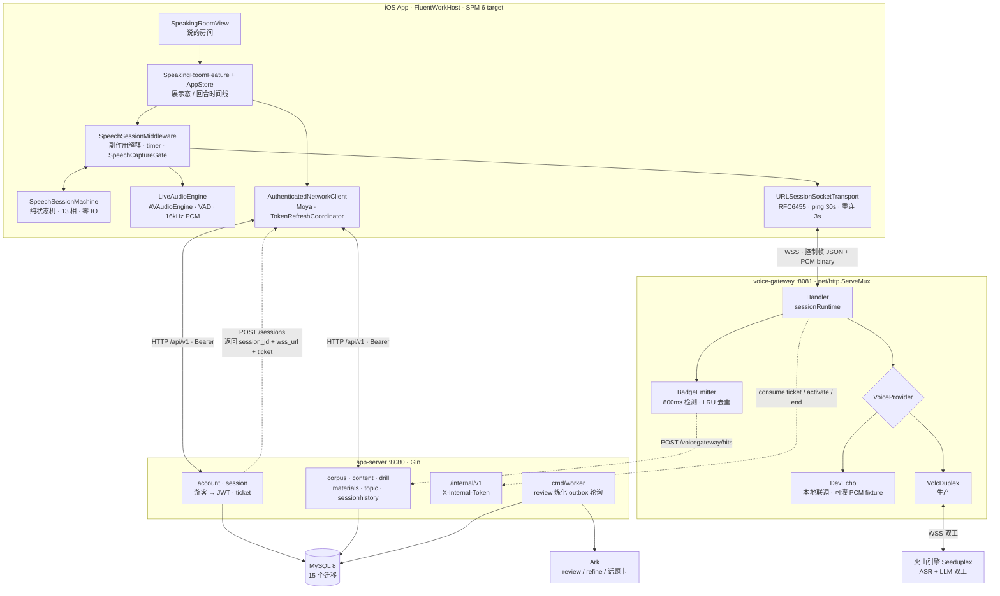
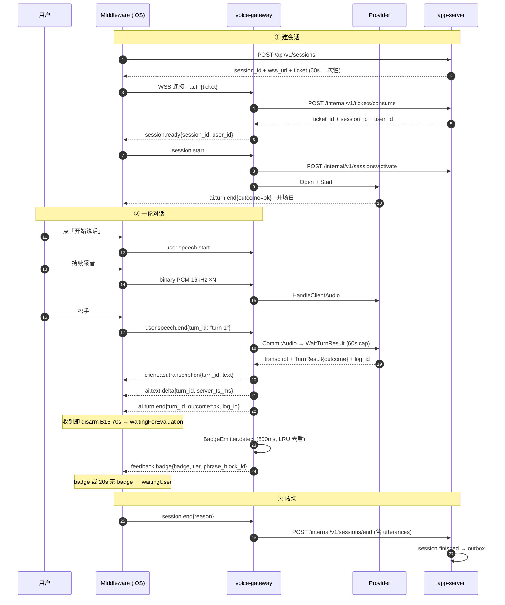
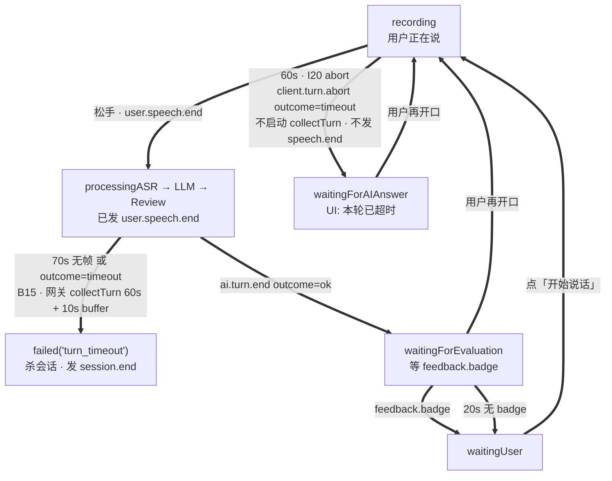
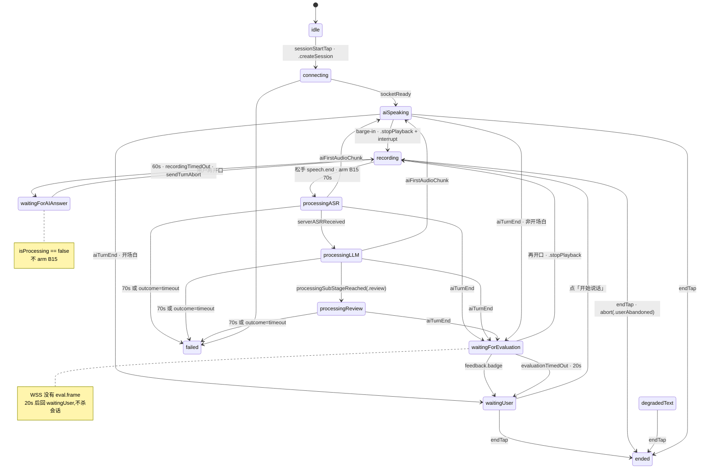
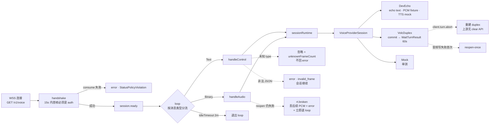

# FluentWork 语音链路架构与联调现状

**版本**：V1.0  
**日期**：2026-09-10  
**定位**：跨仓架构参考。用数据流向讲清 iOS 与 backend 两仓在实时语音会话上的分层、WSS 帧契约与 turn 边界，并写明当前真机联调的阻塞点。**不是**进度账——完成度以 [`66_iOS`](../60_评审与复盘/66_iOS语音链路当前进度_2026-09-10.md) / [`67_Backend`](../60_评审与复盘/67_Backend语音链路当前进度_2026-09-10.md) 为准。  
**对应上游文档**：[`80_项目整体蓝图`](../80_项目整体蓝图.md) · [`50_全链路架构设计V1_0`](./50_FluentWork全链路架构设计V1_0_2026-09-03.md) · [`39_后端技术架构设计V2_0`](./39_FluentWork后端技术架构设计V2_0_2026-09-03.md) · backend `docs/41_真机联调_I20_B15.md`  
**契约真源**：`fluentwork-infra` `schemas/transport/wss-control-frames-v{1,2}.json`（`d60d0fe`）  
**代码锚点**：`fluentwork-ios` `d8a9643` · `fluentwork-backend` `abb01ab`  
**变更说明**：首版。汇总两仓已合并实现的真实分层（含与早期设计文档不一致处），并把真机联调的阻塞点单列成节。

---

## 0. 一句话现状

语音网关已经能按客户端下发的 `turn-N` 跑完一整轮双工对话，把 `outcome` / `log_id` 写进 v2 的 `ai.turn.end`；录音 abort 不杀会话，只有 `collectTurn` 超时才出 `outcome=timeout`。iOS 侧的 13 相状态机、等待相位 watchdog、trace 三键都已落地。

**但整套东西从未在真机上完整跑过一次。** 联调卡住的是证据缺口，不是代码缺口，见 §7。

### 完成度三档（与进度报告同一套词）

| 档 | 判定标准 | 当前 |
|---|---|---|
| **已合并** | 代码在 `main`，`go test` + `go build` / `swift test` 绿 | 两侧 W3/W4 全部票已进 `main`；iOS `swift test` 403/403 |
| **已联调** | DevEcho / 单测 / 跨仓 JSON fixture 对过 | turn 边界、trace 三键、abort、未知帧、v1 字节冻结——均已对过 |
| **已真机** | 真机 WSS 跑通，留下 `turn_id` + `log_id` | **零样本** |

---

## 1. 系统数据流总览

两条独立通道、两个独立进程。`voice-gateway` 是**瘦中继**——它不带数据库，所有持久化都通过 `/internal/v1` 回打 `app-server`（共享 `X-Internal-Token`）。把这两条通道揉成一个端口是这条路上最容易踩的坑。



### 1.1 两个容易看错的地方

1. **Redis 是摆设。** `deploy/docker-compose.yml` 拉起了 Redis 7，`.env.dev` 也有 `REDIS_ADDR`，但**没有任何 Go 代码 import 或连接它**。review 流水线走的是 MySQL outbox 轮询（`session_jobs` → `ProcessNextJob`），不是 Redis Stream。早期文档 `docs/01` 提到的「Redis Stream 后续替换」尚未发生。
2. **网关不带数据库。** 它只持有内存里的 `sessionRuntime`，断线即丢——重连是「新 ticket + 新 `session_id`」，不是会话恢复。

---

## 2. 一轮语音的帧时序

建会话走 HTTP，说话走 WSS。ticket 一次性、60s TTL，由 `POST /api/v1/sessions` 签发，网关通过 `/internal/v1/tickets/consume` 消费。**`auth` 帧带的是 session ticket，不是 access token**——这是两条通道上的两套凭证，排查鉴权问题时不要混。



### 2.1 帧方向速查

| 帧 | 方向 | 关键字段 | 版本 |
|---|---|---|---|
| `auth` | C→S | `ticket` | v1 |
| `session.ready` | S→C | `session_id`, `user_id` | v1 |
| `session.start` | C→S | `material_id`, `scene_type`, `voice` | v1 |
| `user.speech.start` | C→S | 无 `turn_id` | v1 |
| `user.speech.end` | C→S | `text?`, `turn_id?` | v1 |
| `client.asr.transcription` | S→C | `text`, `turn_id` | v1 |
| `ai.text.delta` | S→C | `text`, `turn_id`, `server_ts_ms` | v2 加戳 |
| `ai.turn.end` | S→C | `turn_id`, `outcome`, `log_id` | v2 加字段 |
| `feedback.badge` | S→C | `badge`, `phrase_block_id`, `tier`, `dedupe_key` | v1 |
| `ai.tts.start` / `ai.tts.end` | S→C | `turn_id`, `voice_id`, `codec` / `completion_status` | 仅 v2 |
| `ai.tts.audio` | S→C | 二进制：4 字节大端 `seq` + payload | 仅 v2 |
| `client.turn.abort` | C→S | `turn_id?`，`outcome` **必填且非 `ok`** | 仅 v2 |
| `interrupt` | C→S | `max_seq?` | v1 |
| `error` | S→C | `code`, `message` | v1 |
| `ping` / `pong` | C↔S | `ts` | v1 |

`ai.audio.chunk` 是 v1 遗留的**死帧**——定义还在，当前网关从不发出。v2 的音频路径是二进制 `ai.tts.audio`。

`ai.turn.end.outcome` 取值 `ok | partial | timeout | error`，1:1 映射 `voicepoc.TurnOutcome`。`client.turn.abort.outcome` 取值 `timeout | user_abandoned | error`——**abort 永远不是 `ok`**，缺失或 `ok` 回 `invalid_frame`。

---

## 3. 三条「等太久」不能合成一条

这是整条链路上语义最容易混淆的地方，也是最贵的一次误判（见 iOS `docs/38` 的问题分析）。三条路径**等的对象、时限、失败语义全都不同**，合并任何两条都会产生错误行为。



| 路径 | 触发相位 | 在等什么 | 时限 | 超时后 | 出站帧 |
|---|---|---|---|---|---|
| **I20 abort** | `recording` | 用户闭嘴 / 再开口 | 60s | 会话**继续** → `waitingForAIAnswer` | `client.turn.abort` |
| **B15 timeout** | `processing*` | `ai.turn.end` | 70s | 会话**结束** → `.failed` | `session.end` |
| **评价等待** | `waitingForEvaluation` | `feedback.badge` | 20s | 回 `waitingUser`，**不失败** | —— |

**B15 消歧**：本节的「B15」指 `collectTurn` 超时 / `ai.turn.end outcome=timeout`。GitHub #28 / backend `docs/31` 的「B15」指 Prompt 离线回归集。两回事。

### 3.1 三条红线

1. 不要把 abort 折进 `ai.turn.end outcome=timeout`——那正好会走到 abort 想避免的 `.failed("turn_timeout")`。
2. `waitingForAIAnswer` / `waitingForEvaluation` 的 `isProcessing == false`，**禁止**误 arm B15——abort 之后那一轮网关**不会**再答。
3. 不要再把未知 `type` 映射成 `unsupported_frame`；网关现在的策略是**忽略 + 计数**。历史上这条把还活着的会话打死过。

---

## 4. iOS 状态机与副作用边界

架构是**纯状态机 + 同步中间件解释副作用 + 异步 IO**。Machine 零 IO——timer、WSS、AudioEngine 都不许进 `reduce`。非法 `(相位, 事件)` 组合落入 `default` 返回空。相位实际有 **13 个**，I21 票面写的 7 个已经过期。



超时值集中在 `ProcessingTimeouts`：`asr=15s`、`llm=45s`、`review=30s`、`totalCap=70s`、`evaluationWait=20s`。录音 60s abort **不在这里**——它是 middleware 的 `recordingAbortTimeout`，不要塞进这个 struct。

### 4.1 两个同步盒子守住的边界

| 组件 | 存在原因 | 不变量 |
|---|---|---|
| `SpeechCaptureGate` | 音频循环是独立 `.task`，abort 发生在另一条 task；不能靠读 `@MainActor` store 的相位来决定还发不发 PCM | `abort()` 后丢弃 PCM 直到下一次 `beginSpeech()`，并忽略迟到的 `speechEnded`；而 `endSpeech()` 仍前向尾包（历史契约，有意保留） |
| `OSAllocatedUnfairLock` 系列 | 替代 `NSLock`；按真实双写路径覆盖并发 | `SpeechSessionTimingsRecorder.setLogID` 只写一次——`log_id` 是 per-session 首次非空，后续 turn 的新 id 不覆盖 |

### 4.2 iOS 模块分层

| SPM target | 路径 | 职责 |
|---|---|---|
| `FluentWorkCore` | `Shared/FluentWorkCore` | 状态机、Middleware、Audio、Bootstrap、Navigation、Storage、Permission |
| `FluentWorkNetworking` | `Shared/FluentWorkNetworking` | Moya API client、`URLSessionSocketTransport`、`WSControlFrame` 编解码 |
| `FluentWorkUI` | `Shared/FluentWorkUI` | SpeakingRoom / BadgeFeedback / Corpus / DailyRead / Review / Workbench + DesignTokens |
| `FluentWorkDiagnostics` | `Shared/FluentWorkDiagnostics` | Tracker、结构化日志、trace 透传 |
| `FluentWorkFeatureFlags` | `Shared/FluentWorkFeatureFlags` | TGFeatureFlag 封装（`voiceVadAuto` 默认关） |
| `FluentWorkPluginSupport` | `Shared/FluentWorkPluginSupport` | 插件注册；`FeaturePluginCatalog.firstWave` 决定工作台露出哪些模块 |

依赖方向单向：`FluentWorkUI → FluentWorkCore → FluentWorkNetworking`，而 **`FluentWorkNetworking` 对 Core 零依赖**——`SocketTransportEventMapper` 之所以返回自己的一套 `SpeakingRoomTransportAction` 而不是直接返回 Core 的 action，就是为了守住这条边。

---

## 5. 网关侧：瘦中继 + 三个 Provider



### 5.1 `sessionRuntime` 的字段

| 字段 | 语义 |
|---|---|
| `started` / `startedAt` | 首个 `session.start` 置位；门控所有 speech/audio 帧，并驱动 `duration_sec` |
| `provider` | 懒开；缓存 `VoiceProviderSession` |
| `broken` | 音频转发首次不可恢复失败后置位 → 丢弃在途二进制帧、发 `provider_audio_failed`、**立即退 loop**（而不是挂到 idle 超时） |
| `reopenAttempted` | reopen-once：首次 `HandleClientAudio` 失败时用同一 ticket 重开 Provider 并**透明重试同一块 PCM** |
| `warnDedup` | 5s 窗口内相同 key 的 WARN 只打第一条，之后每 10 条汇总一次——治的是 60s 超时场景下 80+ 条相同噪声 |
| `unknownFrameCount` | 忽略掉的未知类型帧计数，`session.end` 时统一上报 |

网关可能发出的 error code：`unauthenticated`、`invalid_frame`、`already_authenticated`、`session_not_started`、`activate_failed`、`provider_open_failed`、`provider_start_failed`、`provider_control_failed`、`provider_interrupt_failed`、`provider_audio_failed`、`client_asr_required`、`end_failed`。

### 5.2 HTTP 接口面

| 分组 | 端点 |
|---|---|
| auth / account | `POST /auth/guest` · `POST /account/merge` · `DELETE /account/data` · `POST /account/export` |
| session | `POST /sessions` · `GET /sessions/:id/review` · `POST /sessions/:id/messages` |
| corpus | `GET /corpus/blocks` · `PUT\|DELETE /corpus/blocks/:id` · `PATCH .../pin` · `PATCH\|POST .../favorite` · `POST /corpus/blocks/batch-accept` |
| dailyread | `GET /daily-reads/today` · `POST /daily-reads/:id/follow-read` |
| drill | `GET /drill/round` · `POST /drill/judge` |
| history | `GET /sessions`（cursor） · `GET /sessions/:id` |
| materials / topic | `POST /materials` · `GET /materials/:id` · `GET /topic-cards` · `POST /topic-cards/:id/checkin` |
| internal | `/tickets/consume` · `/sessions/activate` · `/sessions/end` · `/corpus/blocks` · `/voicegateway/hits` · `/sessions/:id/recent-hits` · `/tts/synthesize` · `/ai-cost-logs` · `/support/undelete-user` |

两个 HTTP 栈并存：app-server 用 **Gin**，voice-gateway 用 **`net/http.ServeMux`**——它们不共享中间件，也不共享错误信封。

---

## 6. 存储与标识符

### 6.1 数据层

MySQL 8 是唯一存储；`MYSQL_DSN` 为空时各 store 退回内存实现（`dev-up.sh` 默认走这条）。迁移按文件名顺序由 shell 脚本执行，不是 Go migrator。

| # | 迁移 | 表 |
|---|---|---|
| 0001 | create_users_and_auth_tokens | `users`, `auth_tokens` |
| 0002 | create_ai_cost_logs | `ai_cost_logs` |
| 0003 | create_practice_sessions | `practice_sessions`, `session_tickets` |
| 0004 | create_utterances | `utterances` |
| 0005 | create_session_jobs | `session_jobs`（outbox） |
| 0006 | create_phrase_blocks | `phrase_blocks` |
| 0007 | create_daily_reads | `daily_reads` |
| 0008 | alter utterances | + `llm_eval_json` |
| 0009 | alter phrase_blocks | + `total_uses`, `last_used_at` |
| 0010 | create | `phrase_block_uses` |
| 0011 | create | `drill_records` |
| 0012 | alter phrase_block_uses | 唯一约束 |
| 0013 | alter（A4 隐私） | `users` + `deleted_at`/`tombstone_at`；`practice_sessions` + `deleted_at`；`ai_cost_logs` + `user_id_anonymized`；新增 `tombstones`, `audit_logs` |
| 0014 | create | `materials` |
| 0015 | create | `topic_cards`, `topic_checkins`, `topic_streaks` |

### 6.2 三个标识符

| 键 | 谁拍板 | 规则 |
|---|---|---|
| `session_id` | ticket / `session.created` | **握手 `session.ready` 必带**；C→S 控制帧一律省略；`feedback.badge` 可选带上作关联；`ai.turn.end` 省略 |
| `turn_id` | iOS `"turn-N"` | `canonicalTurnID`：有客户端值就用；没有才 `turn-N`。**不再发 `volc-turn-*`** |
| `log_id` | Volc 握手 `X-Tt-Logid` | 写入 v2 `ai.turn.end`；iOS 侧 per-session 首次非空、不覆盖 |

钉死联调 JSON（v2 出站帧，与 iOS `docs/35` / commit `fd17538` 相同）：

```json
{"type":"ai.turn.end","turn_id":"turn-1","outcome":"ok","log_id":"volc-abc123"}
```

**版本协商现状**：没有 `session.start` version 字段，speaking room de facto 全是 v2。v1 schema 已**冻结**（`type` + `turn_id` 而已），文件字节由 `TestSchemaV1BytesAreFrozen` 用 SHA-256 钉死——`outcome` / `log_id` / `client.turn.abort` / `ai.tts.*` 只在 v2。真要协商再开票，冻结期内不加字段。

### 6.3 保活是三层，不是「60s 一帧不发」

| 层 | 周期 | 作用 |
|---|---|---|
| 应用 `ping` → `pong` | 客户端可选 | handler 已接 |
| iOS RFC6455 `sendPing` | 默认 30s，连续 2 次失败断连 | 保 NAT |
| 网关 `IdleTimeout` | 默认 2 分钟（`VOICE_GATEWAY_IDLE_TIMEOUT`） | 读超时退 loop |
| Volc 上游 probe | idle 60s | 供应商连接，不是 WSS 到 iOS |

`collectTurn` 最长 60s 时 iOS ping 仍应在跑。若 ping 失败或半开连接，`outcome=timeout` 可能送不到——iOS 70s 兜底还在。

---

## 7. 联调阻塞

### 7.1 阻塞的本质是证据缺口

两仓 `main` 都已合并，门禁全绿，跨仓 JSON fixture 也已对齐。但**真机 WSS 一次都没跑通过**——没有留下任何一个 `turn_id` + `log_id` 样本。在这之前，任何「后端做完了」的排期判断都没有依据。

### 7.2 环境层面的四个坑

| 坑 | 说明 | 正确做法 |
|---|---|---|
| **网络** | 办公室 `20.0.x` 内网**不作数**，公司网络隔离会导致连不上 | 回家用 `192.168.x.x`，Mac 与 iPhone 连**同一个家用 Wi-Fi** |
| **`LOCAL_HOST`** | 必须填 **Mac 的 LAN IP**，不是手机 IP | `ipconfig getifaddr en0`（空则 `en1`）。`LOCAL_HOST` 只在 ≠ `192.168.2.104` 时需要设（那是 `AppEnvironment.local` 的默认值，机器相关，不能进 `main`） |
| **端口** | iOS `docs/11` 把 WSS 写成 `:8080`——**该文档已过期，不要用** | HTTP `:8080`，语音 WSS `:8081/v1/voice`（以 `POST /sessions` 返回的 `wss_url` 为准）；Mac 防火墙放行 8080 / 8081 |
| **两处 host** | **Xcode 的 `LOCAL_HOST` 与 backend 的 `--host` 必须填同一个 Mac IP**，任一填错都连不上 | 它们控制不同的东西：前者改写 iOS 的 REST base URL，后者决定网关回报的 `wss_url` |

### 7.3 两个改配置时容易白改的地方

1. **`AppEnvironment.wssBaseURL` 是死配置。** 仓库里**没有任何地方读它**——真正使用的 WSS 地址是 `POST /sessions` 响应里的 `wss_url`，由 backend 的 `VOICE_GATEWAY_WSS_URL` 决定。改 iOS 侧这个字段不会有任何效果。
2. **`auth` 帧带的是 session ticket，不是 access token。** ticket 来自 `POST /sessions`（60s 一次性）；access token 只用于 REST 的 `Authorization: Bearer`。

### 7.4 启动命令（Phase 1 · DevEcho）

不要跑 `./scripts/dev-local.sh`（默认火山且写死 `192.168.2.15`）。`dev-up.sh` 不会覆盖已 export 的变量，所以下面这样传是安全的：

```bash
cd fluentwork-backend
HOST=$(ipconfig getifaddr en0)          # en0 为空则改 en1

VOICE_GATEWAY_PROVIDER=dev-echo \
VOICE_DEV_ECHO_TEXT="let's ship it" \
VOICE_DEV_ECHO_TTS_MOCK=true \
./scripts/dev-up.sh --host "$HOST"

# 终端应出现：
# 📡 WSS URL for iOS: ws://192.168.x.x:8081/v1/voice

# 健康检查：本机回环与 Mac IP 各探一次
curl -sf http://127.0.0.1:8080/healthz && curl -sf "http://${HOST}:8080/healthz"
curl -sf http://127.0.0.1:8081/healthz && curl -sf "http://${HOST}:8081/healthz"
```

给 iOS 的地址：API `http://$HOST:8080/api/v1`；WSS `ws://$HOST:8081/v1/voice`。

### 7.5 六个待验场景

记**帧**，不记听感。DevEcho 下 TTS 可能是噪声或无声（mock decoder），只要帧对了就算 Phase 1 过。

| # | 场景 | 操作 | 预期 | 今晚 |
|---|---|---|---|---|
| 1 | 正常一轮 | 开口 → **松手** | v2 `ai.turn.end`：`turn_id`（如 `turn-1`）+ `outcome=ok` + `log_id`（DevEcho 为 `dev-echo`）。iOS 进评价等待；约 20s 无 badge 回 `waitingUser`，**不** `.failed` | 做 |
| 2 | abort | **按住不放约 60s**，不要松手 | 出站 `client.turn.abort outcome=timeout`；**无** `ai.turn.end`；**无** `error`；UI「本轮已超时」；WSS 仍在，可再开口 | 做 |
| 3 | 网关 B15 | 松手后 70s 无 `ai.turn.end` | `ai.turn.end outcome=timeout` → iOS `.failed("turn_timeout")` | **跳过** |
| 4 | 断网 | 会话中关 Wi-Fi / 飞行模式 | 旧 session 结束；回来是**新 ticket + 新 `session_id`**（不是恢复） | 顺手 |
| 5 | 锁屏 | 进后台 | iOS `forceClose` / `session.end` | 顺手 |
| 6 | 耳机插拔 | 录音或播放时插拔 | iOS 重配 tap；网关**不**因此发 error | 顺手 |

场景 3 在 DevEcho 下测不了——它会立刻作答，构造不出 70s 无帧。Phase 2 换 `VOICE_GATEWAY_PROVIDER=volc-duplex` + `VOICE_GATEWAY_CLIENT_AUDIO_FORMAT=pcm-s16le` 再验，**不要在 Phase 1 用这条**。

abort ≠ B15：abort 是还按着说话；B15 是已经 `user.speech.end` 之后网关 `collectTurn` 超时。

### 7.6 证据模板

通过后写入进度报告「已真机」行，至少：

```text
date:
wifi: 192.168.x.x
phase: 1-dev-echo
host:              # Mac LAN IP
session_id:
turn_id:           # 客户端 turn-N
log_id:
outcome:           # ok | (abort: 无 ai.turn.end)
ios_phase:
notes:
```

**没有 `turn_id` + `log_id` 不算已真机。**

### 7.7 两个非阻塞但未闭环的项

| 项 | 现状 | 下一步 |
|---|---|---|
| `server_ts_ms` | 网关**已出站戳**（v2 `ai.text.delta`，UTC 毫秒）；**iOS 尚未 decode** | iOS 按 ping RTT/2 接 offset（不假设 NTP），之后才能填真机 p50/p95 时延 |
| abort 后 ASR 串味 | 火山官方无 `input_audio_buffer.clear`；网关改为**重建 duplex**（先开新连接再关旧，`abb01ab`） | 真机跑完 abort 后确认下一轮 transcript 不混——看同一 `log_id` 链路上的两轮 |

---

## 8. 往前看：产品阻塞在别处

联调是**当下**的阻塞；但即使联调通过，产品演示仍会被另一件事卡住——这两件事不要混为一谈。

| 事项 | 性质 | 状态 | 影响 |
|---|---|---|---|
| **真机 E2E** | 当下的阻塞 | 零样本 | turn 合同在真机上是否收敛，未知 |
| **I15 真机流式 Opus** | 产品演示的阻塞 | blocked | 火山 Opus SDK `not-available`，客户端仍是 mock decoder；回退 `RawPCM16FrameDecoder`。I15 卡住时下一手是 I14 |
| I14 / I16–I19 UI | 功能缺口 | 未开工 | backend 的 B18 / B21 / B22 / B23 / B24 **API 已合并但无客户端联调** |
| ISSUE-08 Instruments | 度量缺口 | 程序已写 | 埋点在、数字没有。等 turn 合同稳定后再跑，不要先造数字 |
| 生产部署 / 监控 | infra 缺口 | 未开工 | `fluentwork-infra` 的 `deploy/`、`environments/`、`docker/`、`monitoring/` 目前**全部是 `.gitkeep` 占位**——该仓实际只有 schema 治理是实的 |

### 8.1 冻结期白名单

iOS 接 I15 / I14 / I16–I19 期间，backend **默认不改 turn 合同**。

- **允许**：未知帧/观测、v1 digest、文档、单测加固。
- **禁止**：改 v1、把 abort 折进 timeout、并行改 `ai.turn.end` 形状。
- **仍需单独开票等 iOS**：真正的 `interrupt` TTS 打断、`session.start` 版本协商字段。

### 8.2 下一步就两件事

1. 回家用 `192.168.x.x` 跑 Phase 1 DevEcho，把**场景 1 + 场景 2** 的 `turn_id` / `log_id` 记下来——这是唯一能把「已联调」推进到「已真机」的动作。
2. 真机过了再开 Phase 2（火山 + abort 后 ASR 不串味 + B15 timeout），同时 iOS 接 `server_ts_ms` offset。

---

## 附录：与早期设计文档的差异

读 [`50_全链路架构设计V1_0`](./50_FluentWork全链路架构设计V1_0_2026-09-03.md) 与本篇时，以下五处以本篇（即代码事实）为准：

1. **iOS 相位是 13 个**，不是 `idle → connecting → waitingUser → recording → processing → waitingUser` 那条 6 态链。新增了 `aiSpeaking`、`processingReview`、`waitingForAIAnswer`、`waitingForEvaluation`、`degradedText`、`ended`，且 `failed` 带 `String` 载荷。
2. **`client.turn.abort` 未在早期设计文档中**——它由 I20 引入，只在 v2 schema。
3. **音频出站是二进制 `ai.tts.audio`**（4 字节大端 seq + payload），不是 JSON 的 `ai.audio.chunk`。
4. **网关是瘦中继**：不带数据库，所有持久化回打 app-server `/internal/v1`。
5. **`server_ts_ms` 的时钟校准用 ping RTT/2**，不假设 NTP，也不改 `pong` 结构。

---

## 相关文档

| 主题 | 位置 |
|---|---|
| 进度快照 | `fluentwork-meta/docs/60_评审与复盘/66_iOS*` · `67_Backend*` |
| 真机联调指导（完整清单） | `fluentwork-backend/docs/41_真机联调_I20_B15.md` |
| turn 超时维护合同 | `fluentwork-ios/docs/24_voice_turn_timeout_contingency.md` |
| 等待相位与失败矩阵 | `fluentwork-ios/docs/37_wait_phase_watchdog_and_failure_matrix.md` |
| 契约真源 | `fluentwork-infra/schemas/transport/` |
| B15 离线评估集 | `fluentwork-backend/docs/31` · `05` |
