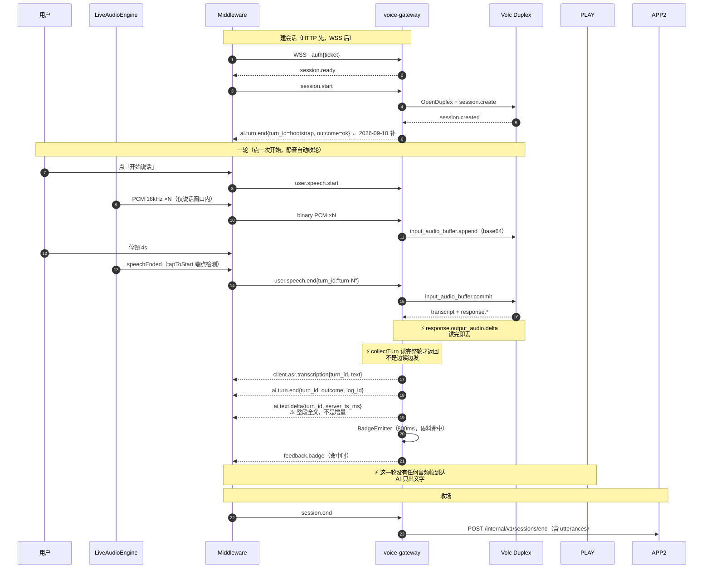
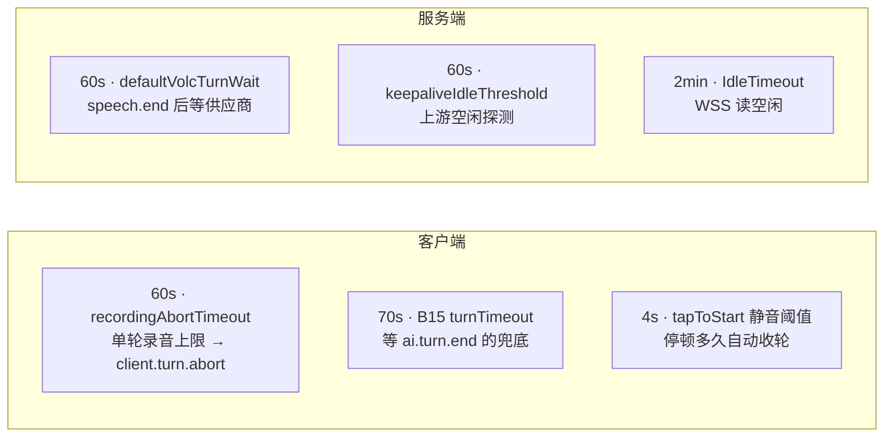
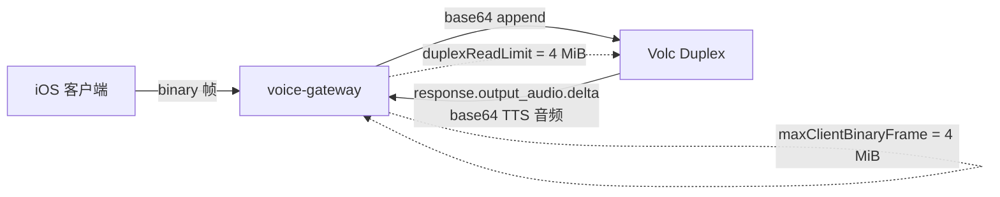

# FluentWork 语音链路架构图

**版本**：V1.0  
**日期**：2026-09-10  
**定位**：当前实现的**实际**结构,带通/断标注。回答"这套东西现在到底长什么样",不回答"应该长什么样"（那是 [`53_`](./53_语音链路架构评价_2026-09-10.md)）。  
**锚点**：`fluentwork-ios` `dc5d520` · `fluentwork-backend` `3e1efed` · 契约 `fluentwork-infra` `d60d0fe`  
**配套**：[`51_语音链路架构与联调现状`](./51_FluentWork语音链路架构与联调现状_2026-09-10.md)（文字版）· [`48_duplex与后端消费边界`](../../../fluentwork-backend/docs/48_duplex与后端消费边界.md)

---

## 图例

本图刻意区分**在跑的**和**只是写着代码的** —— 后者是这个仓群现阶段最大的认知成本来源。

| 线型 | 含义 |
|---|---|
| 实线 | 生产路径,真在跑 |
| 虚线 | 有实现、有接缝,但**当前没有调用方 / 不在主路径上** |
| 粗红线 | 已知缺口 |

---

## 图 1 · 端到端结构

```mermaid
flowchart TB
    subgraph IOS["iOS App · FluentWorkHost"]
        direction TB
        UI["SpeakingRoomView<br/>回合时间线 · Badge 浮层"]
        FEAT["SpeakingRoomFeature<br/>展示态"]
        SM["SpeechSessionMachine<br/>纯状态机 · 13 相 · 零 IO"]
        MW["SpeechSessionMiddleware<br/>副作用解释 · timer · CaptureGate"]
        AE["LiveAudioEngine<br/>AVAudioEngine · tapToStart 端点检测"]
        PLAY["ttsDispatcher<br/>Opus/PCM 解码 · AVAudioPlayerNode"]
        TX["URLSessionSocketTransport<br/>RFC6455 · 重连 3s"]
        APIC["AuthenticatedNetworkClient<br/>Moya · TokenRefresh"]
        UI --> FEAT --> MW
        MW <--> SM
        MW --> AE
        MW --> TX
        MW --> PLAY
        FEAT --> APIC
    end

    subgraph GW["voice-gateway :8081 · net/http.ServeMux"]
        direction TB
        H["Handler · sessionRuntime"]
        PF{"VoiceProvider"}
        DE["DevEcho<br/>本地联调"]
        VD["VolcDuplex<br/>生产"]
        BEM["BadgeEmitter<br/>800ms · LRU 去重"]
        H --> PF
        PF --> DE
        PF --> VD
        H --> BEM
    end

    subgraph APP["app-server :8080 · Gin"]
        direction TB
        A1["account · session · corpus"]
        A2["materials · topic · drill<br/>content · sessionhistory"]
        A3["content/tts<br/>B17 provider 链"]
        A4["cmd/worker<br/>review 炼化 outbox"]
    end

    VOLC["火山 Seeduplex<br/>ASR + 对话生成"]
    STDTT["火山 独立流式 TTS<br/>seed-tts-2.0"]
    ARK["火山方舟<br/>review / refine / 话题卡"]
    DB[("MySQL 8")]
    TICKET["session ticket<br/>60s 一次性"]

    TX <-->|"WSS 控制帧 + PCM binary"| H
    APIC <-->|"HTTP /api/v1"| A1
    APIC <-->|"HTTP /api/v1"| A2
    A1 -.->|"session_id + wss_url + ticket"| APIC

    VD <-->|"WSS 双工"| VOLC
    H -.->|"consume / activate / end / hits"| A1
    BEM -.->|"POST /voicegateway/hits"| A1

    A1 --> DB
    A2 --> DB
    A4 --> DB
    A4 --> ARK

    PLAY x-x|"⚡ 生产路径收不到 AI 音频"| VD
    A3 x-x|"⚡ 无调用方"| STDTT
    A3 -.->|"POST /internal/v1/tts/synthesize<br/>零调用方"| GW

    classDef dead fill:#F3F4F6,stroke:#9CA3AF,color:#374151,stroke-dasharray: 4 3
    classDef gap fill:#FEE2E2,stroke:#B91C1C,color:#7F1D1D
    class STDTT dead
    class A3 dead
```

**三个 ⚡ 是这张图的重点,逐条见 [`53_`](./53_语音链路架构评价_2026-09-10.md)：**

| 缺口 | 事实 | 核实位置 |
|---|---|---|
| AI 在说的房间里没有声音 | `VolcDuplex` 的出站集只有 `client.asr.transcription` / `ai.turn.end` / `ai.text.delta` —— **没有任何 `ai.tts.*`,没有二进制音频**。厂商推的 `response.output_audio.delta` 读完即丢 | `internal/voicegateway/provider_volc_duplex.go` |
| B17 TTS 没有消费者 | `tts.Provider` / `Manager` 全仓只被 `tts.NewHandler(...)` 引用；`POST /internal/v1/tts/synthesize` **零调用方** | `cmd/app-server/main.go:132` |
| iOS 播放路径已就绪 | `ttsDispatcher` 处理 `ai.tts.start` / `.end` / 音频帧 —— **接好的,只是没人给它发东西**(DevEcho mock 会发) | `SpeechSessionMiddleware.swift:395,422,453` |

---

## 图 2 · 一轮语音的帧流（生产路径）



---

## 图 3 · 数据落点：音频进来，文本留下

这张图回答一个反复被问的问题:**后端到底存了什么。**

```mermaid
flowchart LR
    PCM["PCM 16kHz<br/>iOS 采集"]
    GW["voice-gateway<br/>内存里过一遍"]
    V["Volc Duplex"]
    TXT["transcript + reply<br/>纯文本"]
    DB[("utterances 表<br/>{seq, speaker, text}")
    ]
    AUD["⚡ 原始音频<br/>不落盘 · 不入库"]

    PCM -->|"WSS binary"| GW
    GW -->|"base64 append"| V
    V -->|"transcription / text"| TXT
    TXT --> DB
    GW -.->|"读完即丢"| AUD

    classDef gone fill:#FEE2E2,stroke:#B91C1C,color:#7F1D1D,stroke-dasharray: 4 3
    class AUD gone
```

**核实过的三条**（`fluentwork-backend/docs/48`）：

1. `EndUtterance` 是 `{Seq, Speaker, Text}` —— 没有音频字段
2. `utterances` 表**没有** `audio_url` 列（有 `audio_url` 的是 `daily_reads`，另一条链路）
3. 全仓**没有任何**把 PCM 写文件或写库的代码

→ **整条语音链路存在的意义是产出文本。音频是手段,不是目的。** 推论:客户端本地 ASR 出文本直接发 `user.speech.end{text}` 是**协议内合法**的降级路径（B13/B14 的接缝就为此保留）。

---

## 图 4 · 四个「60 秒」不是一回事

排查时最容易混的一组数字,画出来最快。



**服务端没有任何「单轮音频最长 60 秒」的限制** —— 已核实全仓无音频时长或累计字节校验。60 秒是**客户端自己定的产品约束**。

---

## 图 5 · 两类读上限（都已修）

两边都是 `coder/websocket`,**默认每帧 32 KiB**,对音频协议都太小。



| 侧 | 常量 | 踩过的坑 |
|---|---|---|
| 网关 ← Volc | `duplexReadLimit` | 助手语音超过 32 KiB,读失败**每轮断连**,表现为"每轮失忆"（backend `docs/47`） |
| 网关 ← 客户端 | `maxClientBinaryFrame` | 单帧超过 32 KiB 直接踢连接。**协议没规定必须分片** —— 60s 一帧 = 1.83 MiB（backend `docs/48`） |

---

## 相关

| 主题 | 位置 |
|---|---|
| 文字版架构与联调现状 | [`51_`](./51_FluentWork语音链路架构与联调现状_2026-09-10.md) |
| duplex 是什么 / 后端消费边界 | `fluentwork-backend/docs/48` |
| 架构评价与建议 | [`53_`](./53_语音链路架构评价_2026-09-10.md) |
| SDK 选型调研 | [`74_`](../70_外部研究/74_语音实现方式再评估_2026-09-10.md) |
