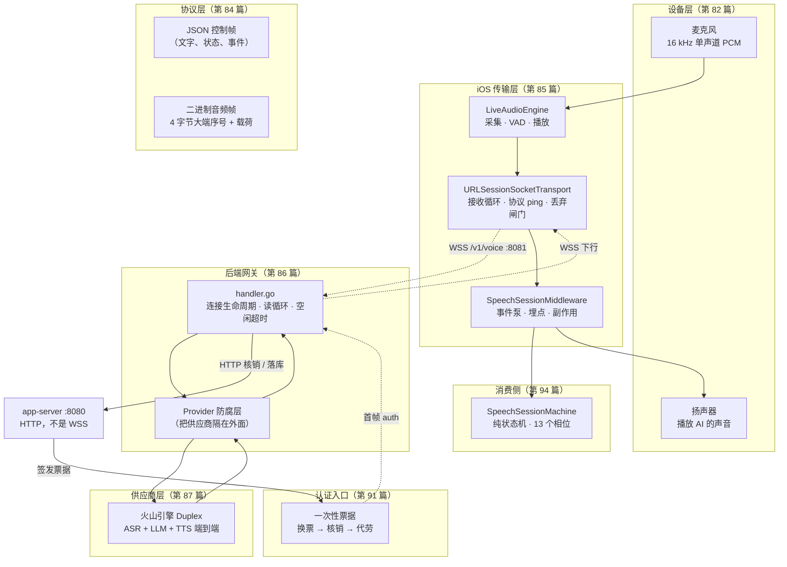
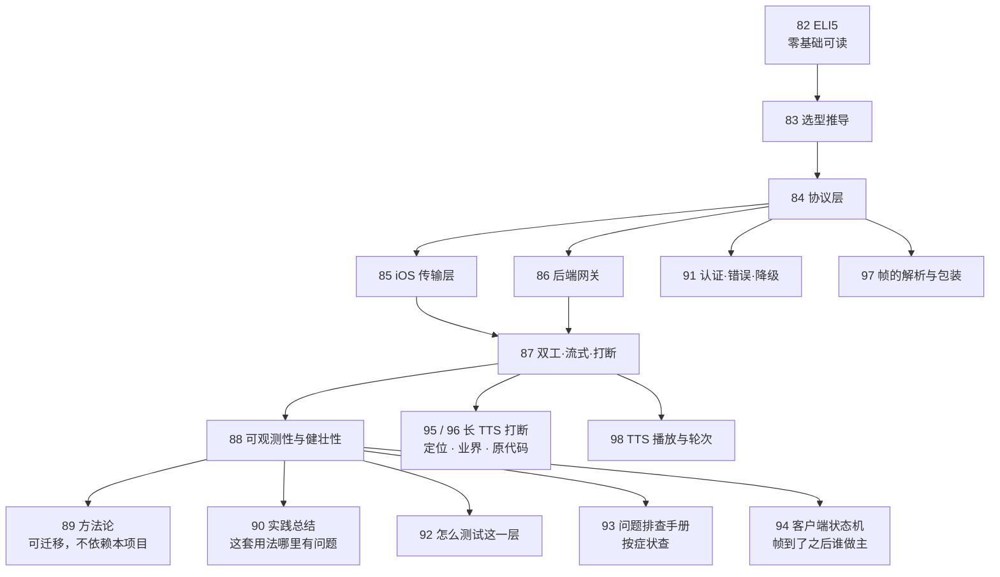

# WSS 系列 00 · 系列导读：全景图与术语表

**版本**：V1.2
**日期**：2026-09-11
**定位**：本系列**十八篇**（结构见 ⑤），讲清 FluentWork 语音链路里的 WebSocket：它为什么长成现在这样、每一处设计是被什么约束推出来的、出问题时怎么用日志回答。本篇是入口 —— 问题索引、分层全景、术语表、阅读路径。
**对应上游文档**：无 —— 本系列自足，不需要读任何系列外的文档
**变更说明**：V1.2。补 95–98：长 TTS 打断的定位与业界对照、帧的解析包装、TTS 播放与轮次。87 / 90 里「打断是空操作」以 95 为准。

---

## ① 本篇回答什么

**一个问题**：我手上这个问题，该读哪一篇？

**读完后你能**：拿到任何一个关于语音传输的疑问，直接定位到解答它的那一篇；并且知道全系列在哪些词上用了什么口径，不会读到第二篇时发现"turn"的意思变了。

---

## ② 问题索引

按你脑子里的疑问找，不要按篇号找。

| 你的疑问 | 读 | 一句话答案 |
|---|---|---|
| **这个项目为什么不能只用 HTTP？** | 82 → 83 | 因为要"一直开着"，而且**上行**要持续送音频 |
| **为什么不用 SSE？** | 83 | SSE 是单向文本，而这里要双向 + 二进制 + 多路同序 |
| **为什么要自己写 WebSocket，不用现成框架？** | 83 | 收益在语义不在替换；有明确的推翻条件 |
| **一条管道里怎么能同时跑文字和音频？** | 84 | 两种帧：JSON 文本帧，和二进制帧（4 字节序号 + 载荷） |
| **这些 `ai.xxx` 帧都是干什么的？** | 84 | 完整帧目录 + 方向 + 字段 |
| **帧在代码里怎么打包、怎么拆？** | **97** | text=JSON 控制；binary=音频。下行 4 字节序号，上行无头。未知 type 不再断开 |
| **`turn_id` 为什么到处都是？** | 84 | 它是贯穿全链路的关联键，客户端生成、服务端回声 |
| **协议改字段会不会把老客户端搞崩？** | 84 | 服务端：v1 字节冻结 + **忽略**未知帧。客户端：**遇到未知帧类型会断开连接** —— 这条规则目前只实现了一半，见 84 的"一处尚未对称的地方" |
| **手机怎么知道服务端还活着？** | 85 | 协议级 ping（30s，两次失败即判定断开） |
| **服务端怎么知道手机还在？** | 85 | 应用级 JSON ping 喂它的 2 分钟读空闲超时 |
| **这两个 ping 是不是重复了，能删一个吗？** | 85 | **不能。删哪个都会坏，而且坏得不一样** |
| **"打断"到底发生了什么？** | 82 → 87 → **95 / 96** | 端上立刻停播；网关**停转发、截断转录**（火山无 cancel，账单照计）。87 的「两层空操作」是 9/11 的旧事实 |
| **为什么 AI 的回复以前要等很久才出声？** | 87 | 整轮音频攒完才发；流式化之后才是逐块发 |
| **TTS 实际是怎么播出来的？和 turn 什么关系？** | **98** | 生产走 `LiveAudioEngine`，不走 `ai.tts.start`。`ai.turn.end` 不是喇叭停 |
| **"透明重开"是什么？为什么它曾经让整场都没声音？** | 86 | 重开新建上游会话，序号从 1 重来，而客户端水位线停在几百 → 之后每帧被丢。**已修**：序号现在跨重开承接。这是本项目最典型的"不报错的坏掉" |
| **怎么知道"首响"到底是快了还是慢了？** | 88 | `timing_first_response`；但服务端与手机时钟要先对齐 |
| **日志里一堆 `timing_*`，怎么看？** | 88 | delta/total/prev 三列的含义与一次真实排查 |
| **"客户端零凭证"到底是什么意思？** | 91 | 一条完整的凭证流转链：换票据 → 核销 → 由网关代劳 |
| **连接是怎么被放进来的？票据为什么只能用一次？** | 91 | 首帧认证 + 15 秒预算。票据一次性；**今日没有重连**，所以这个代价还没兑现 |
| **出错了会怎么样？用户看到什么？** | 91 | 错误码表 + 文本降级。看起来有 3 秒重连，**那条边没有触发者** |
| **这套东西怎么测？** | 92 | 把规则从管道里拉出来；替身只在关键点保真 |
| **用户报了个问题，从哪儿下手？** | 93 | 按症状查：先问什么、看哪条证据、最容易误判成什么 |
| **长 TTS 还在播，点说话，左边气泡裂开 / 答非所问？** | **95** | 播放时钟的上一轮 × 协议帧的下一轮；四条根因叠在一个手势上 |
| **为什么测试都绿了还是有 bug？** | 89 → 92 | 红验证：破坏实现，看**是哪条**红；三种"看起来在测"的形状 |
| **我遇到一个完全不同的实时场景，怎么下手？** | 89 | 五维需求清单 + 判定表 |
| **这套用法本身哪里有问题？** | 90 | 六个偏颇 + 改进清单 + 分清"设计"与"沉积" |
| **帧到了之后，谁决定接下来做什么？** | 94 | 纯状态机 + 副作用解释器；13 个相位里协议只驱动 5 个 |
| **为什么同一个帧会有两种意思？** | 94 | `ai.turn.end` 在"AI 在说话"相位：开场帧 vs 答完 —— **靠本地计数器区分** |
| **为什么客户端 15 秒就放弃了，服务端还在等？** | 94 | 分阶段预算比总预算短，就成了提前放弃。已改成"只上报不行动" |

---

## ③ 全景图

一张图看清有几层、谁跟谁说话。主链路各篇对应其中一层；**认证（91）和状态机（94）也是真实的层**，不在「旁支」里消失。

**读图要点**：

- 图中有**两条** WSS 连接：iOS ↔ 网关，以及网关 ↔ 火山（上游也是 `wss://`，走 TLS）。手机不和火山直接说话 —— **客户端零凭证是硬约束**，这是必须有网关中转的原因。
- 认证发生在握手后的**首帧**（91）：业务服务端签发一次性票据，网关核销后才放行。网关对 app-server 走的是普通 HTTP（核销 / 落库），不是 WSS。
- 帧到了之后由**客户端状态机**决定相位（94），传输层不管业务语义。
- 本系列讲**主要**是手机与网关那一条（85、86 两篇分讲两端）；网关到火山那条只在 86、87 里出现到必要的程度。
- 三种东西走同一条 WSS：**JSON 控制帧**（文字、状态、事件）、**二进制音频帧**（声音）、以及**协议级 ping**（不属于前两者，是 WebSocket 自己的控制帧）。

---

## ④ 术语表

全系列统一口径。**这里的定义优先于你在别处看到的意思。**

**先认路（不写代码也会用到）：**

| 术语 | 含义 |
|---|---|
| **WSS** | 加密的 WebSocket。WebSocket 是"一直开着的一条双向管道"，WSS 是它的 TLS 版本 |
| **网关（gateway）** | 本项目里手机唯一直接对话的那个服务端进程。它不参与对话内容，只做接入、转发、记账 |
| **SSE** | Server-Sent Events。一种只能"服务端 → 客户端"单向推的技术。第 82 篇会讲它为什么不够用 |
| **客户端零凭证** | 本项目的硬约束：手机上一把密钥都不放。所有第三方调用都由网关代劳 —— 这一条决定了整个架构必须有一个中转层 |
| **连接 / 会话 / 轮** | **连接** = 一条 WSS（按下说话前就建好，整场复用）；**会话** = 一次练习（一个连接上通常一个）；**轮** = 一次"用户说完 → AI 答完"（一个会话里有很多轮）。三者是包含关系，别混用 |
| **红验证** | 写完测试后**故意把实现改坏**，看红的是不是预料的那条。是 → 测试有效；不是或全绿 → 你对系统的理解有偏差。见 89 |

**协议层：**

| 术语 | 本系列的含义 |
|---|---|
| **上行 / 下行** | 上行 = iOS → 网关；下行 = 网关 → iOS。**不**以火山为参照 |
| **控制帧** | WebSocket **文本**消息，内容是 JSON，以 `type` 字段区分。见 84 |
| **二进制帧** | WebSocket **二进制**消息。音频走这条。下行带 4 字节大端序号头，上行不带 |
| **帧（音频粒度）** | **上行采集**约 20ms 一块（见 82）；**下行丢弃**用的是约 100ms 一帧（见 87）。采集粒度 ≠ 丢弃粒度，别混 |
| **协议级 ping** | WebSocket 协议自带的控制帧（opcode 0x9）。**不是** JSON，应用层看不见它。见 85 |
| **应用级 ping** | `{"type":"ping"}` 这个 JSON 控制帧。见 85 |
| **`turn_id`** | 一轮的关联键。**发起方生成，对端每条相关下行都带回**。见 84 |
| **增量 / delta** | 边生成边发出的片段，而不是攒完整段再发 |
| **抑制帧，不抑制记录** | 已经流式发出去的内容，结束时**不再重发一遍**；但落库仍然保存整段。见 87 |

**运行时：**

| 术语 | 本系列的含义 |
|---|---|
| **barge-in / 打断** | 用户在人机对话中途开口，让 AI 停声。**它比字面意思窄** —— 见 87 |
| **水位线（watermark）** | 打断发生时记下的音频序号。**序号 ≤ 水位线的帧一律丢弃**。它的生命周期是整条连接，不是单轮 —— 这个错配是若干缺陷的来源 |
| **duplex（双工）** | 指供应商那种"一次会话跑完整个对话"的产品形态 —— 不用你分别调 ASR、LLM、TTS 三个接口。**但"端到端"不等于"看不见中间"**：识别、生成、合成三段仍然以各自的独立事件流出（见 87） |
| **防腐层** | 网关与供应商之间的接口层，保证供应商的类型不渗进网关。见 86 |
| **透明重开 / reopen** | 上游连接死了之后，网关在**不让客户端察觉**的前提下重建一个会话。见 86 |
| **序号（seq）** | 下行音频帧的递增编号。**服务端分配，客户端从不生成** |
| **背压（backpressure）** | 消费速度跟不上生产速度时，对积压数据采取的策略（丢弃 / 阻塞 / 缓冲）。**没有"正确"策略，只有"匹配数据"的策略** —— 可重建的数据可以丢，不可重建的不能丢。见 85、89 |
| **时钟偏移（offset）** | 两台机器的时钟差。**不做这一步，对端时间戳就没法用**。见 88 |
| **首响** | 用户停止说话 → AI 第一个输出（字或声）的时间。见 88 |

---

## ⑤ 两条阅读路径

**路径 A · 先懂再深（推荐第一次）**

**主链路是 82→83→84→85/86→87→88。** 其余是**旁支**，可以在需要时读：

| 旁支 | 什么时候读 |
|---|---|
| **89 方法论** | 想把这套判断用到别的场景时 —— 它**不依赖本项目** |
| **90 实践总结** | 想知道这套用法本身哪里有问题时；或读完 88 之后想听结论 |
| **91 认证·错误·降级** | 关心"连接怎么进来"和"坏了会怎样"；读 86 前后都可以 |
| **92 怎么测试** | 要给这一层写测试时 —— 它讲的是方法，不是机制 |
| **93 问题排查手册** | **出问题的时候** —— 它按症状组织，不通读，拿着症状直接跳 |
| **94 客户端状态机** | 想知道"帧到了之后谁做主"；要改相位；或排查**「连上了但不能说话」** —— `ai.turn.end` 有两种意思，84 的帧目录里看不出来 |
| **95 / 96 长 TTS 打断** | 气泡裂开、答非所问、想对照业界 barge-in；**先 95 后 96** |
| **97 帧的解析与包装** | 要改编解码、对 Wireshark、或怀疑「用错了 text/binary」 |
| **98 TTS 播放与轮次** | 喇叭怎么响、为什么不发 `ai.tts.start`、turn 在两端对不齐 |

**路径 B · 带着问题查**

用 ② 的问题索引直接跳。但有三个前置依赖不能跳：

- 读 85/86/87 之前，**84 的帧目录要看一遍**，否则 `ai.turn.end`、`client.asr.transcription` 这些名字会没有着落。
- 读 88/90 之前，**85 的"两条保活"和"时钟偏移"两节要看** —— 那是这两篇里相当一部分结论的来源。
- 改消费逻辑，或排查「连上了但不能说话」时，**看 94**。`ai.turn.end` 在生产上有两种意思，靠客户端本地计数器区分 —— 帧目录里看不出来。

**可以独立读的三篇**：

- **82**（ELI5）—— 不需要任何前序。
- **89**（方法论）—— 方法本身不依赖本项目，例子全部自带。但它有几处引用语音场景作对照，**先读 82 会更顺**；完全没读过也不影响用它。
- **92**（怎么测试）—— 讲的是通用方法（规则怎么拉出管道、替身怎么保真、红验证），本项目只作为实例。

---

## ⑥ 关于本系列的写法

**内容篇共用一个骨架**，顺序不变：

| 段 | 回答 |
|---|---|
| ① 本篇回答什么 | 一句话问题 + 读完后你能做什么 |
| ② 概念 | 不看代码也能懂的最小定义 |
| ③ 约束与推导 | **为什么必须是这样** —— 本篇重心 |
| ④ 本项目的落地 | 文件、类型、关键锚点 |
| ⑤ 代价与陷阱 | 这么做的代价；踩过的坑及其守卫 |
| ⑥ 自检 | **只考本篇讲过的**，答得出才算读懂 |
| ⑦ 速查表 | 一页纸关键事实 |

**谁不套这个骨架 —— 豁免要写明，否则"统一"就是句空话：**

| 篇 | 豁免 | 改成什么 |
|---|---|---|
| **00 导读（本篇）** | 不套 | 地图和词汇表：② 换成问题索引、③ 换成全景图、④ 换成术语表。它没有"推导"，也不该有 |
| **01 ELI5** | ④ 不套 | 零基础篇不能有"文件、类型、锚点"。④ 改成**"为什么不是更简单的形态"**（逐个淘汰候选方案）—— 这其实是把 ③ 的推导放在更靠后的位置，让读者先走完旅程再问"为什么不简单点" |
| **08 方法论** | 全部不套 | 它讲的是可迁移方法，不是本项目。用"目标 / 规则 / 证据盒 / 边界"的骨架，与本项目各篇刻意不同 —— **这本身就是个信号**：告诉你手上这篇不是讲本项目的 |
| **09 实践总结** | ① 起手是**判断**不是"回答什么" | 它是收束篇：从"先说做对的"开始，然后逐条列偏颇。没有"概念"段（前八篇已建立），也没有"本项目的落地"（它讲的就是本项目） |
| **10 认证·错误·降级** | 不豁免 | 它是常规内容篇。注意它补的是**入口与失败面** —— 与 86 的正常生命周期是互补关系，不是重复 |
| **11 怎么测试** | ④ 不套 | 它讲的是**方法**（怎么测）。④ 换成"本项目用了哪些手段"，与 08 的定位相近但**更具体**：08 讲"怎么想"，11 讲"怎么做" |
| **12 问题排查手册** | 全部不套 | 它是**手册**，不是讲解 —— 结构必须是"症状 → 证据"，因为出问题时你是从症状出发的。**它是全系列唯一一篇不通读的文档**：拿着症状直接跳 |
| **13 客户端状态机** | 不豁免 | 它是常规内容篇。④ 指向的是**客户端仓库**而不是网关 —— 它是本系列里唯一一篇主战场在消费侧的文档 |
| **14 / 15 长 TTS 打断** | 不套「落地文件表」为重心 | 14 是事故证据链，15 是原理对照。骨架仍是「问题 → 推导 → 自检」，但 ③ 是时间线和标杆，不是从零推协议 |
| **16 帧的解析与包装** | 不豁免 | 常规内容篇。与 84 分工：84 是目录与版本，16 是 encode/decode |
| **17 TTS 播放与轮次** | 不豁免 | 常规内容篇。主战场跨网关与 `LiveAudioEngine`，不是单一层 |

**为什么 ③ 是重心。** 结论是廉价的 —— 抄一遍代码注释就有。这套材料想给你的，是**从约束推到结论的那条路**：这样换一个场景、换一套约束，你能自己重推一遍，而不是回来查表。

**三条取材原则**：

1. **自足。** 不要求你打开本系列之外的任何文档。需要的前提在系列内讲。
2. **以代码为准。** 所有技术断言来自代码与测试本身，不引二手转述。写进文档的每一处事实都经过逐条核对。
3. **不回避坏消息。** 已经踩过的坑、还没验证的路径、已知的死角，照写。一个只讲设计意图不讲代价的文档，读的时候很舒服，用的时候会骗人。

---

## ⑦ 自检

分两组。**第一组读完主链路 82–88 应能答**；第二组是旁支，按需。

**主链路：**

1. 这个项目为什么不能只用 HTTP？说出至少两个理由。
2. 一条管道里跑着哪两类东西？它们怎么区分？
3. 这条链路上有**几条** WebSocket 连接？分别连着谁？
4. 用户打断 AI 时，**服务端**做了什么？（9/12 起：停转发、截断转录；火山无 cancel。旧答案「两层空操作」见 87 的历史段。）
5. 手机与网关之间为什么需要**两个**都叫 ping 的机制？删掉一个会怎样？
6. 为什么"透明重开"曾经会让整场都没声音，而且不报错？
7. 怎么把一个"首响"的数字，拆成上行 / 服务端 / 下行三段？

**旁支（可选）：**

8. 为什么"测试全绿"不能证明测试有效？（89 / 92）
9. 拿一个不是语音的场景，怎么判断它该不该上双向长连接？（89）
10. 票据是一次性的。它和"没有重连"之间，真正的因果关系是什么？（91）
11. `ai.turn.end` 为什么会有两种意思？靠什么区分？（94）
12. 长 TTS 还在播时用户开口，为什么 `delivered_chars` 曾恒为 0？（95）
13. 生产路径上二进制音频为什么不进 `TTSDecoder`？（98）

---

## ⑧ 速查

| 项 | 值 |
|---|---|
| 客户端传输 | `URLSessionWebSocketTask`（Apple 原生） |
| 网关传输 | `coder/websocket` v1.8.14 |
| 网关地址 | `:8081`，路径 `/v1/voice` |
| 上游 | 火山引擎 Duplex（端到端 ASR+LLM+TTS） |
| app-server | `:8080`，HTTP |
| 帧类型常量 | 19 个 |
| 下行音频帧头 | 4 字节大端 `uint32` 序号 + 载荷 |
| 上行音频帧头 | **无** —— 整条消息就是载荷 |
| 保活 | 协议级 ping 30s / 阈值 2；应用级 ping 30s |
| 网关读空闲超时 | 默认 2 分钟 |
| 单帧读上限 | 两侧各 4 MiB（默认是 32 KiB，见 86） |
| 票据 | **一次性**；今日没有重连，这个代价尚未兑现（见 91） |
| 前向兼容 | 网关忽略未知帧；**客户端对未知 type 忽略并诊断**（见 97；84 曾写断开，已过时） |
| `ai.turn.end` | 生产上有两种意思（开场 vs 答完），靠客户端本地计数器区分（见 94） |
| 打断 | 本地停播 + 网关停转发；火山无 cancel（见 95） |
| 规范真源 | `fluentwork-infra/schemas/transport/`（本系列讲解，不定义） |

---

**系列导航**

**本篇** · [ELI5](82_WSS系列_01_ELI5_一条语音的旅程.md) · [为什么是 WSS](83_WSS系列_02_为什么是WSS_选型推导.md) · [协议层](84_WSS系列_03_协议层_帧设计与版本化.md) · [iOS 传输层](85_WSS系列_04_iOS传输层.md) · [后端网关](86_WSS系列_05_后端网关.md) · [双工·流式·打断](87_WSS系列_06_双工_流式与打断.md) · [可观测性与健壮性](88_WSS系列_07_可观测性与健壮性.md) · [方法论](89_WSS系列_08_方法论_遇到同类场景怎么想.md) · [实践总结](90_WSS系列_09_实践总结_这套用法的问题与改进.md) · [认证·错误·降级](91_WSS系列_10_认证_错误与降级.md) · [怎么测试](92_WSS系列_11_怎么测试一条WSS链路.md) · [问题排查](93_WSS系列_12_问题排查手册.md) · [客户端状态机](94_WSS系列_13_客户端状态机_协议事件的消费者.md) · [长 TTS 打断·定位](95_WSS系列_14_长TTS打断_如何定位与如何修.md) · [业界与原代码](96_WSS系列_15_长TTS打断_业界做法与原代码问题.md) · [帧的解析与包装](97_WSS系列_16_帧的解析与包装.md) · [TTS 播放与轮次](98_WSS系列_17_TTS播放与轮次设计.md)
