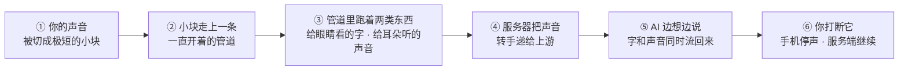

# WSS 系列 01 · ELI5：一条语音的旅程

**版本**：V1.0
**日期**：2026-09-11
**定位**：零基础可读。跟着一个字的旅程走一遍整条链路，理解这套系统为什么必须是现在这个形状。不需要任何 WebSocket 或网络背景。
**对应上游文档**：[81 系列导读](81_WSS系列_00_导读_全景图与术语表.md)
**变更说明**：首版。

---

## ① 本篇回答什么

**一个问题**：我按下说话、听到 AI 回答，这中间到底发生了什么？

**读完后你能**：向一个完全不懂技术的人解释清楚 —— 为什么这个应用不能像网页那样"发个请求等回复"，以及"打断 AI"这件事背后真正发生了什么。

**本篇不含**任何代码、文件名或协议细节。那些从 83、84 篇开始。

---

## ② 先说结论：三种沟通方式

想象你要和一个很博学但很忙的朋友交流。

**第一种：寄信。**

你写一封信寄出去，等回信。回信到了，看完，想追问 —— **再寄一封**。

每一封信都要重新贴邮票、写地址。哪怕你只想说"嗯，继续"，也得从头走一遍流程。

这就是网页的工作方式（HTTP）。它很适合"我要看这一页"这种请求。但它不适合说话：你没法在对方说话说到一半时插嘴，而且每说一个字都要重走一遍流程。

**第二种：打电话。**

线路一直通着，双方随时可以开口。这是最接近"自然对话"的形态。

但它有个前提：**双方要能同时说话**。真正的电话是"全双工"的 —— 你说话的时候我也能说话，两路声音同时在传。

**第三种，也就是这个项目用的：一条一直通着的管道，但轮流说。**

线路一直通着（像打电话），但双方约好：**你说的时候我听，我说的时候你可以打断我**。同一时刻只有一方在"说"。

这个区别很关键，后面会反复回到它。

---

## ③ 一条语音的旅程

现在跟着一个字的旅程走一遍。这里的"字"，是你说出来的第一个字。

每一块下面都会展开。**其中第 ⑥ 步的答案最反直觉** —— 如果只读一块，读那块。

### 第 1 步：你的声音被切成了小块

电话线里跑的是连续的电流。手机里没有电流，只有数字。

所以你的声音进入手机后，第一件事是**被切成极短的小块**：每块 **20 毫秒**。

20 毫秒是什么概念？一次眨眼大约要 100–400 毫秒 —— 也就是说，一块声音只有一次眨眼的五分之一到二十分之一那么长。切成这么小，是因为**小块才能边产生边发送** —— 如果等你说完一整句再打包，对面就要等你说完才有反应。

每一小块声音，是一串数字（大约 320 个数字）。这些数字**不做压缩**，就是原始的声音波形本身。选这个形式是因为**上游的语音引擎就吃这个格式**，省掉一次转换。

> 别把"不压缩"读成"不加密"：整条管道本身是加密的。这里说的是内容没有经过音频压缩编码器处理。

### 第 2 步：小块的数字走上一条一直开着的管道

这是整篇最关键的一步。

手机和服务器之间，**在你按下说话之前就已经建立好了一条一直通着的连接**。不是"你说一句、我开一条连接、传完关掉"，而是**连接从头到尾一直开着**。

这就是 WebSocket（本项目用的是它的加密版本，WSS）。

它带来的直接好处有三个：

1. **不用每次重新打招呼。** 连接建立时确认一次身份，之后一直有效。
2. **小块可以立刻发出去。** 不需要攒够一整包、不需要重新走流程。
3. **服务器也能随时主动发东西给你。** 这一条经常被忽略，但它是"AI 边想边说"的前提 —— 如果只允许你问、服务器答，那服务器就只能在"答"的那一刻开口。

### 第 3 步：同一条管道里，其实跑着两种完全不同的东西

管道只有一条，但上面跑的东西分成两类，用完全不同的形式：

**第一类：人能读的纸条。**

一张一张的小纸条，上面写着规规矩矩的文字，比如"AI 开始说话了""这一轮结束了""你刚才说的这句话被识别成了什么"。这些纸条是**给人看的、给程序读的**，内容都是文字。

**第二类：密封的音频罐子。**

这些不写文字，直接装声音数据。因为声音本来就是数字，再转成文字形式（比如用字符表示每个字节）会让体积胀大三分之一 —— 白白浪费带宽，还要多一道转换。

**两类东西怎么排队？** 靠罐子上贴的编号。

每个音频罐子开头的 4 个字节，是一个递增的编号。手机上靠它**认出哪些声音已经过期** —— 比如你已经打断、不该再听到的那一批，直接丢掉。

**编号是服务器贴的，手机从不自己编号** —— 这一点后面会变成一个很重要的问题。

### 第 4 步：服务器把你的声音递给了上游

服务器（我们叫它"网关"）收到你的声音小块之后，并不自己处理。它把声音**转手递给**一个上游的语音引擎。

为什么要转手，而不在服务器上自己跑？因为：

- **密钥不能放在手机上。** 所以手机不能直接连上游 —— 那意味着密钥要发到每一台手机上。
- **记录必须留在服务器。** 你说了什么、AI 答了什么，是产品的核心资产，必须在服务器上一手可见。

网关在这里的角色很像一个**前台**：它不参与对话内容，只负责接进来、转出去、把该记的记下来。

### 第 5 步：AI 的回应是边生成边流回来的

上游的引擎开始工作：听懂你说什么 → 想怎么答 → 把答案变成声音。

关键在于，这三步**不是全部做完才一起交出来**，而是**一边做一边往外冒**。

所以你会看到：屏幕上**先出现文字**（AI 正在打的字），而声音稍微晚一点点跟上。

这在以前不是这样的。以前整段回答要**全部生成完**才一次性发回来 —— 意味着你要等 AI 把整段话都想完、都念完，才听到**第一个音节**。对一个用来说话的应用，这是最要命的延迟。

### 第 6 步：你听到了，然后你打断了它

AI 正在说话，你突然想插一句，于是开口了。

**这里是最反直觉的地方。**

你的手机立刻做了一件事：**把正在放的声音停掉**。

同时它也给服务器发了一个"我打断了"的信号。

但服务器收到这个信号之后……**什么都没做**。

它没有让上游停下来。上游的引擎**还在继续生成** AI 的那段话 —— 它不知道你已经不想听了。

所以"打断"的准确含义是：

> **不是你让 AI 闭嘴了，是你把自己的耳朵捂上了。**

后果有两个，都真实存在：

1. **上游还在算、还在生成** —— 而这些工作量是**按秒计费**的。
2. 那些你听不到的音频，其实**还在往你手机上传**，只是你手机在收到后直接丢掉了。

（为什么这么设计、代价是什么，87 篇展开。这里你只需要先记住这个反直觉的事实。）

---

## ④ 那为什么不干脆用最简单的办法？

到这里，你可能会问：为什么要搞这么复杂？用最简单的"发请求、等回复"不行吗？

逐个试一遍：

| 方案 | 为什么不行 |
|---|---|
| **你说一句，发一次请求** | 每 20 毫秒的小块都要发一次请求，每块都要重新确认身份。开销比内容还大 |
| **攒够一整句再发一次** | 那就退回了"要等你说完才有反应"，对话感消失 |
| **服务器单向推给你（有一种技术叫 SSE）** | 它只能**服务器 → 你**这一个方向。你的声音上不去，除非再开一条连接 —— 两条连接之间还要自己对上号，等于把简单问题做复杂 |
| **真正的电话（全双工）** | 双方同时说话的代价是巨大的：要处理回声（你自己的声音从对方喇叭里传回来又被听回去）、要处理双方同时开口谁优先。而**这个产品根本不需要同时说** —— 它是一问一答 |
| **手机直连上游引擎** | 密钥就得上手机，而"客户端零凭证"是硬约束 |

所以最后落在中间那个位置：**管道一直开着（像电话），但轮流说（像对讲机）** —— 这个形态正好匹配"一问一答、但要快"的需求。

---

## ⑤ 四个最容易搞混的地方

**① "一直开着"不等于"一直在传"。**

管道立在那儿，大部分时间是安静的。你在听 AI 说话时，你的手机几乎什么都不发 —— 这带来一个副作用：服务器会怀疑"这条线是不是断了"。所以双方要定期互相"喂"一点东西证明还活着（85 篇两条保活讲的这件事）。

**② "打断"在 AI 那边根本没发生过。**

你打断后再开口，是一轮**新**的对话。但关键在于：AI 那边**不认为上一轮被打断过**。

因为那个"我打断了"的信号**根本没传到上游**（见 ③ 第 6 步）。上游会把 AI 那一轮**正常说完**，一个字不少。所以在 AI 的上下文里，上一轮是一句**完整**的话，而不是半句。

"被打断"只是你手机上的事实，不是对话的事实。

**③ 名字会骗人。**

代码里的名字有时写的是**打算用的**技术，不是**正在用的**。别靠名字猜系统 —— 后面几篇会反复回到这条。

**④ 文字和声音不是同时到的。**

文字**先到**，声音**后到**。因为声音要一小段一小段地生成、转换采样率、切成小块再传下来。所以你盯着屏幕时，看到的字往往领先于你耳朵听到的内容。这不是 bug，是这套架构的固有形态。

---

## ⑥ 自检

不看上面，试试回答 —— **只考本篇讲过的**：

1. 为什么"每说一个字就发一次 HTTP 请求"行不通？说出至少两个理由。
2. 一条管道里跑着哪两类东西？它们怎么区分？
3. 你打断 AI 的时候，**服务端**做了什么？
4. 为什么这个产品不用"真正的电话"（全双工）那种形态？
5. 你听到 AI 的声音之前，屏幕上可能已经出现了文字。为什么？

**第 3 题的答案如果你答成"服务端让 AI 停下了"，请回头重读 ③ 的第 6 步。** 这是全篇最容易被直觉带偏的一处。

> 保活（双方怎么知道对方还在）**故意不在本篇考** —— 那是 85 篇的题目。

---

## ⑦ 速查

| 你可能想问 | 简短答案 |
|---|---|
| 用什么技术连的 | WebSocket（加密版），一条连接从头用到尾 |
| 声音怎么切 | 每 20 毫秒一小块，不压缩的原始波形 |
| 文字和声音怎么共存 | 两种形式：可读的文字纸条 + 带编号的密封音频罐子 |
| 谁给音频编号 | 服务器，手机从不自己编 |
| AI 怎么做到"边想边说" | 上游边生成边往外冒，网关即时转发 |
| 打断时服务端做了什么 | **什么都没做** |
| 为什么不用 SSE | 只能单向推，你的声音上不去 |
| 为什么不用全双工电话 | 不需要同时说话，却要付出回声消除的巨大代价 |
| 为什么手机不直连 AI 引擎 | 密钥不能上手机（客户端零凭证是硬约束） |

---

**系列导航**

[导读](81_WSS系列_00_导读_全景图与术语表.md) · **本篇** · [为什么是 WSS](83_WSS系列_02_为什么是WSS_选型推导.md) · [协议层](84_WSS系列_03_协议层_帧设计与版本化.md) · [iOS 传输层](85_WSS系列_04_iOS传输层.md) · [后端网关](86_WSS系列_05_后端网关.md) · [双工·流式·打断](87_WSS系列_06_双工_流式与打断.md) · [可观测性与健壮性](88_WSS系列_07_可观测性与健壮性.md) · [方法论](89_WSS系列_08_方法论_遇到同类场景怎么想.md) · [实践总结](90_WSS系列_09_实践总结_这套用法的问题与改进.md) · [认证·错误·降级](91_WSS系列_10_认证_错误与降级.md) · [怎么测试](92_WSS系列_11_怎么测试一条WSS链路.md) · [问题排查](93_WSS系列_12_问题排查手册.md) · [客户端状态机](94_WSS系列_13_客户端状态机_协议事件的消费者.md)
