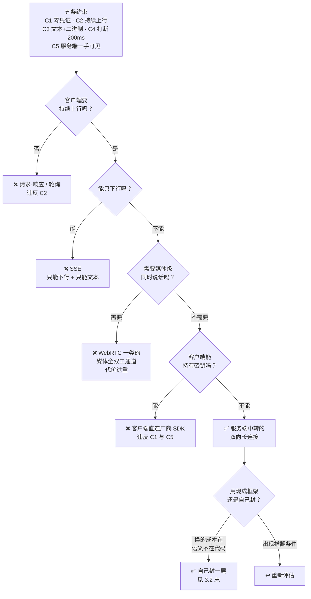

# WSS 系列 02 · 为什么是 WSS：从约束推出来的选型

**版本**：V1.0
**日期**：2026-09-11
**定位**：把"用 WebSocket"从一个决定还原成一次推导 —— 从五条硬约束出发，逐个淘汰候选方案。读完你能自己重推一遍，也能判断这套结论什么时候该被推翻。
**对应上游文档**：[81 系列导读](81_WSS系列_00_导读_全景图与术语表.md) · [82 ELI5](82_WSS系列_01_ELI5_一条语音的旅程.md)
**变更说明**：首版。V1.1：速查的推翻条件与正文 3.2 四条能力条件对齐。

---

## ① 本篇回答什么

**一个问题**：这条链路为什么是 WSS？以及 —— 为什么不用别人现成的东西？

**读完后你能**：

- 拿到任意一个"客户端和服务端要持续交换"的场景，判断它该不该上长连接、该上哪一种
- 说清 SSE 为什么在这类场景里不够用（这是最常被问到的一个）
- 说清"自研"在这套约束下买到的是什么，以及**什么条件下应该改回用现成的**

---

## ② 概念

**单向 / 双向。** 单向 = 只有一端能主动发。服务端推送（SSE、推送通知）是单向的：服务端随时能说话，客户端不行。双向 = 两端都能随时开口。WebSocket 是双向的。

**长连接 / 短连接。** 短连接 = 每次交换都重新建立（普通 HTTP 请求）。长连接 = 建一次，之后一直用。

**"轮次制"与"全双工"。** 这是两个容易混的东西，第 82 篇的主力话题，这里只重申一句：**双向不等于同时**。双向是"两端都能发"，全双工是"两端能同时发且信号会叠加"。语音对话要前者，不要后者。

**中转层（relay）。** 一个位于客户端和第三方服务之间的自家服务端进程。它的存在常常不是设计选择，而是某条硬约束推出来的必然结果。

---

## ③ 约束与推导

### 3.1 先把约束列出来

不要从"用什么技术"开始，从"什么东西不能动"开始。这套系统的硬约束有五条：

| # | 约束 | 性质 |
|---|---|---|
| **C1** | **客户端零凭证** —— 手机上一把第三方密钥都不放 | 硬约束，不可协商 |
| **C2** | 上行要**持续**送音频（每 20ms 一块） | 物理事实 |
| **C3** | 下行要同时送**文本**（增量字幕、事件）与**二进制**（音频） | 物理事实 |
| **C4** | 打断后声音必须在 **200ms 内消失** | 产品红线 |
| **C5** | 转录、事件、用量必须**在服务端一手可见** | 业务要求 |

注意 C1 和 C5 **不是技术偏好，是架构约束** —— 它们不讨论"哪种协议更好"，它们直接排除掉一整类方案。后面会看到，正是这两条把候选集砍掉了一大半。

### 3.2 逐个淘汰

先看整棵树，再看每一刀为什么落下：

#### ❌ HTTP 短轮询（说一句发一次请求）

违反 **C2**。每 20ms 一块音频就要一次请求，而每次请求都要重新建立连接、重新确认身份。**开销比载荷还大**，而且 C4 也满足不了：打断信号得排队等下一次请求。

#### ❌ HTTP 长轮询（挂住一个请求等回应）

违反 **C3**。长轮询能让服务端"推"一点东西，但它一次只能推一个响应。文本和音频这两种形态要在同一条逻辑流里保持**相对顺序**（见 84 的顺序契约），而长轮询每次响应都是独立的一次交换，顺序要自己造。

而且每次响应回来都要立刻再发一个请求续上 —— 那个空窗期里服务端**没有可以推的通道**。对流式增量来说，这就是一段一段的静默。

#### ❌ SSE（Server-Sent Events）

这是最常被问的一个，值得单独看。

SSE 长这样：客户端发一个普通的 HTTP 请求，服务端**不结束响应**，而是一块一块地往下写文本。浏览器有内置支持，服务端实现也简单。听起来非常合适 —— 那为什么不行？

它有三个**结构性**的缺口：

| 缺口 | 后果 |
|---|---|
| **只能下行** | C2 要求的持续上行音频**发不出去**。你得再开一条连接专门做上行 |
| **只能文本** | C3 的二进制音频要么 base64（体积 +33%），要么另想办法 |
| **两条连接要自己对上号** | 一旦为了上下行开两条连接，你就得自己保证"上行那条的第 N 轮"和"下行那条的第 N 轮"是同一轮 —— 而这本来是一条双向连接天然就有的性质 |

第三条是最要命的。它不是"多一点工作量"，是**把一条连接天然提供的一致性，换成了一个你必须自己维护的不变量**。而这类不变量正是最容易在重连、超时、乱序的时候悄悄失效的东西。

**结论**：SSE 适合"服务端单向推文本"的场景（通知、进度、日志流）。它不适合任何需要客户端**持续上行**的场景。

#### ❌ WebRTC / 全双工媒体通道

违反"最小代价"原则，而不是违反某条硬约束 —— 它**能**做，但你付的是**媒体级**的代价：回声消除（对方喇叭声被自己麦克风收回去）、混音、双路时钟同步、NAT 穿透。

而 C4 说的"打断后 200ms 内停声"**不需要**这些东西：它要的是"停掉本地播放 + 丢弃在途音频"，这在一个消息级的通道上就能做（见 87）。

**只有两端的声音要真的叠在一起时才付这个代价。** 一问一答不叠。

#### ❌ 裸 TCP / 自定义二进制协议

过度设计。你要自己实现帧边界、心跳、重连、TLS、代理穿越（很多企业网络只放行 443 上的 HTTP 系协议）。而 WebSocket 恰好就是"在 443 上伪装成 HTTP 的双向帧协议"—— 这些它都替你做了。

#### ❌ 客户端直连厂商 SDK

违反 **C1**（密钥上手机）与 **C5**（转录和事件必须服务端可见）。一票否决，不需要再讨论。

#### ❌ 第三方 WebSocket 框架（客户端侧的封装库）

这一条最微妙，因为它**不违反任何硬约束** —— 换上它，C1–C5 全都还满足。所以它不能靠约束淘汰，得靠成本判断。

判断的落脚点是：**换掉它，我实际买到了什么？**

- **语法糖。** 而这条链路的传输层本身不复杂：连接、收发、心跳、丢弃闸门。这部分代码量是可控的。
- **可靠性。** 这通常是最有说服力的理由 —— 但要去核实它到底给了什么。一个常见的发现是：重连、退避、恢复这些"可靠性"特性，文档里根本没写。
- **它替你挡掉的那层 API 差异。** 这一层在本项目里是**真实存在而且干净**的 —— 传输层有一个明确的协议接口，测试用的是内存实现，业务代码不直接碰 `URLSessionWebSocketTask`。也就是说：**将来真要换，替换点是现成的。**

所以结论是：**换的成本不在"改代码"，在"改语义"。** 新框架会把连接状态、错误分类、取消时机换成它自己的模型，而你依赖的那些行为（比如"关闭时要不要发最后一帧"）得逐条重新验证。

**推翻条件**（写下来，免得这条决定变成教条）。这四条是**能力性**的 —— 每一条都是"现有工具做不到某件事"，而不是"感觉不太行"：

| # | 触发条件 | 为什么它是硬条件 |
|---|---|---|
| **1** | 网关开始要求**载荷匹配的 pong** | 协议级 ping 的回执由库内部消化，应用层拿不到 —— 想校验载荷就没有着力点 |
| **2** | 需要**客户端证书 / 双向 TLS** | 这是握手层的能力，封装层给不了 |
| **3** | 原生实现出现**可证实的**缺陷 | 注意"可证实"三个字：**能复现的证据**，不是"感觉不太稳"。前者是条件，后者是情绪 |
| **4** | 需要**后台保活** | 系统挂起后的连接维持，超出应用层封装能管的范围 |

**一并写下不该推翻它的理由**，因为这一条比上面四条更容易被违反：

> **再引入一个重连实现，是这个决定最大的风险。**

自研的传输层里已经有一个重连逻辑了。再叠一个框架的，就成了**两个重连器都以为自己拥有同一条连接** —— 它们会互相取消、互相重建，而且这种竞争**不会稳定复现**，只在特定时序下咬人。

所以"框架自带重连"不是换掉自研的**理由**，恰恰是**最需要警惕的那一点**。

### 3.3 剩下的：双向长连接

五条约束过完，只剩一个形状：**一条服务端中转的双向长连接**。

而且它有个副产品：因为 C1 强制要求了中转层，这个中转层**顺带成了做可观测性、限流、成本记账的唯一位置**（C5 要的东西正好落在这里）。约束 C1 看起来是一条安全要求，实际上重排了整个架构 —— 这件事本身值得记住，见 89 的五维清单。

---

## ④ 本项目的落地

| 位置 | 实现 | 说明 |
|---|---|---|
| 客户端 | `URLSessionWebSocketTask`（Apple 原生） | 不引第三方框架。封装在 `URLSessionSocketTransport` 一个 actor 里，对上层暴露一个协议接口 |
| 网关 | `coder/websocket`（Go） | 服务端的 WebSocket 实现 |
| 网关地址 | `:8081`，路径 `/v1/voice` | 生产环境是 `wss://`，本地开发是 `ws://` |
| 上游 | 火山引擎 Duplex，`wss://` | 网关到上游**也是**一条 WebSocket —— 这条链路上有两条 |
| app-server | `:8080`，普通 HTTP | 网关向它持久化会话与用量 |

**分层**：客户端传输层只做"连接、收发、心跳、丢弃闸门"，业务语义全部在外面。这样做的直接好处是**传输层可以单独替换** —— 上面那条"推翻条件"才有意义，否则换传输层就是重写应用。

---

## ⑤ 代价与陷阱

**代价一：自研意味着这三件事得自己负责。**

选了自研，就等于接手了三件现成框架通常会替你做（或声称替你做）的事：

| 你要负责的 | 本项目的做法 | 见 |
|---|---|---|
| **连接保活** | 两条机制，一条探测对端死活、一条喂对端空闲超时 | 85 |
| **重连** | 客户端**至今没有真正的重连** —— 传输层接收出错即终结，由上层重建；这条路径未经验证 | 85 |
| **消息大小上限** | 库的默认上限很小（32 KiB），两侧都踩过；必须显式抬高 | 86 |

**代价二：库的默认值是"面向通用"，不是"面向你"。**

本项目两侧的读上限都被默认值坑过：`coder/websocket` 默认每帧最多读 32 KiB，而上游一条音频事件就超过这个数，**读一超限连接当场作废**。这个错误在两份真机日志里都出现过，只是被另一层"部分成功"的返回掩盖了，很久没人看见。

**教训**：引入任何传输库，第一件事是把它的**默认限制**列出来核对一遍。

**陷阱：本地开发和生产用的是两种 scheme。**

生产/开发构建走 `wss://`（TLS），但**本地构建是 `ws://`（明文）**。写文档、写测试、做安全判断时别把"加密"当成全称命题 —— 它是**部署环境的属性**，不是代码的属性。

---

## ⑥ 自检

1. 五条硬约束里，哪两条是**一票否决**性质的？它们各自否决了什么？
2. SSE 有三个结构性缺口，哪一个最要命？为什么它不是"多一点工作量"？
3. 为什么"两人同时打字"的协作编辑**不**需要 WebRTC？
4. 不引第三方 WebSocket 框架的核心理由是什么？（提示：不是"性能"）
5. 说出两条会让上面那个决定**应该被推翻**的条件。

---

## ⑦ 速查

| 项 | 值 |
|---|---|
| 结论 | 一条服务端中转的**双向长连接** |
| 客户端实现 | `URLSessionWebSocketTask`（原生，无第三方） |
| 服务端实现 | `coder/websocket` |
| 链路上一共几条 WSS | **两条**：手机↔网关、网关↔上游 |
| 生产 scheme | `wss://`（本地开发是 `ws://`，明文的） |
| 被 C1 一票否决的 | 客户端直连厂商 SDK |
| 被 C5 一票否决的 | 同上（转录与事件必须服务端可见） |
| SSE 的三个缺口 | 只能下行 · 只能文本 · 开两条连接要自己维护一致性 |
| 不用 WebRTC 的理由 | 不需要**媒体级**同时，而它要你付回声消除那一整套 |
| 自研必须自己负责的三件事 | 保活 · 重连 · 消息大小上限 |
| 推翻"不用第三方"的条件 | 网关要求**载荷匹配的 pong** · 需要**客户端证书 / 双向 TLS** · 原生出现**可证实的**缺陷 · 需要**后台保活**。不是"感觉不稳" |

---

**系列导航**

[导读](81_WSS系列_00_导读_全景图与术语表.md) · [ELI5](82_WSS系列_01_ELI5_一条语音的旅程.md) · **本篇** · [协议层](84_WSS系列_03_协议层_帧设计与版本化.md) · [iOS 传输层](85_WSS系列_04_iOS传输层.md) · [后端网关](86_WSS系列_05_后端网关.md) · [双工·流式·打断](87_WSS系列_06_双工_流式与打断.md) · [可观测性与健壮性](88_WSS系列_07_可观测性与健壮性.md) · [方法论](89_WSS系列_08_方法论_遇到同类场景怎么想.md) · [实践总结](90_WSS系列_09_实践总结_这套用法的问题与改进.md) · [认证·错误·降级](91_WSS系列_10_认证_错误与降级.md) · [怎么测试](92_WSS系列_11_怎么测试一条WSS链路.md) · [问题排查](93_WSS系列_12_问题排查手册.md) · [客户端状态机](94_WSS系列_13_客户端状态机_协议事件的消费者.md) · [轮次归属](99_WSS系列_18_轮次归属_顺序标识与三条时钟.md)
