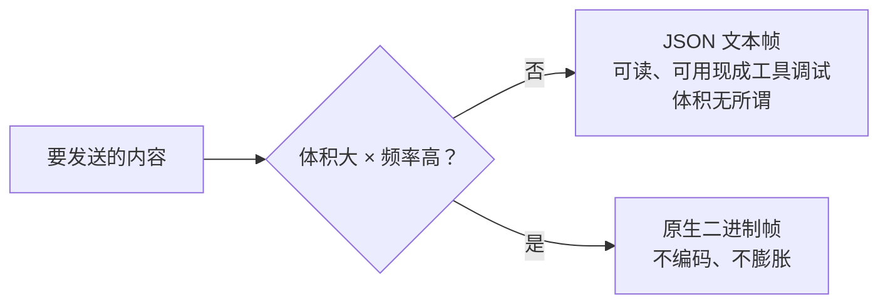
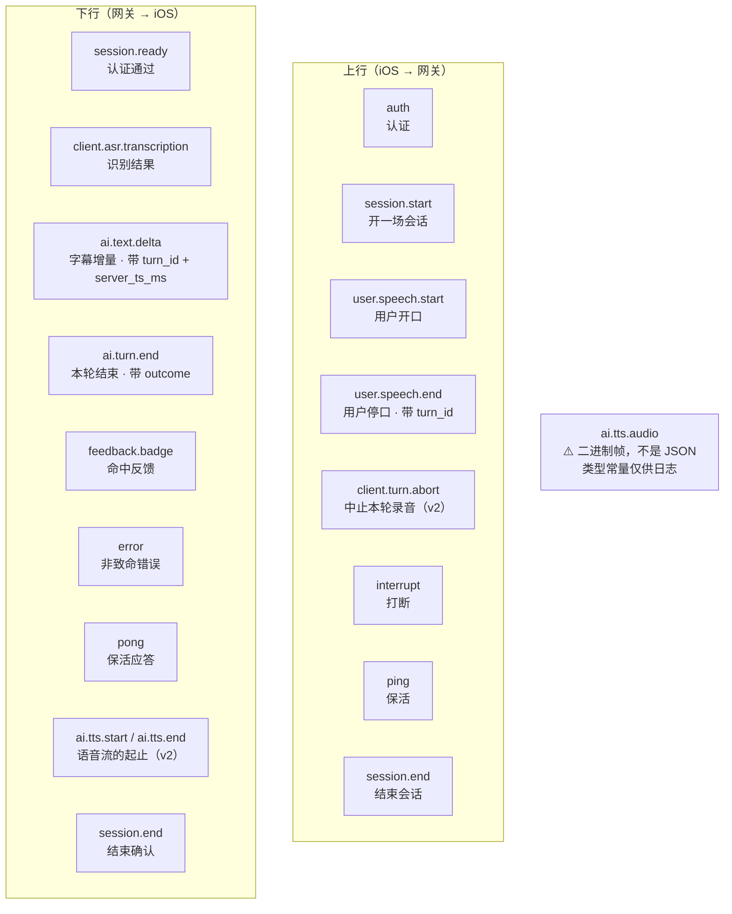
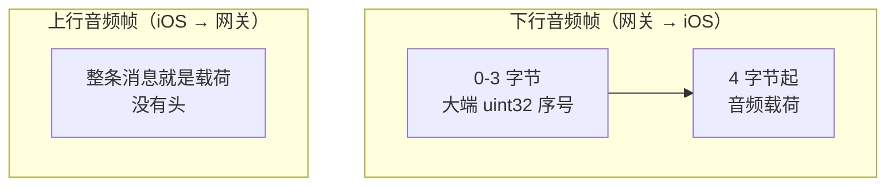
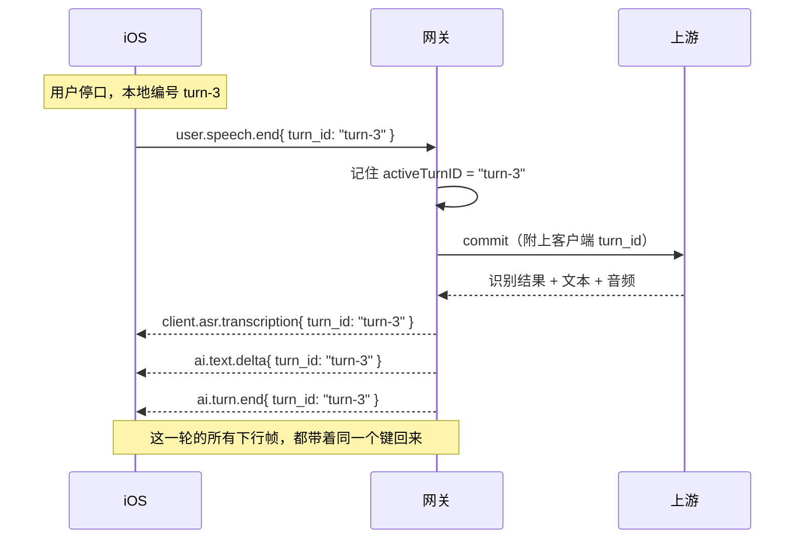
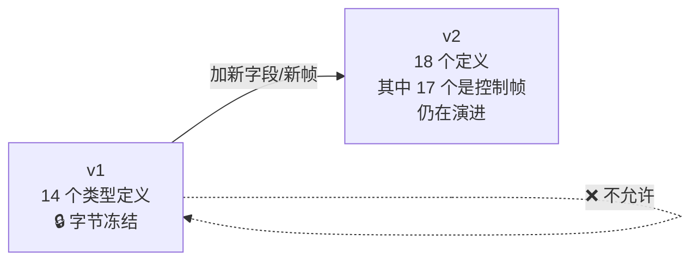
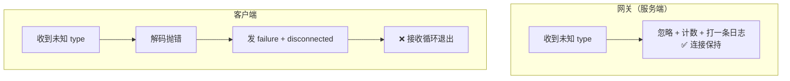
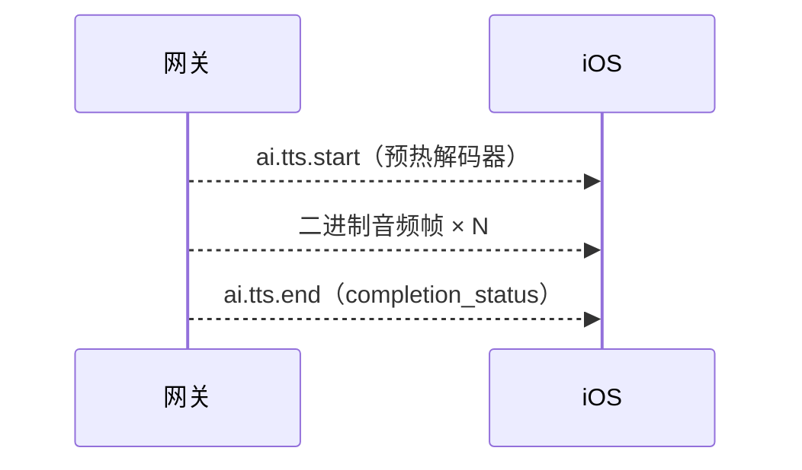
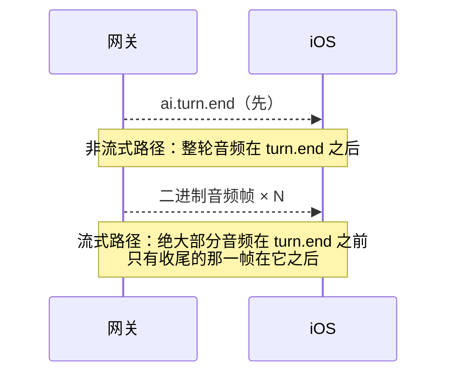

# WSS 系列 03 · 协议层：帧设计与版本化

**版本**：V1.0
**日期**：2026-09-11
**定位**：讲清这条 WSS 上跑的**所有**东西 —— 两种帧的形态、完整目录、贯穿全链路的关联键、版本化与前向兼容、以及顺序契约。
**对应上游文档**：[83 为什么是 WSS](83_WSS系列_02_为什么是WSS_选型推导.md)
**变更说明**：首版。规范真源是 `fluentwork-infra/schemas/transport/`；本篇**讲解**协议，**不定义**协议。V1.1：速查区分规范顺序与生产顺序；`ai.turn.end` 指向 94 的两种含义。

---

## ① 本篇回答什么

**一个问题**：这条连接上到底跑着哪些消息？它们怎么区分、怎么关联、怎么演进？

**读完后你能**：

- 看懂任何一条线上消息，说出它属于哪一类、属于哪一轮
- 判断一个新字段该加在哪个版本、会不会影响老客户端
- 说清"前向兼容"在这条链路上**实现了多少**（答案是：一半）

---

## ② 概念

**帧（frame）。** 一条 WebSocket 消息。本项目里分两种：**文本帧**（内容是 JSON）和**二进制帧**（内容是裸数据）。

**控制帧（control frame）。** 本系列特指**文本帧**里那些带 `type` 字段的 JSON —— 注意这跟 WebSocket 协议自己的"控制帧"（ping/pong/close）**不是一回事**。本系列说"控制帧"一律指前者。

**类型常量。** 每个控制帧的 `type` 字符串，比如 `ai.text.delta`。**一共 19 个** —— 其中 18 个是 JSON 控制帧，1 个是二进制。

**关联键。** 把属于同一次逻辑交互的消息拴在一起的字段。本项目叫 `turn_id`。

**版本化。** 协议本身带版本号（本项目是 v1 / v2），新字段只加在新版本上。

**前向兼容。** 收到不认识的消息时，**忽略它并继续**，而不是报错断开。这是让"服务端升级"不等于"老客户端全部掉线"的唯一办法。

---

## ③ 约束与推导

### 3.1 两种帧的边界，按"体积 × 频率"划

先看这条连接上要跑什么：

| 要跑的东西 | 特征 |
|---|---|
| 状态、事件、字幕增量、错误 | 小、可读性有价值、频率中等 |
| 音频 | 高频（每秒几十块）、体积大、二进制 |

于是分界很自然：

**为什么音频不能塞进 JSON？** 因为二进制要变成 JSON 里能放的东西（比如 base64），体积会**膨胀约三分之一**，而且两头各多一次编解码。这笔账在每秒几十块的频率下会直接变成带宽。

反过来，**控制消息也不该做成自定义二进制格式** —— 你会失去可读性，而它们的体积根本不需要优化。

### 3.2 完整帧目录

19 个类型常量。**方向按"谁构造并发送"定**：

**四条容易看错的**：

- `ai.tts.audio` 虽然有一个 `type` 常量，但它**是二进制帧**，不是 JSON 控制帧。所以 19 个常量里只有 18 个是真正的 JSON 类型。
- `ai.audio.chunk` 声明了，但**从来没有人发过或收过** —— 见 ⑤ 的"死面"。
- `ai.tts.start` / `ai.tts.end` 在 v2 里定义了，**但生产路径今天一个都不发**（刻意的）—— 见 3.7。上面这张目录图画的是**协议允许的形状**，不是**线上的实际流量**。
- `ai.turn.end` 在生产上有**两种意思**（开场 vs 答完），协议本身不携带区分信息，靠客户端本地计数器——见 [94](94_WSS系列_13_客户端状态机_协议事件的消费者.md)。帧目录里看不出来。

### 3.3 二进制的字节布局

两种二进制帧，**只有下行带头**：

**为什么上行不加头？** 因为它是流式推送的原始字节，网关收到直接转发给上游，不需要靠序号做什么判断。而**下行需要序号**，因为客户端要用它认出发送过期的音频（见 85 的水位线）。

**序号由服务端分配，客户端从不生成。**

### 3.4 `turn_id`：贯穿一切的那个键

一轮的关联键，全链路只有这一个。它的旅程：

> 图里画的是**哪些帧带这个键**，不是它们的先后顺序。实际到达顺序取决于走哪条路径 —— 流式之后文本增量可能**先于** ASR 中继到达，见 3.7。

**四条规则**：

1. **发起方生成。** 客户端用 `turn-1`、`turn-2`… 递增编号。
2. **音频帧上没有它。** 二进制帧里只有序号和载荷 —— 所以"哪一轮的音频"是靠**上下文**（当前活跃轮）判断的。
3. **服务端必须回声。** 网关从 `user.speech.end` 学到它，之后每一条该轮的下行帧都带上。不做这件事，客户端就只能靠猜上下文来归位 —— 而猜在并发下必然出错。
4. **服务端要有回退规则。** 客户端没给键时用什么代替？本项目有一条：客户端没给就回退到 `turn-<序号>` 这种服务端自造的形式。**回退是"能用"，不是"等价"** —— 它和客户端自造的命名一旦错位，跨层关联就对不上了。

### 3.5 版本化：v1 已经冻结，改动只能往 v2 走

**v1 是字节冻结的** —— 用哈希钉住，改动即测试失败。冻结的意义是：**老客户端永远不会因为服务端升级而看到不认识的 v1**。

v2 相对 v1 加了什么：

| 新增 | 为什么不能进 v1 |
|---|---|
| `client.turn.abort` 帧 | 新帧类型 |
| `ai.tts.start` / `ai.tts.end` 帧 | 新帧类型 |
| `ai.turn.end` 的 `outcome` / `log_id` 字段 | 新字段 |
| `ai.text.delta` 的 `server_ts_ms` 字段 | 新字段 |

**注意 `ai.tts.audio` 故意不在 v2 的类型清单里** —— 因为它是二进制，不属于"JSON 控制帧"这个集合。有一个测试专门钉住这一点。

**规矩是硬的**：新字段一律进新版本，**不要**为了省事刷新 v1 的哈希。冻结的成本是每次加字段要开新版本；不冻结的成本是某一天你改了 v1，而所有没升级的老客户端集体出错。

### 3.6 前向兼容：这条规则**只实现了一半**

**规则**：收到不认识的消息类型 → **忽略并计数**，不要报错、不要断连接。

这条在本项目的落地情况是不对称的：

**后果**：一个只加了新帧类型的服务端版本，**依然能让所有老客户端掉线**。这和当年"未知帧把活会话打死"是**同一类事故**，只是搬到了另一端。

这条不对称是这套协议目前最值得注意的一处风险。它也给出一条通用教训：

> **"我们遵守了前向兼容"是一个必须逐端核实的说法，不是一个可以整体宣称的属性。**

### 3.7 顺序：**规范写了一套，生产跑的是另一套**

这是本篇最值得警惕的一处 —— 它是一份"规范与现实分叉"的活样本。

**v2 规范里定义了一套语音流的三段式：**

规范要求：`ai.tts.start` 在音频之**前**（用于预热解码器），`ai.tts.end` 在最后一块音频之**后**；同一时刻只允许一段活跃的语音流，不交错。

**但生产路径今天一个 `ai.tts.start` 都不发。**

这不是遗漏，是**刻意的** —— 音频以**朴素二进制帧**直接下发，不带那对 start/end。原因在下游：客户端只有在见过 `ai.tts.start` 之后才会把二进制帧交给那套 TTS 解码流程，而当前绑定的解码器**只记录、不真正驱动播放**。不带 start，客户端就会走另一条**真正会出声**的路径。

**于是实际顺序是这样的：**

**也就是说：讨论"`ai.tts.*` 与 `ai.turn.end` 的相对顺序"时，要先问是哪一套路径。** 而两套路径的顺序是**相反**的。

**三条可迁移的教训：**

1. **"规范里有"不等于"线上会发"。** 一份协议文档描述的是**允许**的形状，不是**实际**的流量。要判断线上跑的是哪一套，只能看生产代码。
2. **`ai.tts.start` 的缺失是有原因的，不是 bug。** 把"生产没发这个帧"当成缺陷去"修"，会让客户端走回一条不出声的路径 —— 这是最坏的一种修复。
3. **同一个协议里可以同时存在两套顺序**，只要消费方能区分它们。但代价是：任何写"顺序契约"的文档都必须**分别写**，否则读者会把其中一套当成全部。

---

## ④ 本项目的落地

| 位置 | 文件 |
|---|---|
| 帧定义与常量（服务端） | `internal/voiceproto/frames.go` |
| 帧解码（客户端） | `WSControlFrame.swift`（手写的 `Codable`，因为线上的判别字段是 `type` 字符串而不是 Swift 的类型名） |
| 二进制帧编解码 | `WSAudioFrameCodec.swift`（客户端）· `frames.go` 的 `AITTSAudio`（服务端） |
| **规范真源** | `fluentwork-infra/schemas/transport/wss-control-frames-v{1,2}.json` |

**规范真源在 infra 仓，不在本系列，也不在任一运行时仓。** 运行时仓保留镜像副本供测试与打包，但**所有共享 schema 的改动必须先落在 infra**，再向外同步。本地镜像的存在是为了让测试能在不跨仓的情况下跑起来，不是第二份真源。

---

## ⑤ 代价与陷阱

**陷阱一：死面 —— 声明了但没人用。**

扫描协议，发现两处"声明了却从不产生、从不消费"的东西：

| 死面 | 状态 |
|---|---|
| `ai.audio.chunk` 帧类型 | 后端从不生产也不消费。**但它已经躺在 v1 和 v2 两个冻结/半冻结的 schema 里** —— 也就是说，现在想删都难 |
| `interrupt` 帧的 `max_seq` 字段 | 全后端**只出现在声明处一次**，没有任何地方读它。同样在两侧 schema 里 |

**它们的代价不是性能，是误导**：后来的实现者会照着它们写对接代码，然后发现对端根本不发。**这种负债在协议层比在代码层更难清** —— 因为协议一旦发布并冻结，删字段就是破坏性变更。

**陷阱二：`ai.tts.audio` 有类型常量，但它不是 JSON。**

它的 `type` 常量**只用于日志**。如果有人照着"19 个类型常量"去写一个 JSON 解析器的分发表，会在这一个上出错。已有一个测试专门钉住"它的 JSON 拼写不是控制载荷"。

**陷阱三：`turn_id` 不在音频帧上。**

于是"这段音频属于哪一轮"只能靠**当前活跃轮**推断。这在正常轮次里没问题，但在一轮被中止、下一轮立刻开始的时候，就是一个需要小心的边界。

---

## ⑥ 自检

1. 19 个类型常量里，有几个是真正的 JSON 控制帧？那一个例外是什么？
2. 上行音频帧和下行音频帧的字节布局差在哪？为什么会有这个差别？
3. `turn_id` 由谁生成？音频帧上有它吗？如果没有，客户端怎么知道音频属于哪一轮？
4. v1 为什么要字节冻结？如果有人想加一个字段，正确做法是什么？
5. 前向兼容规则在本项目**实现了多少**？没实现的那一半会导致什么后果？
6. `ai.tts.start` → 音频 → `ai.tts.end` → `ai.turn.end` 这个顺序，和"流式音频会先于 `ai.turn.end` 到达"矛盾吗？

---

## ⑦ 速查

| 项 | 值 |
|---|---|
| 类型常量总数 | 19（18 个 JSON + 1 个二进制） |
| 二进制帧头 | 4 字节大端 `uint32` 序号 + 载荷 |
| 上行音频帧头 | **无** —— 整条消息就是载荷 |
| 关联键 | `turn_id`，客户端生成，服务端每条相关下行都回声 |
| 关联键不在哪 | 二进制音频帧上（只有序号） |
| 版本 | v1：14 个定义，**字节冻结** · v2：18 个定义（17 个控制帧 + 1 个二进制），演进中 |
| `server_ts_ms` 在哪 | **只在** `ai.text.delta`，**只在** v2，可选 |
| 前向兼容 | 服务端 ✅ 忽略并计数 · 客户端 ❌ 断连接 |
| 顺序契约（规范） | `ai.tts.start` → 音频 → `ai.tts.end` → `ai.turn.end` |
| 顺序契约（生产） | **无** start/end；流式音频大部分在 `ai.turn.end` **之前**（见 3.7） |
| `ai.turn.end` 的两种意思 | 开场 vs 答完；靠客户端本地计数器区分，见 94 |
| 规范真源 | `fluentwork-infra/schemas/transport/` |
| 已知死面 | `ai.audio.chunk` 帧类型 · `interrupt.max_seq` 字段 |

---

**系列导航**

[导读](81_WSS系列_00_导读_全景图与术语表.md) · [ELI5](82_WSS系列_01_ELI5_一条语音的旅程.md) · [为什么是 WSS](83_WSS系列_02_为什么是WSS_选型推导.md) · **本篇** · [iOS 传输层](85_WSS系列_04_iOS传输层.md) · [后端网关](86_WSS系列_05_后端网关.md) · [双工·流式·打断](87_WSS系列_06_双工_流式与打断.md) · [可观测性与健壮性](88_WSS系列_07_可观测性与健壮性.md) · [方法论](89_WSS系列_08_方法论_遇到同类场景怎么想.md) · [实践总结](90_WSS系列_09_实践总结_这套用法的问题与改进.md) · [认证·错误·降级](91_WSS系列_10_认证_错误与降级.md) · [怎么测试](92_WSS系列_11_怎么测试一条WSS链路.md) · [问题排查](93_WSS系列_12_问题排查手册.md) · [客户端状态机](94_WSS系列_13_客户端状态机_协议事件的消费者.md)
