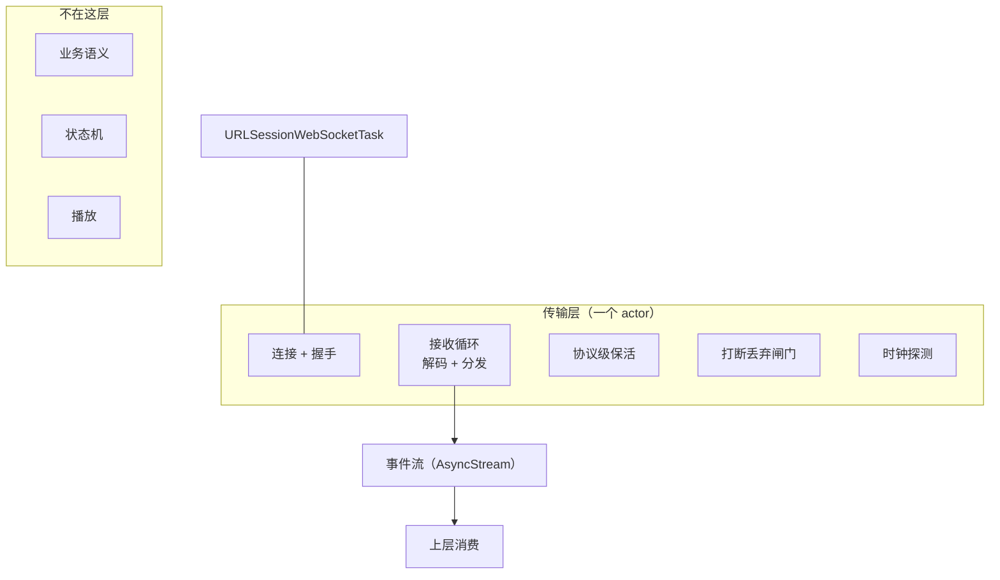
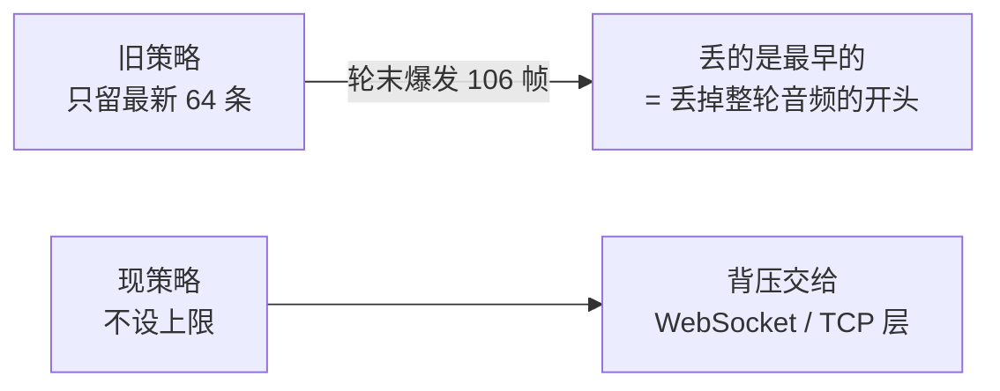
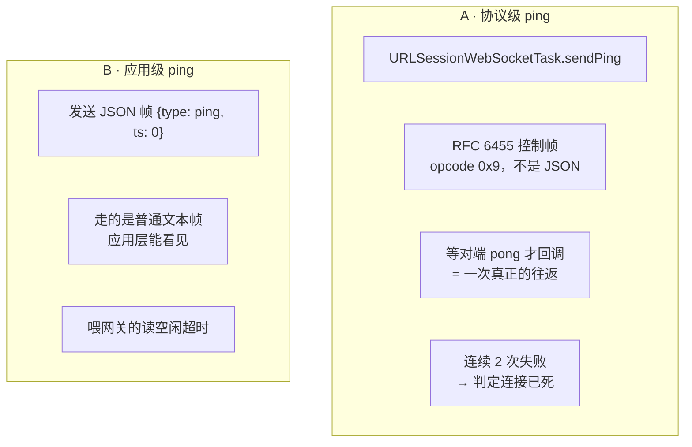
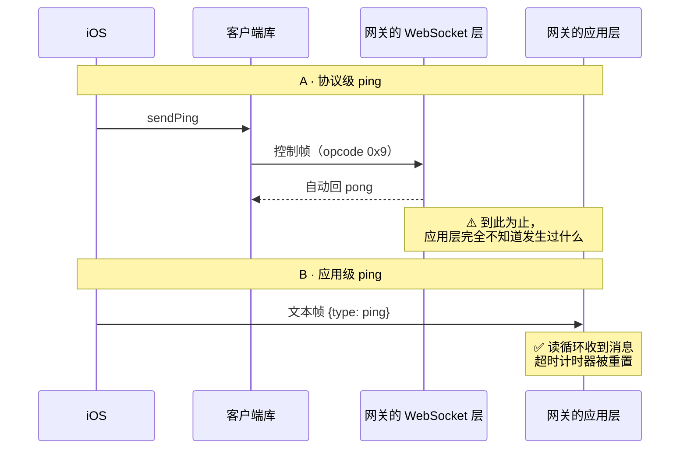
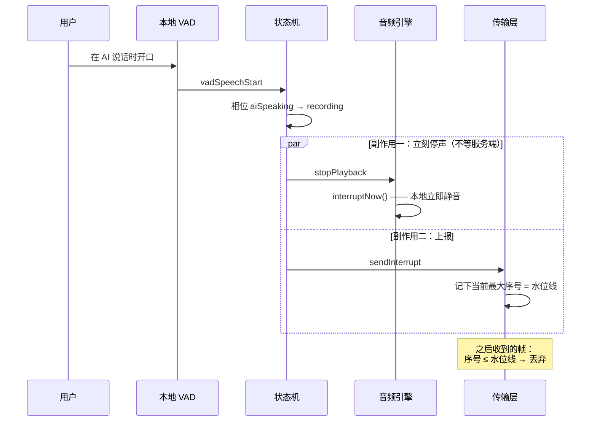
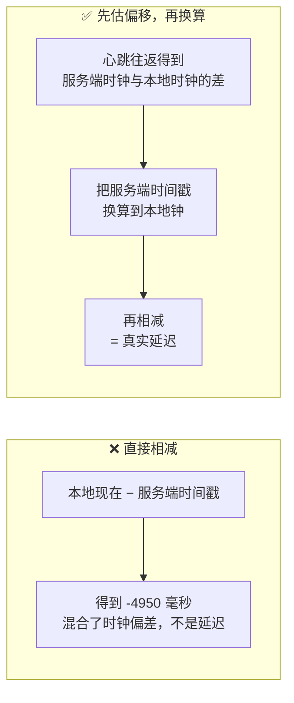
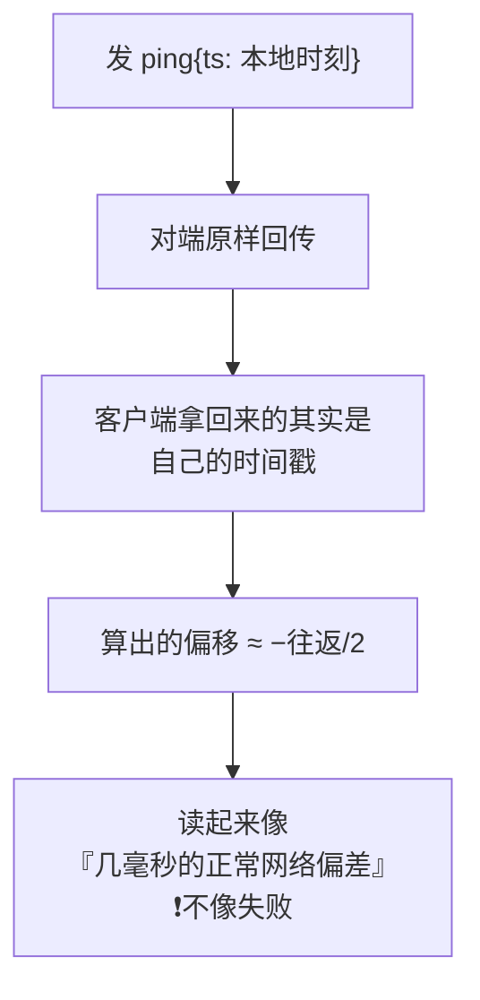
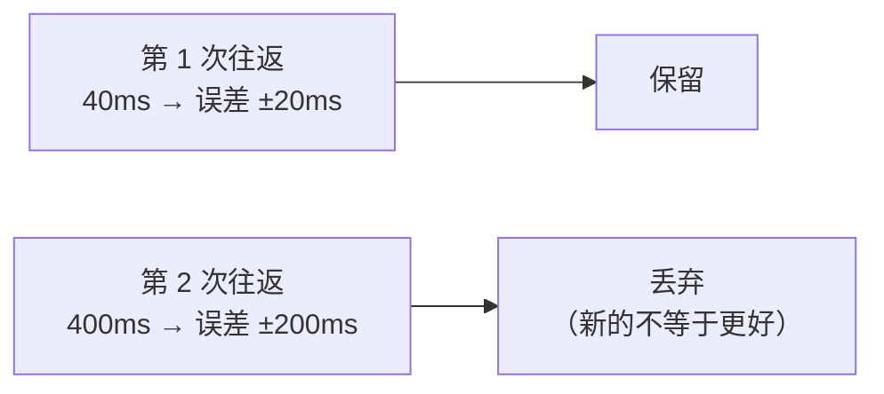

# WSS 系列 04 · iOS 传输层

**版本**：V1.0
**日期**：2026-09-11
**定位**：手机这一端。连接怎么建、事件怎么流上来、**两条保活各自在保什么**、打断怎么让声音立刻停、以及为什么"服务端时间戳"不能直接用。
**对应上游文档**：[84 协议层](84_WSS系列_03_协议层_帧设计与版本化.md)
**变更说明**：首版。本篇的"两条保活"一节是**此前没有任何文档完整写过**的内容。

---

## ① 本篇回答什么

**一个问题**：手机上这个传输层，到底在管哪些事？

**读完后你能**：

- 说清这一层负责什么、**不**负责什么
- 讲清两条都叫 ping 的机制各自的职责，以及**为什么删掉任何一条都会坏、坏得还不一样**
- 说清"打断"在客户端是怎么让声音在 200ms 内消失的
- 理解为什么"服务端给了时间戳"≠"你能算出延迟"

---

## ② 概念

**actor。** Swift 的并发隔离单位：同一时刻只有一个任务能碰到它的可变状态。传输层整个是一个 actor —— 连接、任务句柄、各种计数器都靠它保证不被并发改坏。

**事件流（`AsyncStream`）。** 传输层把收到的每一条消息推进一个流，上层用一个循环消费。**这个流是单消费者的** —— 这个性质后面会引出一个重要设计。

**背压（backpressure）。** 消费速度跟不上生产速度时怎么办。三个选项：丢弃、阻塞、缓冲。**没有普适的正确选择** —— 取决于被丢的数据能不能重建。

**水位线（watermark）。** 打断发生时记下的音频序号。序号 ≤ 水位线的帧一律丢弃。

---

## ③ 约束与推导

### 3.1 这一层负责什么



**关键的分界**：这一层只做**管道**该做的事 —— 连接、收发、保活、丢弃。它不知道什么叫"一轮对话"，也不知道 `ai.turn.end` 意味着什么。**业务语义全部在外面。**

这个分界不是洁癖，它有实际价值：**传输层可以单独替换**（83 篇那条"推翻条件"才有意义）。

### 3.2 背压：为什么选了"不丢"

先看曾经踩过的坑。事件流原本用的是"只保留最新 N 条"的策略（N=64）—— 看起来很合理：消费慢了就丢旧的，保证不积压。

**实测结果是 200 帧进、64 帧出。**

为什么会这样？**当时**网关是把一轮的音频**攒在轮末一次性推下来**的 —— 一条 10 秒的回复大约 106 帧，瞬间灌进来。而 64 这个界限，恰好在这种爆发下开始丢。

> 音频改成**边生成边发**之后（见 87），这个"轮末爆发"的成因已经不存在了。但**这个决定仍然成立**：它当时的依据是真实的，而且"不设上限"在任何到达节奏下都不会丢东西。**别因为成因消失了就回头去收紧它** —— 那等于把一个已经被证明会咬人的界限重新装回去。

**更糟的是这条流上不只有音频。** `ai.turn.end`、`error`、`feedback.badge` 走的是**同一条流**。丢掉一个 `ai.turn.end`，客户端就会**永远停在"处理中"**；丢掉一个 `error`，会话就卡在一个没人知道的状态。

所以改成了**不设上限**：



**这句注释值得记住**：*"背压应该属于 WebSocket/TCP 层，而不是属于一个会静默丢弃整轮的缓冲区。"*

TCP 本身就有流量控制 —— 消费不过来时，它会反压发送方。**那才是背压该发生的地方**：发送方减速，而不是接收方偷偷把数据扔掉。

### 3.3 两条保活 —— 本篇最重要的一节

这条链路上有**两个都叫 ping** 的机制，间隔都是 30 秒，看起来完全重复。它们**不是**。



**它们解决的是两个不同的问题：**

| | A · 协议级 | B · 应用级 |
|---|---|---|
| **回答的问题** | 对端**死了吗**？ | 对端**会不会把我超时**？ |
| **机制要求** | 需要**往返**（发出去、对方回没回） | 只需要**定期有上行流量** |
| **失败时** | 计一次失败，连续 2 次 → 断开 + 上报 | **错误被吞掉**，什么都不发生 |
| **对端看得见吗** | **看不见** —— 见下 | 看得见，是一条普通 JSON |

### 为什么不能合并 —— 决定性的一条

**A 到不了服务端的应用层。**

WebSocket 库在**自己的读循环内部**就把 ping/pong 处理掉了：收到 ping 自动回 pong，**不会把它交给上层代码**。而网关的读空闲超时是**在读循环里计时的** —— 它只认"有消息到达"。

于是：



**所以 A 喂不到那个计时器。** 而 B 因为把错误吞了，也当不了存活探测。

**删任何一条都会坏，而且坏得不一样**：

- 删 A → 失去**唯一**的存活探测。半开连接上发送可能一直"成功"，只有真正的往返能证明对端还在。
- 删 B → 失去**唯一**喂网关超时的输入。网关会开始按 2 分钟空闲回收会话。

**这个分工一度没有写在任何地方** —— 两条都叫 ping、间隔还都是 30 秒，下一个"整理"代码的人很容易判定其中一条是冗余的。

> **顺带一个产品问题**：B 的存在让网关那个 2 分钟空闲回收机制**永远不会触发**。用户打开房间放下手机，会话会一直挂着。这是不是想要的行为是产品判断，但今天的事实是：B 让它不可能发生。

### 3.4 打断：200ms 内让声音消失



**三个要点：**

1. **本地先停，不等服务端确认。** 200ms 这个指标只有端上做得到 —— 一个来回的网络时间就可能超过它。
2. **水位线是第二道闸。** 停播之后，**已经在路上的**音频还会继续到达。没有水位线，用户就会听到"停了一下又冒出一句"。水位线让这些帧在到达引擎之前就被丢掉。
3. **服务端什么都没做。** 那个 `interrupt` 上行到网关后只留下一条日志（见 87）。**"打断"是客户端的事实，不是对话的事实。**

### 3.5 水位线的生命周期错配

水位线有一个设计上的错配，值得单独说：

| | 它要解决的问题 | 它实际的生命周期 |
|---|---|---|
| 水位线 | **单轮**：丢掉被打断那一轮的在途音频 | **整条连接**：一旦设下，直到连接重建才清除 |

也就是说，**一个轮级别的需求，被给了一个连接级别的生命周期**。

在正常情况下这不显形。但当**音频序号发生回退**时，它就变成灾难：水位线停在几百，而新的序号从 1 重新开始 —— **之后每一帧都被丢弃，整场永久静音，而且不报错**（文字走另一条路径，所以照常显示）。这个失效模式已经发生过一次并由"序号跨重开承接"修掉了（见 86），但**错配本身还在**。

**这是本项目最典型的一类错误**：不会自己暴露。音频没了，但文字正常、连接正常、没有任何错误上报。

### 3.6 时钟偏移：为什么服务端时间戳不能直接用

线上有一条帧带着服务端的墙上时钟（`server_ts_ms`，见 84）。看起来把"本地现在"减掉它，就是延迟。

**不是。** 两台机器的时钟没有关系，你量到的是**时钟差混合着延迟**：



**偏移怎么来**：让对方把**它自己的时钟**发过来，和本地时刻配对：

```
偏移 = 服务端的时刻 − (本地发送时刻 + 往返/2)
误差 = 往返 / 2
```

注意那个**误差**不是装饰。往返 400ms 时误差棒是 ±200ms —— 这个误差可能比你要测的改善还大，那这个数字就不该被引用。

### 最需要防的那个错法：回显

估偏移这件事有一个**不会自己暴露**的错误做法。

协议约定：对端收到心跳后，会把心跳里的时间戳**原样回传**；但如果那个值是 0，它会**换成自己的时钟**。

于是如果客户端老老实实发自己的时间戳：



**为什么这个错法危险**：它产出的不是一个明显的垃圾值，而是一个**看起来完全合理的几毫秒偏差**。你不会发现它是错的。

**本项目的对策不是"检测并报告"，而是让这个错误写不出来**：把"心跳必须带 0"这条规则收进**唯一那个出口**做归一化，调用方想发错都发不出去。守在最外层的一条测试，比散落在十个调用点的注释可靠得多。

### 3.7 偏移必须"留最紧的"，不是"留最新的"

每一次往返都给出一个偏移估计和一个误差范围。真值落在**每一个**估计的范围内，所以**范围最小的那个钉得最准**。



**新样本只能靠"更快"取胜，不能靠"更晚"。**

而且**重连之后必须丢掉旧偏移** —— 新连接可能落在另一台机器上。留着旧偏移，所有数字都会错，而且**不会看起来错**。

---

## ④ 本项目的落地

| 职责 | 文件 |
|---|---|
| 传输层本体（actor） | `URLSessionSocketTransport.swift` |
| 协议接口与事件定义 | `SocketTransport.swift` |
| 控制帧编解码 | `WSControlFrame.swift` |
| 二进制帧编解码 | `WSAudioFrameCodec.swift` |
| 丢弃闸门与水位线 | `AudioFrameDropGate.swift` |
| 时钟探测 | `ClockOffset.swift`（`ClockProbe` / `ClockOffsetEstimator`） |
| 测试替身 | `InMemorySocketTransport.swift` —— **音频注入走和生产同一条丢弃闸门**，所以打断行为是保真的，不是假装的 |

---

## ⑤ 代价与陷阱

**陷阱一：`receiveLatency` 量错了区间。**

有一个埋点声称测量"从 `receive()` 返回到处理完成"的耗时。但实现里，**起点采样在 `await` 之前** —— 于是它量到的主要是"socket 干等下一帧的时间"，而真正的处理开销**完全没被计入**。

后果：一次爆发边界会得到一个很大的样本，而爆发内部全是接近零的样本。数字看着合理，含义完全不是它声称的那个。

**这是"注释说了一件事、代码做了另一件事"的典型**，而它比崩溃更难发现 —— 崩溃有人报，错的埋点只会让所有基于它的判断偏掉。

**陷阱二：没有真正的重连。**

接收循环出错即终结，由上层重建。而**重建路径未经验证**。同时，配置里那个"重连窗口"参数**存了但从来没被读过** —— 实际生效的窗口硬编码在别处。两个默认值数值相同，但**没有连在一起**，改一个不会影响另一个。

**陷阱三：一批"写了但没人用"的残留。**

| 残留 | 状态 |
|---|---|
| 连接状态里的 `reconnecting` | **从未被发出过** |
| 两个错误类型（无效 URL / 握手失败） | **从未被构造过** |
| 水位线的 `clearInterrupt()` | **生产代码零调用** —— 一旦设下，整条连接期间永不清除（这正是 3.5 那个错配） |
| 占位传输实现 | **全仓零调用** |

单独看每一个都无害。合起来的效果是：**读代码的人会以为系统有某些能力，而实际上没有。**

**陷阱四：连哪个地址是**服务端说了算**，不是客户端常量说了算。**

客户端里确实有一组按环境分档的地址常量，但有两个反直觉的事实：

1. **真正连的地址不来自那组常量。** 会话创建接口返回一个 `wss_url` 字段，客户端连的是**它**（`DefaultSpeechSessionClient` 用 `created.wssURL`）。那组客户端常量里，与它对应的那个属性**在整个 App 里只有一处引用，而且是个测试**。
2. **其中一档环境常量是不可达的。** 当前环境的选取逻辑在调试构建下恒返回"本地"、否则恒返回"生产" —— 中间那一档**永远不会被选中**。

**所以"加密还是明文"是一个部署属性**，由服务端配置决定，不在这份代码里。读这份代码判断安全性会得出错误结论 —— 那是这个陷阱的真正形状：**变量的名字描述的是意图，连接的地址来自别处。**

---

## ⑥ 自检

1. 传输层**不**负责什么？说出至少两件属于上层的事。
2. 事件流为什么改成了"不设上限"？举出两个会因为丢弃而出问题的消息类型。
3. 两条保活各回答什么问题？**决定性的一条**是：为什么协议级 ping 喂不到网关的超时计时器？
4. 打断时，客户端做了哪两件事？水位线是其中哪一件的一部分？
5. 为什么"发一个带本地时间戳的心跳"会产生一个看起来合理的错误结果？项目怎么防住它？
6. 偏移估计为什么保留"往返最短的"而不是"最新的"？

---

## ⑦ 速查

| 项 | 值 |
|---|---|
| 实现 | `URLSessionWebSocketTask`，封在一个 actor 里 |
| 事件流策略 | **不设上限**（曾是"只留最新 64"，实测 200 进 / 64 出） |
| A · 协议级 ping | 30s，阈值 2 次 → 断开；**唯一的存活探测** |
| B · 应用级 ping | 30s，发 `ts: 0`；**唯一喂网关空闲超时的输入** |
| 为什么不能合并 | 库把 ping/pong 在内部消化了，A **到不了**服务端的应用层 |
| 打断 | 本地立即停播 + 上行 `interrupt`（服务端空操作） |
| 200ms 怎么做到 | 端上做，不等服务端确认 |
| 水位线生命周期 | 整条连接 —— **而它要解决的问题是单轮的**（已知错配） |
| 时钟偏移 | `偏移 = 对端时刻 − (本地发送 + 往返/2)`，误差 = 往返/2 |
| 保留策略 | **往返最短的**，不是最新的 |
| 回显陷阱 | 带本地时间戳的心跳会回显 → 得到"看似正常的几毫秒偏差" |
| **已知未修** | `receiveLatency` 量错了区间 · 无重连 · 一批零调用残留 |

---

**系列导航**

[导读](81_WSS系列_00_导读_全景图与术语表.md) · [ELI5](82_WSS系列_01_ELI5_一条语音的旅程.md) · [为什么是 WSS](83_WSS系列_02_为什么是WSS_选型推导.md) · [协议层](84_WSS系列_03_协议层_帧设计与版本化.md) · **本篇** · [后端网关](86_WSS系列_05_后端网关.md) · [双工·流式·打断](87_WSS系列_06_双工_流式与打断.md) · [可观测性与健壮性](88_WSS系列_07_可观测性与健壮性.md) · [方法论](89_WSS系列_08_方法论_遇到同类场景怎么想.md) · [实践总结](90_WSS系列_09_实践总结_这套用法的问题与改进.md) · [认证·错误·降级](91_WSS系列_10_认证_错误与降级.md) · [怎么测试](92_WSS系列_11_怎么测试一条WSS链路.md) · [问题排查](93_WSS系列_12_问题排查手册.md) · [客户端状态机](94_WSS系列_13_客户端状态机_协议事件的消费者.md)
