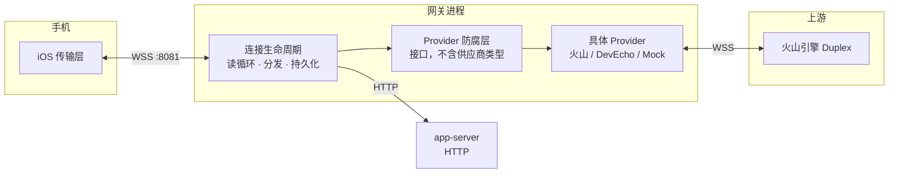
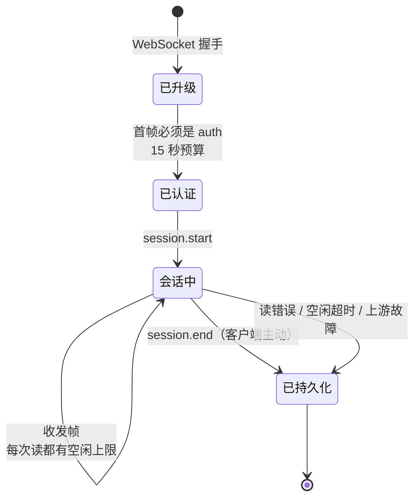
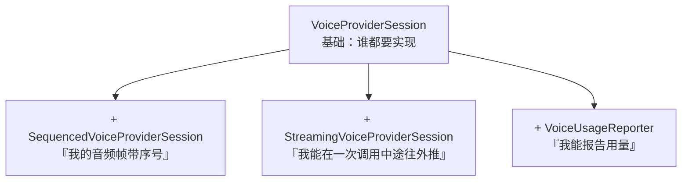
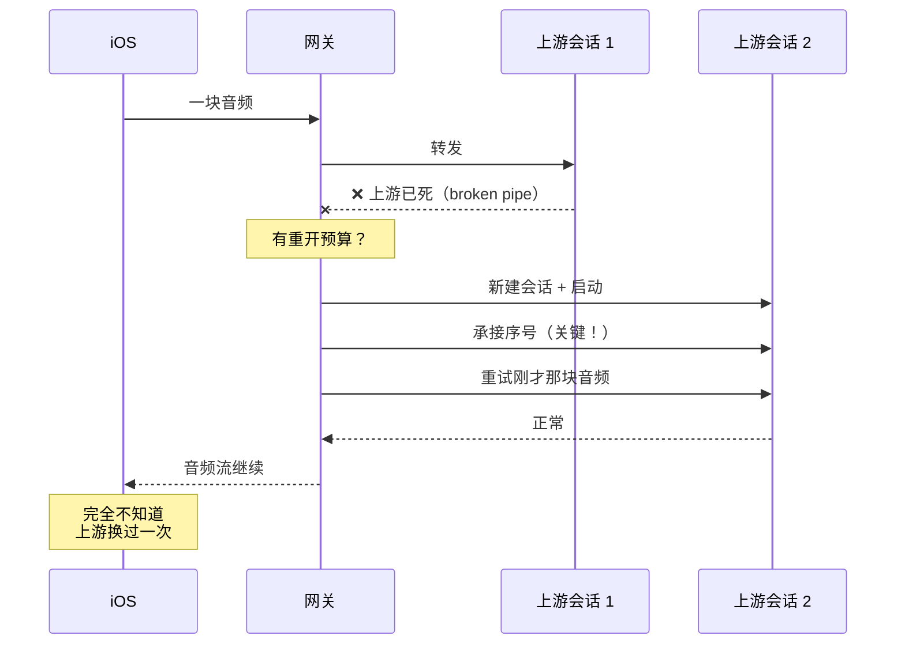
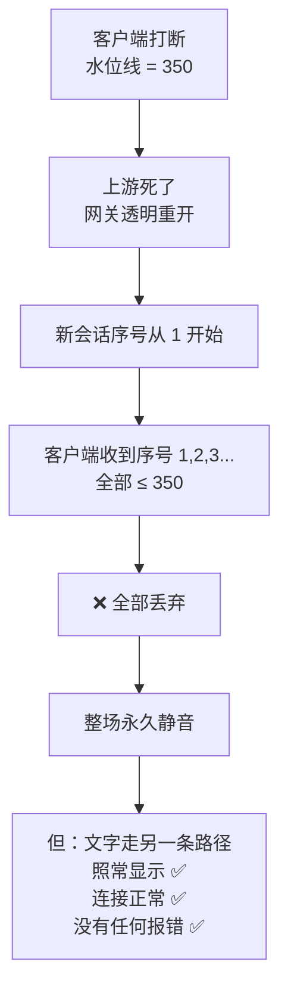
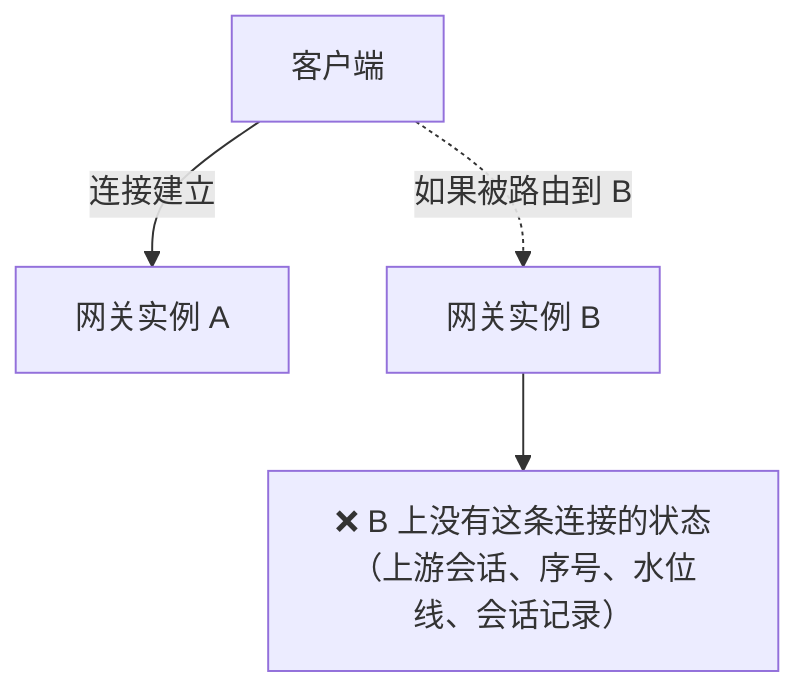
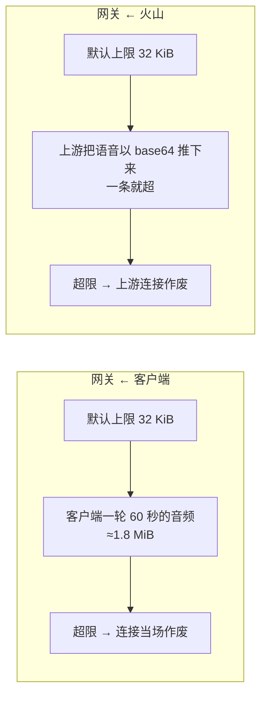

# WSS 系列 05 · 后端网关

**版本**：V1.0
**日期**：2026-09-11
**定位**：服务端这一端。连接怎么活、消息怎么分发、**供应商怎么被隔在外面**、上游死了怎么不让客户端察觉，以及"序号承接"这个不报错却致命的坑。
**对应上游文档**：[85 iOS 传输层](85_WSS系列_04_iOS传输层.md)
**变更说明**：首版。

---

## ① 本篇回答什么

**一个问题**：网关收到一条连接之后，到底做了什么？

**读完后你能**：

- 讲清一条连接从建立到销毁的完整生命周期
- 说清"防腐层"在这里具体挡掉了什么，以及为什么是**三个**接口而不是一个
- 理解"透明重开"—— 上游断了但客户端不知道 —— 是怎么做到的，以及它差点怎么把整场声音弄没
- 说出两个"每次赋值都必须重接"的接线点，以及漏接的后果

---

## ② 概念

**网关（gateway）。** 手机唯一直接对话的服务端进程。它**不编排对话** —— 不调 ASR、不调 LLM、不调 TTS，只做接入、转发、记账。

> 一个精确化的地方：说它"不参与内容"是不准的。网关**确实**在旁路上做了一件事 —— 拿转录文本去跑**命中检测**（判断用户是否用上了目标表达），然后推一条反馈帧。但它是**旁路**：有超时预算、超时就跳过，绝不影响主链路。所以界线不是"碰不碰内容"，而是**"在不在主链路上"**。

**防腐层（anti-corruption layer）。** 网关与上游供应商之间的接口层。它的存在是为了让供应商的类型、概念、错误**不渗进**网关的业务代码。

**透明重开（reopen）。** 上游连接死了之后，网关**在不告诉客户端的前提下**换一个新的上游会话，让对话继续。客户端完全察觉不到。

**读空闲超时。** 网关对每一次"读"设的时间上限。超时即认为对端不再说话，连接结束。

---

## ③ 约束与推导

### 3.1 先看全貌：三层与一条边界



**那条边界就是防腐层。** 网关的连接逻辑**从不 import 供应商类型** —— 它只认接口。这样做的收益很直接：**本地开发可以换一个不花钱、不联网的 Provider**，而连接逻辑一行都不用改。

### 3.2 连接的完整生命周期



**几个推导出来的细节：**

**① 首帧必须是 `auth`，而且有 15 秒预算。** 一个连接在认证之前不能做任何事 —— 否则它就是一个匿名可用的资源。预算防止"连上就不说话"的连接占着不放。

**② 空闲超时是"每次读"的，不是"整个连接"的。** 每轮循环都重新起一个计时器。所以只要**有**消息到达（任何消息），计时器就重置。**这正是 85 篇那条应用级保活存在的理由** —— 它是唯一能重置这个计时器的输入。

**③ 退出时一定要持久化。** 客户端正常结束会走 `session.end`；但连接异常断开（上游故障、空闲超时、网络断）**不会有那个帧**。如果只管前者，那么"被上游故障杀掉的会话会丢掉全部对话记录"—— 没有落库、没有后续处理、什么都留不下。

### 3.3 原子性的一个细节：持久化要用"去掉取消的上下文"

连接断开时，它的 `context` 已经被取消了。如果直接用这个 context 去调用持久化，调用会在**发出进程之前**就失败 —— 因为 context 一进去就是已取消状态。

做法是：**保留 context 里的值（日志字段等），但去掉它的取消信号**。同一手法在关闭上游连接时也要用一遍 —— 否则每次异常退出都会**泄漏一条上游连接**。

**这条值得抽出来**：任何"在失败路径上做清理"的代码，都要检查自己用的 context 是不是已经被同一次失败取消了。

### 3.4 防腐层：为什么是三个接口而不是一个

基础接口定义了"一个供应商会话能做什么"（启动、收控制帧、收音频、快照、关闭）。另外三个是**可选能力** —— 供应商**按需实现**：



**为什么不做成一个胖接口？**

因为**能力是分层的，而实现成本不同**：本地的 Mock 与 DevEcho 两个能力都没有；生产那个三个都有。做成一个胖接口，本地 Provider 就得实现一堆空方法 —— 而**空方法是最危险的实现**，它不报错，只是静默地什么都不做。

用接口断言在编译期钉住"谁到底支持什么"：

```go
var _ SequencedVoiceProviderSession = (*volcDuplexProviderSession)(nil)
```

**这三个能力各自解决一个真实问题：**

| 能力 | 它解决的问题 |
|---|---|
| **序号** | 客户端用序号丢弃"打断之前发出的"音频帧。所以序号必须**跨重开单调** —— 否则客户端会把新会话的帧全丢掉（见 3.6） |
| **流式推送** | 基础接口的形状是"返回一个切片"—— 一个想边生成边推的供应商**没有地方放那个片段**，只能等整轮结束。这正是"AI 要等全部说完才开口"的结构性原因（见 87） |
| **用量上报** | 成本记账需要知道两个方向各传了多少音频。这是**可选**的，因为 Mock 这类没有真实的音频 |

### 3.5 透明重开：上游死了，但客户端不知道

上游连接会死。这不是异常，是常态 —— 实测大约**每轮一次**。如果每次死都告诉客户端"出错了"，这个产品就没法用。

所以网关做**透明重开**：



**三个必须做对的点：**

**① 预算属于一轮，不属于一场。**

初版把"重开过一次了"这个标记设成**整场只允许一次**。结果是：上游每轮死一次，而第一次重开就把预算用光了 —— **从第二轮起，任何上游故障都会直接杀掉会话**。表现就是"第三轮必挂"。

现在这个预算在**新的一轮开始时重置**。

**② 序号必须跨重开承接。** 这是最致命的一条，见 3.6。

**③ 新会话必须重新接线。** 流式推送的通道、序号的承接，都是在"供应商会话被赋值"的那一刻装上去的。重开新建了一个会话 —— 如果只在初始化时接一次线，**重开之后的新会话就是一个不流式的哑会话**。它不会报错，只是**悄悄地不再流式**。

### 3.6 序号承接：一个不报错的致命坑

这是本系列最值得反复看的一个案例。

**背景**：客户端用"水位线"丢弃打断前的音频帧（见 85）。水位线的生命周期是**整条连接** —— 一旦设下，直到连接重建才清除。

**坑**：透明重开会**新建**一个上游会话。新会话的音频序号**从 1 重新开始**，而客户端的水位线还停在几百。



**它为什么特别贵**：三条独立的通道里，只有音频这一条坏了。文字正常、连接正常、错误上报为空。**从任何日志上看，这个会话都是健康的** —— 只是用户什么都听不见。

**修法**：把序号从被替换的会话**交接**给新的会话。承接这个动作被固定在"每次供应商会话被赋值"的地方，而不是散落在重开逻辑里。

### 3.7 一个超出代码的后果：有状态连接不能被随意负载均衡

这一条**不在代码里，但它是这套架构的一阶后果**，值得写下来。

一条 WSS 连接一旦建立，它就**绑定在某个具体的网关进程上**：



**为什么这和普通 HTTP 不一样**：

| | 普通 HTTP | WSS |
|---|---|---|
| 每个请求 | 可以落到任意实例 | 整条连接只在**一个**实例上 |
| 状态 | 通常在共享存储里 | 大部分在**那个进程的内存里** |
| 扩缩容 | 加实例即可 | 加实例**不自动分摊已有连接** |

**三个直接推论**：

1. **负载均衡必须按连接做粘性路由**（而不是按请求轮询）—— 否则连接会在不同实例之间弹跳，而每个实例都只掌握一部分状态。
2. **扩容不会自动缓解已有连接的压力。** 新实例只接新连接；已经连上来的那些还压在老实例上。**要真正分摊，得有"让客户端重连"的机制。**
3. **实例重启 = 它上面所有会话一起断。** 没有优雅迁移的前提，因为状态不在共享存储里 —— 会话记录是在**断开时**才落库的。

**所以"网关是单点"这个说法不准确** —— 准确的说法是：**每一个进程是它自己那批连接的单点。**

> **这一条的实际状态**：本项目的部署目录目前是空的占位，所以这些推论还**没有被实践检验过**。写在这里是因为它们是这套设计的**结构后果**，而不是待观察的现象 —— 上线前就该知道。

### 3.8 串行写路径

网关的写路径是**串行**的：它跑在读循环那一个 goroutine 上。

于是有一条硬规则：**流式推送的实现，必须在发起这次控制调用的同一个 goroutine 上调用推送回调**。从自己 spawn 的 goroutine 里调用，就会和读循环的写并发 —— 两个 goroutine 同时往一条 WebSocket 里写。

这条规则**写进了接口注释**，因为它是那种"不写下来就会被违反"的约束。

---

## ④ 本项目的落地

| 职责 | 文件 |
|---|---|
| 连接生命周期 / 读循环 / 分发 / 持久化 | `internal/voicegateway/handler.go` |
| 帧定义 | `internal/voiceproto/frames.go` |
| 防腐层接口 | `internal/voicegateway/provider.go` |
| 生产 Provider（火山） | `internal/voicegateway/provider_volc_duplex.go` |
| 上游 SDK 封装 | `internal/voicepoc/volc_duplex.go` |
| 本地 Provider | `provider_dev_echo.go`（模拟 ASR 中继）· Mock |
| 配置 | `internal/voicegateway/config.go` |

---

## ⑤ 代价与陷阱

### 最大的陷阱：两侧的读上限（同一种 bug，写了两遍）



**两侧都踩了同一个默认值。** 库的默认每帧读上限很小，而这个协议两侧的实际帧都远超它。

**为什么第二个坑藏了那么久**：错误确实发生过，日志里也有 —— 但它被另一层"读失败但捞到了内容"的处理标成了"部分成功"，错误文本**从来没被看到**。而且它还和另一个 Bug 叠在一起，合起来表现为"每一轮都失忆"。

**两条教训：**

1. **引入任何传输库，第一件事是把它的默认限制列出来核对。**
2. **"部分成功"的返回是错误文本的坟墓。** 一个把失败包装成"拿到了部分数据"的抽象，会让真正的失败永远不可见。

### 第二个陷阱：`session.end` 只处理一半

`session.end` 帧的处理里，**解码失败只打一条日志，然后继续用默认值往下走**。也就是说：一个畸形的结束帧，会被当成正常的"用户主动结束"处理。

这个设计**可能是有意的**（结束这件事不该因为帧畸形就做不成），但它值得写下来 —— 因为读代码的人会以为那里有个校验。

### 第三个陷阱：重开的两个接线点

回顾 3.5 的 ② 和 ③：**序号承接**与**流式接线**都必须在**每一个**"供应商会话被赋值"的地方执行。

代码里这样的地方有**两处**（初次打开、透明重开）。**只在其中一处接线，另一处就静默退化** —— 不报错、不崩溃，只是那个能力没了。

**这类"必须重接"的接线点，是"新增赋值点"这个动作最容易被漏的地方。** 防御方式是：让它只有一个赋值点，或者用测试钉住"每一个赋值点都接了线"。

---

## ⑥ 自检

1. 空闲超时是"整个连接的"还是"每次读的"？这个区别为什么重要？
2. 退出时持久化，为什么要用一个"去掉取消信号"的 context？
3. 三个可选能力接口各解决什么问题？为什么不做成一个胖接口？
4. 重开预算为什么必须**按轮**而不是按场？
5. 用一句话说清"序号承接"这个坑：什么坏了、什么没坏、为什么难发现？
6. 网关的两侧各有一个读上限，默认值是多少、实际需要多少？

---

## ⑦ 速查

| 项 | 值 |
|---|---|
| 传输库 | `coder/websocket` v1.8.14 |
| 网关地址 | `:8081`，`/v1/voice` |
| 认证 | 首帧必须 `auth`，15 秒预算 |
| 空闲超时 | **每次读**重新计时，默认 **2 分钟** |
| 单帧读上限 | **两侧各 4 MiB**（库默认 32 KiB，两侧都踩过） |
| 压缩 | **未启用** |
| 退出持久化 | 用"去掉取消信号"的 context，且 provider 关闭**先于**快照 |
| 重开预算 | **按轮重置**（曾是整场一次 → 第三轮必挂） |
| 序号承接 | 重开必须把序号交给新会话，否则**整场静默** |
| 接线点 | 序号 + 流式通道，**每个会话赋值点都要接**（共两处） |
| 写路径 | 串行；推送回调**必须**在同 goroutine 调用 |
| 防腐层 | 基础接口 + 三个可选能力（序号 / 流式 / 用量） |

---

**系列导航**

[导读](81_WSS系列_00_导读_全景图与术语表.md) · [ELI5](82_WSS系列_01_ELI5_一条语音的旅程.md) · [为什么是 WSS](83_WSS系列_02_为什么是WSS_选型推导.md) · [协议层](84_WSS系列_03_协议层_帧设计与版本化.md) · [iOS 传输层](85_WSS系列_04_iOS传输层.md) · **本篇** · [双工·流式·打断](87_WSS系列_06_双工_流式与打断.md) · [可观测性与健壮性](88_WSS系列_07_可观测性与健壮性.md) · [方法论](89_WSS系列_08_方法论_遇到同类场景怎么想.md) · [实践总结](90_WSS系列_09_实践总结_这套用法的问题与改进.md) · [认证·错误·降级](91_WSS系列_10_认证_错误与降级.md) · [怎么测试](92_WSS系列_11_怎么测试一条WSS链路.md) · [问题排查](93_WSS系列_12_问题排查手册.md) · [客户端状态机](94_WSS系列_13_客户端状态机_协议事件的消费者.md)
