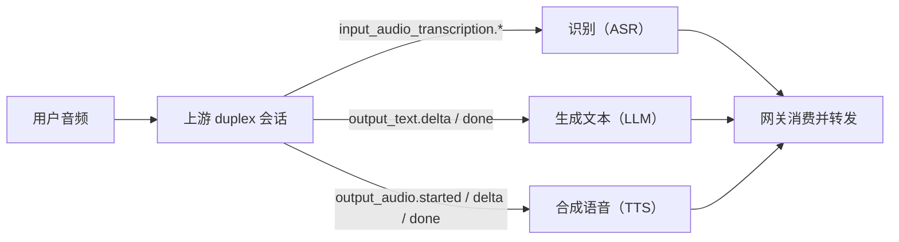
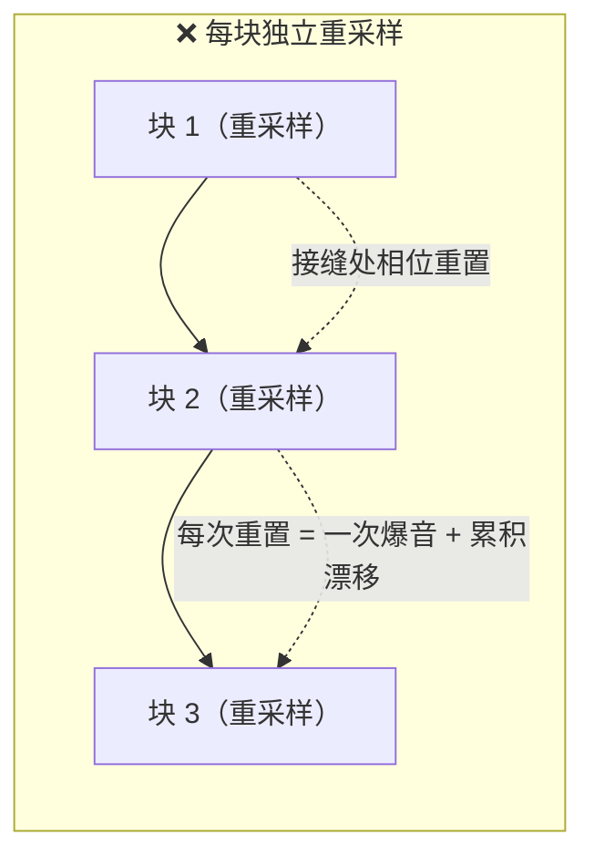
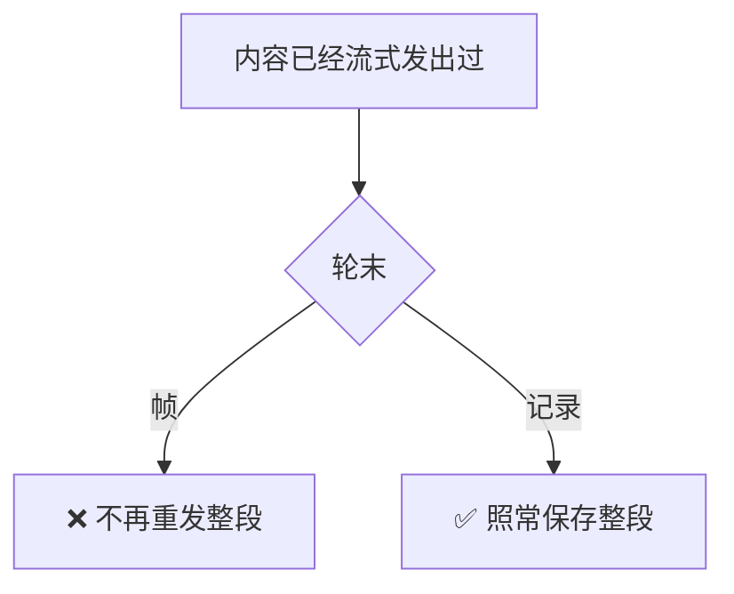
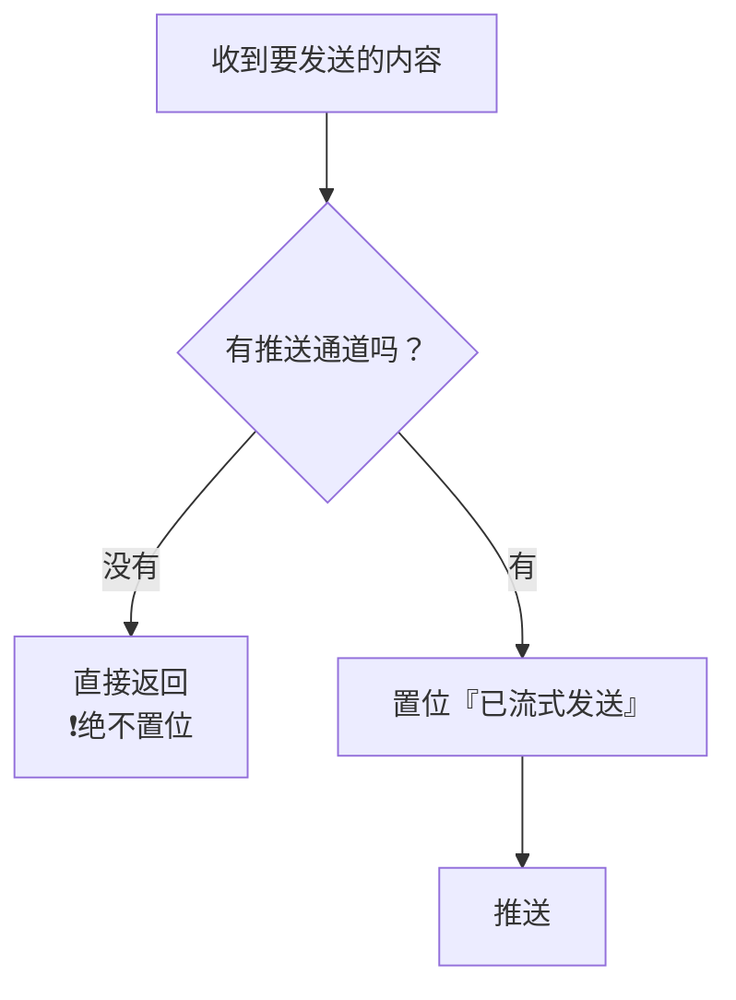
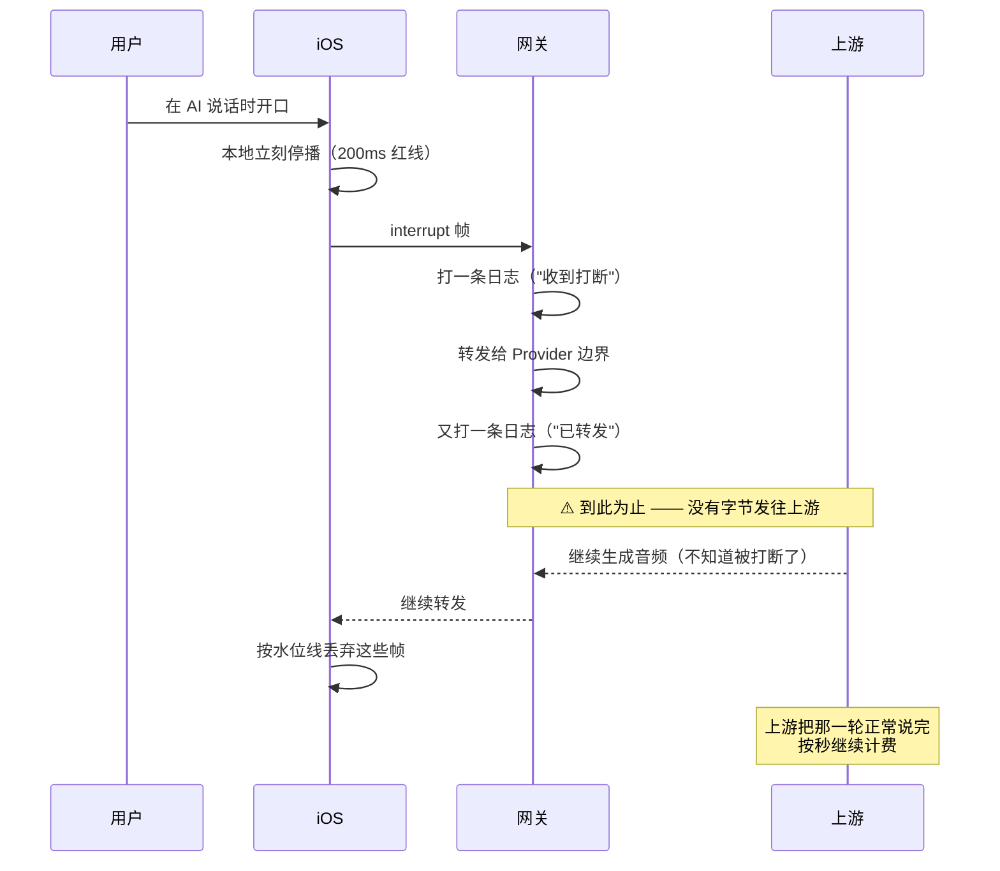

# WSS 系列 06 · 双工、流式与打断

**版本**：V1.0
**日期**：2026-09-11
**定位**：这条链路上最容易想当然的三件事 —— 上游到底是黑盒还是白盒、"流式"流的是什么、以及"打断"到底断了什么。三件都会推翻直觉。
**对应上游文档**：[86 后端网关](86_WSS系列_05_后端网关.md)
**变更说明**：首版。V1.1：速查打断口径与正文「两层空操作」对齐；下行 100ms 与 82 上行 20ms 分开。

---

## ① 本篇回答什么

**三个问题**：

1. 上游是"端到端"的，那中间过程看得见吗？
2. "流式"到底让什么变快了？**文字**变快和**声音**变快，哪个才是用户感知的？
3. 用户打断 AI 的时候，**服务端**做了什么？

**读完后你能**：回答上面三个问题，并且理解为什么每一个的正确答案都和直觉相反。

---

## ② 概念

**duplex（双工）。** 供应商那种"一次会话跑完整个对话"的产品形态 —— 你送音频进去，它送音频出来，不用分别调三个接口。

**增量（delta）。** 边生成边发出的片段。

**重采样。** 把音频从一个采样率换到另一个。本项目的上行是 16 kHz，上游的输出是 24 kHz，手机播放要 16 kHz。

**抑制标记（suppression flag）。** 一个"这个内容已经发过了，结束的时候别再发一遍"的标记。

---

## ③ 约束与推导

### 3.1 第一个反直觉：端到端 ≠ 黑盒

"端到端"这个说法容易让人以为上游是个黑盒：音频进去、音频出来，中间什么都看不见。

**不是。** 上游把三段过程都以**各自的独立事件**流出来，网关逐段消费：

**所以"duplex"描述的是产品形态（一次调用跑完全程），不是可见性（看不见中间）。**

这个区别有实际后果：网关能拿到**权威的识别文本**，把它作为"用户到底说了什么"的准据转发给客户端。如果真是黑盒，这条路就断了 —— 而下游的命中检测等功能都依赖这段文本。

### 3.2 第二个反直觉：流式有两半，而**音频那一半**才是用户感知的

这是本项目一次排查里最重要的发现。

"把 `ai.text.delta` 变成真增量"听起来就是"实现了流式"。但做完之后：

> **屏幕上的字更早出现了，可是 AI 并没有更早开口。**

因为**音频那半边还是攒完整轮才发的**：

对一个**用来说话**的应用：

| | 文字流式 | 音频流式 |
|---|---|---|
| 让什么变快 | 屏幕上的字出现得更早 | **AI 真的更早开口** |
| 用户感知 | 辅助 | **主导** |

**所以"流式"这个词在这条链路上要拆成两半看。** 只做文字那一半，是一个看起来很漂亮但用户几乎感觉不到的改进 —— 因为用户等的是声音。

### 3.3 音频流式的技术难点：重采样必须变成"带状态"的

要把音频边生成边发，就得**边重采样**。而原来的重采样是**无状态**的：输入一整段，输出一整段，输出位置由绝对下标算出来。

**逐块调用它是错的**：

**为什么**：3:2 的重采样里，输出样本 `i` 插值于输入样本 `⌊1.5i⌋` 和 `⌊1.5i⌋+1` 之间。而**供应商的分块边界几乎从不会恰好落在这个位置上**。每块独立处理，就等于在**每一个接缝处**把插值相位重置一次 —— 漂移，加上每个接缝一声爆音。

#### 关键推导：流式可以做到**逐字节等价**，而且**不需要收尾**

这是本篇技术上最漂亮的一步。

流式能不能和整段等价，取决于**输出样本 `i` 是否依赖总长度**。代码里唯一可疑的地方是一个边界钳位：当"第二个源样本的下标"超出输入总数时，把它夹回最后一个样本。

**逐个余数验算之后发现：它从不触发。**

于是：输出样本 `i` **只依赖**输入 `⌊1.5i⌋` 和 `⌊1.5i⌋+1`，而这两个下标对**所有**输出都落在流内。

**结论有三层：**

1. **两个源样本到齐就能出** —— 不需要等后续数据。
2. **流结束时正好出满应有的数量** —— 所以**没有东西需要收尾（flush）**。
3. 因此**分块输出与整段输出逐字节相同**。这不是近似，是可证相等的。

**这条推导的副产品是一个精确的失败信号**：如果有一天速率常量被改到让那个钳位**开始触发**，那么输出就依赖总长度了，这个流式实现**就不再成立**。所以有一条测试专门钉住"钳位不触发"这个前提 —— 它守的不是行为，是**这个设计成立的条件本身**。

**还有一条必须做的收尾**：重采样输出不对齐帧大小，所以不满一帧的尾巴要跨块携带。而**轮末必须把这尾巴冲出去** —— 不冲的话，最后几毫秒会被**永久剪掉**，而且它留在缓冲里，会被**串到下一轮音频的开头**。

### 3.4 "抑制帧，不抑制记录"

真实的问题：内容已经**以增量发出去了**，那么轮末还能不能再发一遍整段？

**不能** —— 客户端的渲染逻辑是"把增量追加到当前那条消息上"。再发一遍整段，屏幕上就会出现两次。

但**落库记录的必须是整段** —— 那是这一轮被持久化的内容，不能被流式切成碎片。

于是这条不变量：

**一句话：抑制帧，不抑制记录。**

#### 这个不变量旁边的一个致命守卫

抑制是靠一个标记实现的："这一轮已经流式发过了"。于是有一个**必须写对**的顺序：

**如果反过来先置位再判断**，一个"不支持流式推送"的会话会得到什么？——**它抑制了轮末的整段，却没有任何地方可以把内容推出去**。结果是**客户端一个字都收不到**。

这不是"多做了一件事"型错误，是"**少做了一件事**"型：所有正向测试都绿，因为没人测"没有通道时会发生什么"。

**标记的清除点也要小心**：它必须放在**轮次开始**，而不只是轮末。因为一个**被中止的轮次**永远不会走到"轮末"那段代码 —— 标记会留到下一轮，把下一轮的回复**整段吞掉**。

### 3.5 第三个反直觉：打断时，服务端什么都没做

先看完整的链路：

**准确地说，是有两层、两处日志，然后停下来：**

| 层 | 做了什么 |
|---|---|
| 网关的连接层 | 收到 `interrupt`，记一条日志，**转发给 Provider 边界** |
| Provider 边界 | 收到，记一条日志，**返回空** —— 没有把任何东西发给上游 |

**两层都"处理"了这个帧，但没有任何字节离开进程。** 所以"服务端什么都没做"指的是**结果**（上游不受影响），不是"代码里没有这个分支" —— 它有一条完整的分支，只是那条分支的终点是空的。

**所以"打断"的准确含义是**：客户端停止播放并丢弃在途音频。**上游不知道，对话记录里也不知道。**

**两个真实后果：**

1. **成本照计。** 上游继续生成到自然结束，而这些秒数会照常进入用量统计 —— 因为记账量的是"上游产出了多少"，不是"用户听了多少"。
2. **AI 的上下文里，上一轮是一句完整的话。** 用户以为自己打断了，但对话的事实是：那一轮说完了。

**为什么这么设计？** 打断响应的目标是"200ms 内声音消失"，而**这个指标只有端上做得到** —— 一个来回的网络时间就可能超过它。等上游确认再停播，用户会先听到一段不该听到的话。

**代价是明确的**：省了一次往返，换来的是上游的无效生成与计费。这是一个 consciously 做的取舍，不是一个疏忽 —— 但它**没有被写在任何地方**，所以值得在这里记下来。

### 3.6 一个承重的常量

音频帧的大小（大约 100ms 一帧）**不是随便定的**，它是**承重的**：

客户端按**整帧**丢弃（水位线比较的是帧的序号）。如果一轮只发**一帧**，那么打断发生时——**没有任何东西可以丢**：要么整轮都在，要么整轮没了。

所以帧必须切得足够小，让"丢掉打断之后的那些"这个动作有粒度。**一个看起来纯粹是性能调优的参数，实际上是另一个功能的实现前提。**

---

## ④ 本项目的落地

| 职责 | 文件 |
|---|---|
| 上游会话封装（识别 / 文本 / 音频事件） | `internal/voicepoc/volc_duplex.go` |
| Provider：流式推送、轮次处理、抑制标记 | `internal/voicegateway/provider_volc_duplex.go` |
| **带状态重采样** | `internal/voicegateway/pcm_resampler.go` |
| 客户端的丢弃闸门与水位线（**传输层**那道） | `AudioFrameDropGate.swift` |
| 客户端的第二道闸（**播放侧**） | `LiveAudioEngine` 里的播放门禁 |
| 客户端的停播 | `LiveAudioEngine` · `SpeechSessionMachine` |

> **客户端有两道丢弃闸门，不是一道。** 一道在传输层（收到就丢），一道在播放侧（排进队列前再判一次）。它们的生命周期不同，是本项目若干问题的来源 —— 见 85 的水位线错配。

---

## ⑤ 代价与陷阱

**陷阱一：上游"每轮死一次"是常态，不是异常。** 真机实测大约每轮一次。任何"上游不会死"的假设都会立刻破产 —— 这就是透明重开存在的原因（见 86）。

**陷阱二：重采样没有抗混叠滤波。** 把 24 kHz 降到 16 kHz，8–12 kHz 那一段会**折叠回**可听频段。语音仍然听得懂，这是一个"先让声音通起来"的第一版取舍。**如果音质变成投诉，正确的做法是换成多相滤波器，而不是调插值参数** —— 这一点写在代码注释里，值得保留。

**陷阱三：抑制标记是"反向失败模式"的重灾区。** 见 3.4。这类错误的共同形状是：**漏掉一个守卫，系统不是多做一件事，而是少做一件事** —— 而"什么都没发生"和"坏了"长得一模一样。

**陷阱四：成本记账记的是"上游产出了多少"，不是"用户听了多少"。** 所以打断、丢帧、客户端没播放，都不影响计费。这在做成本分析时是个必须知道的偏差。

---

## ⑥ 自检

1. "端到端"的上游，中间过程看得见吗？举出三类事件。
2. 只做文字流式会有什么问题？为什么？
3. 为什么逐块独立重采样是错的？说清"相位"在这里指什么。
4. 那个关键推导的结论是什么？它成立的前提是哪一条？如果前提被破坏会发生什么？
5. "抑制帧，不抑制记录"—— 为什么记录不能一起抑制？
6. 抑制标记为什么必须在**轮次开始**清除，而不只是轮末？
7. 用户打断时，服务端做了什么？两个后果分别是什么？
8. 音频帧为什么不能一轮只发一帧？

---

## ⑦ 速查

| 项 | 值 |
|---|---|
| 上游可见性 | 端到端**但**三段事件独立流出（识别 / 文本 / 音频） |
| 流式的两半 | 文字（辅助）· **音频（主导感知）** |
| 采样率 | 上游输出 24 kHz → 客户端播放 16 kHz（3:2） |
| 重采样 | **必须带状态**；逐块独立处理会在每个接缝爆音 + 漂移 |
| 关键前提 | 上游那个边界钳位**从不触发** → 输出不依赖总长度 → **逐字节等价且无需收尾** |
| 尾帧 | 轮末**必须**冲刷，否则剪尾 + 串到下一轮 |
| 不变量 | **抑制帧，不抑制记录** |
| 致命守卫 | **没有推送通道时绝不置位**（否则整轮回复被吞） |
| 标记清除点 | **轮次开始**（中止的轮次走不到轮末） |
| 打断 | 客户端停播 + 丢帧；网关**两层都处理了帧，没有任何字节离开进程** |
| 打断的代价 | 上游继续生成、**继续计费**；AI 上下文里那一轮是**完整**的 |
| 帧大小 | 下行约 100ms —— **承重**：太大则打断时没有可丢的粒度。这不是 82 里上行那 20ms |

---

**系列导航**

[导读](81_WSS系列_00_导读_全景图与术语表.md) · [ELI5](82_WSS系列_01_ELI5_一条语音的旅程.md) · [为什么是 WSS](83_WSS系列_02_为什么是WSS_选型推导.md) · [协议层](84_WSS系列_03_协议层_帧设计与版本化.md) · [iOS 传输层](85_WSS系列_04_iOS传输层.md) · [后端网关](86_WSS系列_05_后端网关.md) · **本篇** · [可观测性与健壮性](88_WSS系列_07_可观测性与健壮性.md) · [方法论](89_WSS系列_08_方法论_遇到同类场景怎么想.md) · [实践总结](90_WSS系列_09_实践总结_这套用法的问题与改进.md) · [认证·错误·降级](91_WSS系列_10_认证_错误与降级.md) · [怎么测试](92_WSS系列_11_怎么测试一条WSS链路.md) · [问题排查](93_WSS系列_12_问题排查手册.md) · [客户端状态机](94_WSS系列_13_客户端状态机_协议事件的消费者.md)
