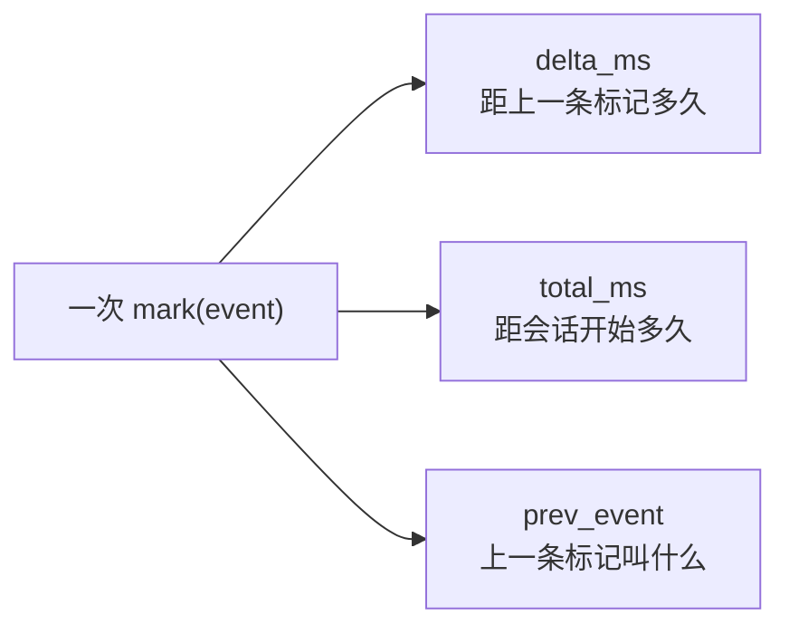
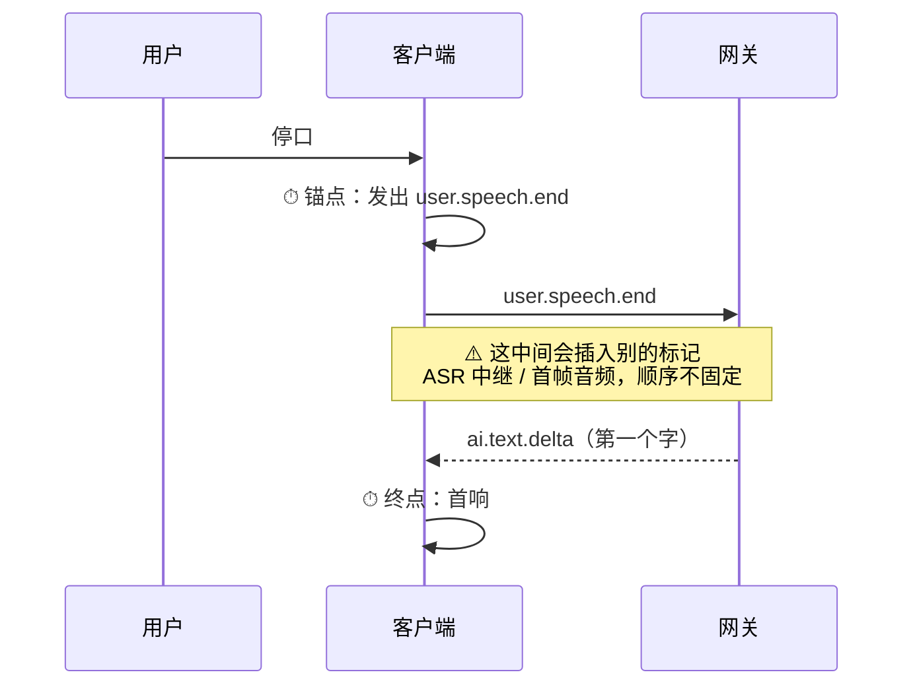
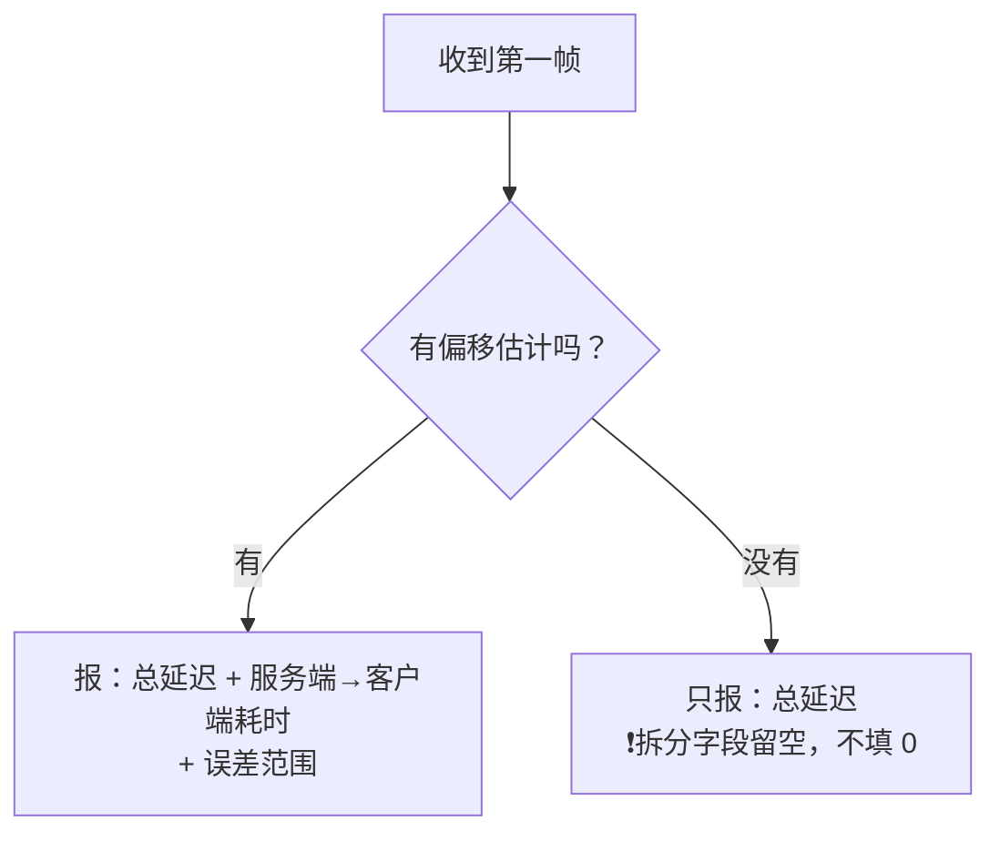
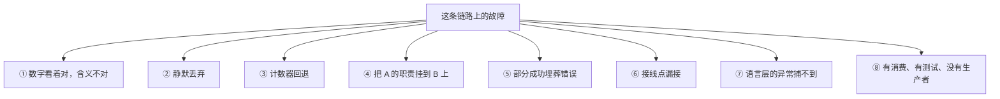
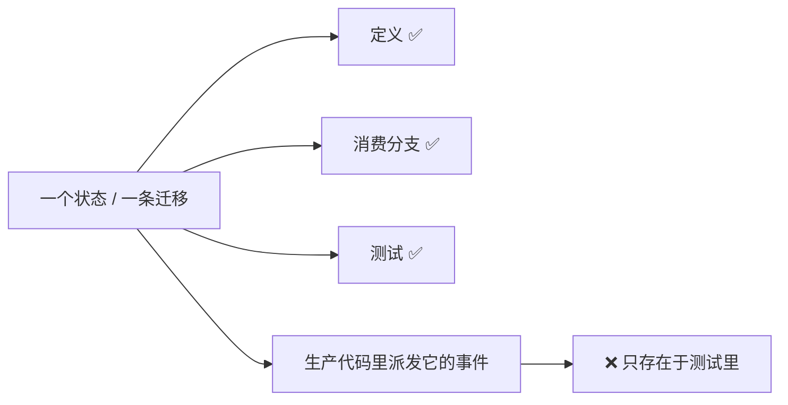
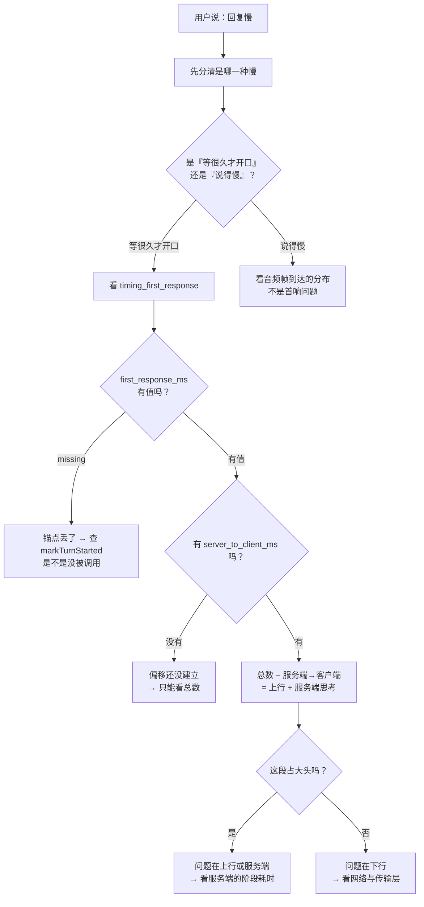

# WSS 系列 07 · 可观测性与健壮性

**版本**：V1.0
**日期**：2026-09-11
**定位**：这条链路怎么被看见（埋点体系、首响怎么量），以及它怎么坏（按**失效模式**分类的缺陷谱系，每条附守卫）。
**对应上游文档**：[87 双工·流式与打断](87_WSS系列_06_双工_流式与打断.md)
**变更说明**：首版。V1.1：旁支名单改指向 81⑤；⑧ 补「契约只兑现一部分」的指针。

---

## ① 本篇回答什么

**两个问题**：

1. 出问题时，怎么用日志回答"为什么慢"？
2. 这条链路上都有哪些坏法？**它们分几类？**

**读完后你能**：拿到一段真机日志，知道该看哪几个埋点、按什么顺序看；以及认出八类失效模式，在看到症状之前就知道该去哪里找。

---

## ② 概念

**埋点（tracking event）。** 一条结构化日志，带事件名和一组属性。

**时间线标记（timing mark）。** 本项目特有的一类埋点，专门记"两个里程碑之间过了多久"。

**首响。** 用户停止说话 → AI 产生第一个输出（字或声）的时间。这是这套系统**最核心的一个延迟指标**。

**失效模式（failure mode）。** 故障的**形状**，而不是它的原因。按形状分类的价值是：**同一形状的故障，修法往往相同**。

---

## ③ 约束与推导

### 3.1 埋点体系：三条属性撑起一条时间线

一个时间线标记会带三条自动生成的属性：

**为什么是这三条而不是一条时间戳**：因为排查时你问的通常是"**哪一段**慢"，而不是"几点几分发生了这件事"。`delta_ms` 直接回答前者，`prev_event` 让你能顺着链条往回走。

**设计约束：这个记录器必须能被注入时钟。** 因为它的全部价值就是那几个数字 —— 而数字只有能**在测试里算出来**才可断言。用一个可注入的时钟，"首响 250ms"这种断言就能写成精确值而不是"大于零"。**这是"可测性倒逼设计"的一个例子**：为了让数字可断言，时间必须从外面传进来。

### 3.2 首响：怎么量，以及一个反直觉的发现

**首响的两个端点都在客户端时钟上**：

**第一个反直觉**：量首响**不需要**服务端时钟。两个端点都在同一台设备上，相减即可。

服务端时钟买到的是**另一件事** —— 把总延迟**拆成三段**：

有了时钟偏移，三段的边界才都落在同一条时间轴上；没有偏移，你只有总数。

**第二个反直觉（也是本篇最值得记的一条）**：这个标记**必须锚在"轮次开始"，不能锚在"上一个标记"**。

因为**别的埋点会落在两者之间** —— ASR 中继、首帧音频，都会打标记。如果用"距上一条标记多久"来算，量出来的其实是"**上一条标记 → 首响**"，而那条标记是谁**取决于哪一路先到** —— 换句话说，**同一个指标会随场景变化含义**：有时少算了识别耗时，有时少算的是音频到达的时刻。

**这比单纯"少算一段"更糟**：一个含义会随场景漂移的数字，看趋势时会得出错误的结论，而每一份日志单看都挑不出毛病。

**而那个数字仍然像个延迟**，只是意思变了。读者会据此得出"很快"的结论，而实际上被略去的那一段恰好可能是最慢的一段。

> **通用教训**：`delta_ms` 这种"距上一条"的链是**脆的** —— 中间插入任何一条新埋点，链就断了，而且断得无声无息。**要测"A 到 B"，就显式记住 A 的时刻，在 B 处做差。**

**两条实现纪律**：

- **每轮只报一次。** 流式回复的每一帧都会宣告自己，只有第一帧是"AI 开始回答"。全报会把"多久开口"变成"多久说完"。
- **拿不到就说"测不出"，不要填 0。** 缺少锚点时报 `missing`。报 `0` 会读成一个好得可疑的延迟 —— 而"缺失"是诚实的。

### 3.3 偏移拿不到时，总数照报，拆分不编造

这条是 3.2 的自然推论，但值得单独写：

**为什么"没有偏移就不报拆分"**：没有偏移时，那个"服务端→客户端"的数字其实是**时钟差**，不是网络耗时。把它报出来，等于**把两台的时钟偏差伪装成延迟** —— 而它看起来完全合理。

---

## ④ 本项目的落地

| 职责 | 文件 |
|---|---|
| 时间线记录器（可注入时钟） | `SpeechSessionTimingsRecorder.swift` |
| 首响标记 | 同上 —— `markFirstResponse` |
| 时钟偏移 | `ClockOffset.swift` |
| 埋点消费与分发 | `SpeechSessionMiddleware.swift` 的事件泵 |
| 传输层诊断事件 | `SocketTransport.swift` 的 `SocketTransportDiagnostic` |

**一条设计原则值得注意**：传输层**从不直接调用埋点系统**。它只发"诊断事件"，由上层消费后决定怎么记。这样传输层不必依赖埋点实现，但它产生的可观测数据一样不丢。

---

## ⑤ 缺陷谱系：按**失效模式**分类

按时间排列缺陷列表没有教学价值 —— 那是台账的职责（见 [89](89_WSS系列_08_方法论_遇到同类场景怎么想.md) 的错误分类学）。**按形状分类**才有：同一种形状的故障，修法往往相同。

### ① 数字看着对，含义不对

| 实例 | 症状 | 守卫 |
|---|---|---|
| `receiveLatency` 起点采样在 `await` 之前 | 量的是"socket 干等"，不是处理耗时；爆发内全是近零样本 | 尚无 —— **这是当前已知的缺口** |
| 用 `delta_ms` 链代替显式锚点 | 量的是"ASR 之后"，不是"用户停口之后" | 改成显式锚点 + 本系列 3.2 那条纪律 |
| 带本地时间戳的心跳 | 偏移 ≈ −往返/2，读起来像"正常网络抖动" | **让错误写不出来**：归一化收进唯一出口 |

**这一类的共同点**：**不会自己暴露**。没有崩溃、没有错误码，只有一个微微偏掉的数字。所以对策不是"检测"，是**让错误在结构上无法表达**。

### ② 静默丢弃

| 实例 | 症状 | 守卫 |
|---|---|---|
| 背压策略丢弃事件 | 200 帧进、64 帧出；丢控制帧会让状态机卡死 | 事件流改为**不设上限**，背压交还给 TCP |
| 水位线丢弃音频 | 音频缺一段／整场静音，**而文字正常** | 丢弃**要上报**：开头一次、结束一次，带上丢弃计数 |
| 帧格式不匹配 | 每一帧都被丢，客户端一无所知 | 服务端留一条警告（**只到服务端为止**） |

**关键设计**：丢弃**必须是可观测的**。一个静默的丢弃和一个"本来就没有数据"完全无法区分 —— 而这正是"回复缺了一半"这类反馈最难查的原因。

### ③ 计数器回退

| 实例 | 症状 | 守卫 |
|---|---|---|
| 透明重开让音频序号从 1 重来 | 客户端水位线停在几百 → **整场永久静音**，且**不报错** | **序号跨重开承接** + 一条测试钉住"重开后序号仍高于水位线" |

**为什么这一类特别贵**：坏掉的只有一条通道（音频），文字照常、连接正常、错误上报为空。**从日志上看这个会话是健康的。**

### ④ 把 A 的职责挂到 B 上

这一类是**计时器**区域的重灾区。

| 实例 | 症状 | 守卫 |
|---|---|---|
| 把"停播"挂在**评估超时**上 | 评估预算是固定的 20 秒，而音频长度由 AI 说了多长决定 → **话尾被剪掉** | 兄弟分支（评估**收到**）落同一相位却不停播 —— 这个不对称就是证据；已移除 |
| 重开预算设成**整场一次** | 上游每轮死一次 → 第一次重开用光预算 → **第三轮必挂** | 预算改为**按轮重置** |
| 水位线生命周期是**整场**，而要解决的问题是**单轮** | 一旦序号回退，整场静音 | 已修已知回退路径；**错配本身仍在** |

**这类缺陷的根源都是同一个**：一个机制被赋予了一个**比它的职责范围更大（或更小）的生命周期**。

**排查手法**：列出这条链路上的**所有**计时器和状态标记，逐个问 —— *它的范围是什么？它要解决的问题的范围是什么？两者一致吗？*

### ⑤ 部分成功埋葬错误

| 实例 | 症状 | 守卫 |
|---|---|---|
| "读失败但捞到了内容"被标成"部分成功"并返回成功 | 真正的失败错误文本**从来没被看到**；同一个错误在两份真机日志里都在，没人发现 | 读错误与超时**区分开**；读失败必须显式重置上游 |
| 网关的 `session.end` 解码失败只打日志 | 畸形的结束帧被当成正常的"用户主动结束" | 已记录（**是否有意为之待确认**） |

**教训**：**一个把失败包装成"拿到了部分数据"的抽象，是错误文本的坟墓。**

### ⑥ 接线点漏接

| 实例 | 症状 | 守卫 |
|---|---|---|
| 流式通道只在初始化时接，重开的新会话没接 | **静默地不再流式** —— 不报错、不崩溃，只是那个能力没了 | 测试钉住"**每一个**会话赋值点都接了线" |
| 序号承接同上 | 见 ③ | 同上 |

**防御方式**：让赋值点只有一个；或者用测试枚举所有赋值点。

### ⑦ 语言层的异常捕不到

| 实例 | 症状 | 守卫 |
|---|---|---|
| 在已停止的音频引擎上启动播放节点，抛的是 **Objective-C 异常**而不是 Swift 错误 | Swift **捕获不到** → **进程终止**（用户那边就是 App 崩了） | 用 ObjC 兜底把异常转成一次丢帧 + 一条日志 |

**这一条超出了传输层的范围，但它说明一件事**：这套系统的失败模式里，有一类的成因是**你用的语言和底层框架之间的边界**。前三轮修复都在预测"它什么时候抛"，而真正的修法是**承认捕不到，然后在边界上兜住**。

### ⑧ 有消费、有测试、没有生产者

**这是一个完整的形状，唯独缺一个触发者。**

| 实例 | 缺什么 |
|---|---|
| 客户端有一条"重连成功 → 回到会话中"的迁移，配了 3 秒窗口 | **没有任何东西派发"重连成功"** —— 于是每一次网络丢失都必然落到文本降级 |
| 客户端有一个"审阅中"相位，配了超时、配了迁移 | **没有任何东西派发进入它的事件** —— 那条路径线上永远不会发生 |

**为什么它比"死字段"更难发现**：死字段只是没人读；这个是**有消费者、有测试、有文档记录** —— 每一处单看都在暗示"这条路是活的"。

**代价**：任何照着代码理解系统的人，都会**多知道一件不存在的事**。"重连会在 3 秒内恢复"、"AI 的处理会经过三个阶段" —— 这两句都会被当成事实，而它们都不成立。

**通用的检查**：

> 对每一个状态或分支，问一句 —— **谁生产进入它的那个事件？**
>
> 如果答案只在测试里，那它不是一条路径，是一个装饰。

**近亲，不在这里展开**：声称跨端的契约只兑现了一部分 —— 91 文案表 5/12、94 阶段标签 3/13、84 前向兼容只一端。形状类似（单看每处都像活的），实例见各篇。

---

## ⑥ 一次真实的排查路径

假设用户反馈："**AI 回复得特别慢**"。按这个顺序看：

**每一步都对应一个已经存在的埋点**，不是临时加日志。

**三个容易走错的岔口**：

- **把"说得慢"当成"首响慢"**。这两个是不同的问题：首响是等待，语速是播放。看错指标会查错方向。
- **看到 `missing` 以为是零**。`missing` 说明**锚点丢了**，那是一个 bug，不是一个好数字。
- **没有拆分字段时以为拆分是 0**。没有偏移时拆分是**测不出**，不是 0。

---

## ⑦ 自检

1. 时间线标记的三条属性各回答什么问题？为什么需要三条而不是一条时间戳？
2. 为什么记录器要能被注入时钟？不注入会失去什么？
3. 首响的两个端点分别在哪？为什么说它**不需要**服务端时钟？那服务端时钟买到了什么？
4. 首响标记为什么不能锚在"上一个标记"上？会错成什么？
5. 八类失效模式里，哪几类是"不会自己暴露"的？它们的共同形状是什么？
6. "有消费、有测试、没有生产者"这一类，为什么比死字段更难发现？
7. "部分成功"这个抽象为什么危险？
8. 用户说"回复慢"，你怎么分清是"等很久才开口"还是"说得慢"？

---

## ⑧ 速查

| 项 | 值 |
|---|---|
| 时间线三属性 | `delta_ms` · `total_ms` · `prev_event` |
| 记录器 | 时钟**可注入** —— 否则数字无法断言 |
| 首响锚点 | **轮次开始**（发出 `user.speech.end` 时），不是上一条标记 |
| 首响终点 | 第一帧文本 **或** 第一帧音频，谁先到算谁 |
| 报几次 | **每轮一次** |
| 缺锚点报什么 | `missing` —— **不报 0** |
| 拆分字段 | 只在**有偏移**时出现；没有偏移只报总数 |
| 八类失效模式 | 数字含义不对 · 静默丢弃 · 计数器回退 · 职责挂错 · 部分成功 · 接线漏接 · 语言边界异常 · **有消费没生产者** |
| 最贵的一类 | **不报错、只让数字微微偏掉**的那一类 |
| 对策 | 不是"检测错误"，是**让错误在结构上写不出来** |
| 排查第一问 | 是"等很久才开口"还是"说得慢"？ |

---

## 读完本篇之后

旁支（89–94）的位置见 [81 导读](81_WSS系列_00_导读_全景图与术语表.md) 的 ⑤，这里不另维护一份名单。

**系列导航**

[导读](81_WSS系列_00_导读_全景图与术语表.md) · [ELI5](82_WSS系列_01_ELI5_一条语音的旅程.md) · [为什么是 WSS](83_WSS系列_02_为什么是WSS_选型推导.md) · [协议层](84_WSS系列_03_协议层_帧设计与版本化.md) · [iOS 传输层](85_WSS系列_04_iOS传输层.md) · [后端网关](86_WSS系列_05_后端网关.md) · [双工·流式·打断](87_WSS系列_06_双工_流式与打断.md) · **本篇** · [方法论](89_WSS系列_08_方法论_遇到同类场景怎么想.md) · [实践总结](90_WSS系列_09_实践总结_这套用法的问题与改进.md) · [认证·错误·降级](91_WSS系列_10_认证_错误与降级.md) · [怎么测试](92_WSS系列_11_怎么测试一条WSS链路.md) · [问题排查](93_WSS系列_12_问题排查手册.md) · [客户端状态机](94_WSS系列_13_客户端状态机_协议事件的消费者.md) · [轮次归属](99_WSS系列_18_轮次归属_顺序标识与三条时钟.md)
