# WSS 系列 08 · 方法论：遇到同类场景怎么想

**版本**：V1.0
**日期**：2026-09-11
**定位**：全系列的落点。**不讲本项目** —— 讲可迁移的判断方法。本项目在文中只作为**证据**出现（"这条规则抓到过什么"），不作为主题。
**对应上游文档**：[81 系列导读](81_WSS系列_00_导读_全景图与术语表.md)
**变更说明**：首版。V1.1：保活、delta 链、文末三问改为证据盒口径。

---

## 目标

给你一套**能在下一个项目里直接走一遍**的判断流程，覆盖实时双向链路从选型到验收的六个环节：

1. 选传输形式
2. 设计帧协议
3. 设计保活
4. 做端到端可观测性
5. 证明你的测试真的在测东西
6. 识别"不会自己暴露的错误"

**这套方法适用于**：语音对话、协作编辑、实时行情、多人游戏状态同步、长任务进度推送 —— 任何**需要服务端主动把变化推给客户端**的场景。

（注意这个说法比"两端持续交换"宽：**上行可能是偶发的，甚至没有**。实时行情就基本是单向推 —— 第一节的分类树会把它判到单向那一支，那是对的。）

---

## 一、先分类：你要解决的是哪一类问题

**不要一上来就问"用 WebSocket 还是轮询"。** 先确定问题的形状，形状决定了候选集。

```mermaid
flowchart TB
    Q1{"客户端需要<br/>发东西给服务端吗？"}
    Q1 -->|"不需要"| Q2{"服务端需要<br/>主动推吗？"}
    Q2 -->|"不需要"| R1["普通请求-响应<br/>结束。不要过度设计"]
    Q2 -->|"需要"| R2["单向推送<br/>SSE / 长轮询 / 服务端推送<br/><br/>↑ 实时行情、进度、通知，大多在这"]

    Q1 -->|"需要"| Q3{"这个需要<br/>是持续的吗？"}
    Q3 -->|"一次性 / 低频"| R3["请求-响应 + 轮询<br/>别上长连接"]
    Q3 -->|"持续 / 高频"| Q4{"你需要的『同时』<br/>是哪一种？"}

    Q4 -->|"媒体级<br/>两路声音真的叠在一起<br/>要混音、回声消除、时钟同步"| R4["全双工媒体通道<br/>WebRTC 一类"]
    Q4 -->|"消息级<br/>两边都能发，但不叠在一起"| R5["双向长连接<br/>WebSocket 一类<br/><br/>绝大多数场景在这"]

    style R5 stroke-width:3px
```



**最容易搞错的是最后那个分叉 —— 它问的不是"要不要同时"，而是"同时的是什么"。**

- **媒体级同时**：两个人的**声音**真的同时进入同一条流，远端要能同时听见、还要消掉回声。
- **消息级同时**：两边**都可以随时发**，但每条消息是独立的、不叠在一起。

**"多人同时在打字"不是媒体级同时。** 协作编辑里两个人同时敲键盘，产生的是两条独立的消息，服务端做合并（OT / CRDT）—— 这落在**消息级**那一支。按"字面同时"去选全双工媒体通道是这篇文章最想拦住的一个错误：你会白白背上一整套回声消除和时钟同步，而它们对你的问题毫无用处。

反过来，**语音对话也不是媒体级**：虽然传的是声音，但双方**轮流**说，声音不叠加。这也是消息级那一支 —— 只是它的"消息"恰好是音频帧。

> **证据盒 · 语音对话为什么落在消息级**
>
> 直觉上"语音对话"听起来该是全双工 —— 传的就是声音。但这个产品是**一轮一轮**的：你说完，AI 才说；AI 说的时候你打断，是**中止**它，不是和它叠着说。同一时刻只有一路声音在传。
>
> 省下的正是媒体级那一整套代价：回声消除（对方的喇叭声被自己的麦克风收回去）、混音、双路时钟同步。这些都是真金白银的工程量，而这里一样都不需要。
>
> 判定依据不是"传的是不是声音"，是"**两路声音会不会同时存在**"。

---

## 二、选传输形式：五维需求清单

确定形状之后，用这五条把候选集收窄。**每一条都要写下具体数字，不要写"要求低延迟"。**

| 维度 | 你要回答的问题 | 为什么它决定选型 |
|---|---|---|
| **① 上行** | 客户端要发什么？持续还是间断？峰值频率多少？ | 决定了能不能用"只能下行"的方案 |
| **② 下行** | 服务端要主动推吗？推的内容是"结果"还是"过程"？ | 决定了能不能用"只能应答"的方案 |
| **③ 延迟预算** | **最紧的那个交互**允许多少毫秒？ | 决定了能不能容忍"重新建立连接"的成本 |
| **④ 载荷** | 文本还是二进制？单条多大？每秒多少条？ | 决定了要不要避开文本编码 |
| **⑤ 凭证** | 密钥放在谁手里？客户端能不能持有？ | 常常**一票否决**掉最直接的那个方案 |

### 判定表

| 你的取值 | 排除 | 指向 |
|---|---|---|
| ③ 的答案 < 一次 TLS 握手（几百 ms） | 任何"每次重新建连接"的方案 | 长连接 |
| ① 是"持续" | 纯下行方案（SSE、推送） | 双向 |
| ④ 是二进制且量大 | 文本协议（要额外编码，体积胀） | 原生二进制消息 |
| ⑤ 是"客户端零凭证" | 客户端直连第三方服务 | 必须有服务端中转 |
| ③ 是"严格有序" | 允许乱序的通道 | 单一有序通道 |

**⑤ 经常被低估。** 它看起来是一条安全要求，实际上会**重排整个架构** —— "客户端不能持有密钥"意味着你必须有一个中转层，而中转层一旦存在，它就成了你做可观测性、做限流、做成本记账的唯一位置。

同一个"凭证在哪"的问题，在不同领域指向不同结论：

- **交易所行情**：密钥若在客户端，等于把下单权发给每个用户 —— 必须中转。
- **公开数据推送**：没有密钥，客户端直连 CDN 就够，中转层是纯粹的成本。
- **协作文档**：密钥是"这个文档的编辑权"，它必须跟着**文档**走而不是跟着连接走 —— 于是鉴权发生在文档维度，不在连接维度。

> **证据盒 · 一张填好的表（语音对话）**
>
> ① 持续上行音频 · ② 服务端主动推增量 · ③ 打断要 200ms 内停声 · ④ 二进制音频、高频 · ⑤ 客户端零凭证。
>
> 五条合起来只剩一个形状：**服务端中转的双向长连接**。注意 ⑤ 是其中最"硬"的一条 —— 前四条都是"更好"的问题，只有它和 ③ 是**一票否决**：满足不了就没有候选方案。

---

## 三、设计帧协议：六条

### 3.1 关联键先定，而且从第一天就贯穿

长连接上跑的是**多条并发的逻辑会话**（多轮对话、多个协作文档、多个订单）。你需要一个字段把属于同一次逻辑交互的消息拴在一起。

**规则**：

- 这个键由**发起方**生成，随第一个上行消息出发
- 服务端**记住**它，之后**所有**该逻辑单元的下行消息都带着它回来
- 不要用"第几条"当键 —— 序号会因为重试、重连、并行而失去意义
- 服务端要有**回退规则**：客户端没给键时用什么代替？通常是回退到**更粗的粒度**（连接级、用户级）—— 但要清楚那意味着什么：同一连接上的多次交互会被当成同一次，重复的会被去掉。回退是"能用"，不是"等价"

**为什么重要**：没有它，客户端的每一条下行消息都要靠"猜上下文"来归位，而猜在并发下必然出错。

### 3.2 版本化从第一天做，不要等需要的时候再加

**规则**：

- 第一版就把版本号写进协议（哪怕只有一个版本）
- 已发布的版本**字节冻结** —— 用摘要（hash）钉住，改动即测试失败
- 加字段**只加在新版本上**，不改老版本

**这条的代价看起来很高**（每次加字段都要开新版本），但它换来的是：**老客户端永远不会被新服务端搞崩**。反过来，如果第一版没版本号，你第一次想加字段时就会面对"改了会崩老客户端、不改没法演进"的两难。

### 3.3 未知消息必须可忽略，绝不能报错

**规则**：收到不认识的消息类型 → **忽略并计数**，不要发错误、不要断连接。

**这是前向兼容的唯一实现方式。** 新版本的服务端会给老客户端发它不认识的消息；如果老客户端选择"报错并断开"，那么每次服务端升级都会把所有老客户端踢下线。

**加一条操作纪律**：计数要能被观测到。忽略是静默的，而静默的忽略和"根本没发"无法区分。

> **证据盒 · 语音对话（这条规则踩过两次）**
>
> **第一次**：网关对未知帧回一个错误帧，客户端把这个错误当作致命错误 —— 新协议消息把老连接杀掉了。
>
> **修的时候只修了一半**：第一版仅把**一个**已知的新帧类型加进白名单，其余未知类型仍然回错误帧 —— 事故成因还在，只是换了个触发条件。"忽略并计数"是后来才补的。教训：修"未知输入导致崩溃"时，问一句 —— 我是修了**这一个输入**，还是修了**"未知"这件事**？
>
> **而另一半至今没修**：网关现在会忽略未知帧了，但**客户端遇到不认识的帧类型仍然会断开连接**。所以同一条规则，在这条链路的两端是不对称的 —— 服务端前向兼容，客户端不前向兼容。一个只加了新帧类型的服务端版本，依然能让所有老客户端掉线。
>
> 这条不对称值得记在心上：**"我们遵守了前向兼容"是一个必须逐端核实的说法，不是一个可以整体宣称的属性。**

### 3.4 文本与二进制的边界，按"体积 × 频率"划

| 内容 | 形式 | 理由 |
|---|---|---|
| 状态、事件、控制指令、小段文本 | 文本（JSON） | 可读、可用现成工具调试、体积无所谓 |
| 音频、图像、大块二进制、高频小块 | 原生二进制 | 文本编码会让体积膨胀约 1/3，且多一道转换 |

**不要**因为"统一比较优雅"就把二进制塞进 JSON（比如 base64）。那个优雅是假的 —— 你在为每次传输付 33% 的额外带宽和一次编解码。

**反过来也不要**把控制消息做成自定义二进制格式。你会失去可读性，而控制消息的体积根本不需要优化。

### 3.5 顺序契约要显式写出来

当同一逻辑单元内有多个消息**必须按特定顺序到达**时，把这个顺序写成契约，并让测试钉住它。

**规则**：

- 用"开始 → 数据 → 结束"这样的三段式包住一段流
- 把"结束"消息的**位置**定义清楚（在最后一块数据之前还是之后？）
- 这个顺序一旦写进契约，**改它就是破坏性变更**

### 3.6 没人用的声明是负债 —— 而且它有两层

**规则**：定期扫一遍"声明了却从不产生、从不消费"的东西。它们会让读者以为系统有某个能力，而实际上没有；后来的实现者会照着它们写代码，然后发现对端根本不发。

**为什么它有两层，且第二层更难发现：**

| 层 | 长什么样 | 判定方法 | 骗的是谁 |
|---|---|---|---|
| **接口层** | 协议里声明了、但没人发也没人收的字段 | 全仓搜字段名 —— 只有声明和测试、没有生产代码，就是负债 | **集成方**：照着它写对接 |
| **实现层** | 结构体里有、但从不被读写的成员 | 搜每个成员的读写点；**特别留意同名遮蔽**（函数内局部变量盖住外层成员） | **维护者**：以为这里有个可调参数 |

处理方式只有两种：**删掉**，或在注释里写明"预留，未启用"。默认应该是删 —— "预留"的字段在真正用上之前，一直在收利息。

> **证据盒 · 一次扫描的结果**
>
> **接口层扫出两处**：一个帧类型常量、一个字段，后端从不生产也不消费，却已经躺在**字节冻结**的协议版本里（也就是说，现在删不掉了）。
>
> **实现层扫出一处**：网关会话结构体上有两个字段（一个时长、一个间隔）从来没被读写过 —— 因为写日志的函数用的是**函数内的局部变量**，把同名的成员遮蔽了。它不影响任何外部行为，测试也不会红。
>
> 这正是两层难度的差别：接口层的负债至少还出现在协议文档里，翻得到；实现层的负债只在读代码时才现形，而它长得和正常代码一模一样。

---

## 四、设计保活：先问"我在探测什么"

**这是最容易做错、而且做错了不会立刻发现的一节。**

"保活"其实是**两个完全不同的问题**，被同一个词盖住了：

| 问题 | 你要知道什么 | 机制的特征 |
|---|---|---|
| **A. 对端死了吗？** | 连接是否还通 | 需要**往返**（发出去了、对方回没回），失败要能触发重连 |
| **B. 对端会不会把我超时？** | 我的空闲计时器会不会被对方踢掉 | 需要**定期有上行流量**，失败与否不重要 |

### 为什么它们不能合并

关键在于：**A 的机制未必能解 B 的定时器。**

- 如果 A 用的是**协议层**的心跳（比如 WebSocket 自带的 ping 控制帧），那么它在**协议栈内部**就被应答了 —— 你的应用层代码根本看不到它。如果对方是在**应用层**计空闲，协议层的心跳**喂不到**那个计时器。
- 反过来，如果 B 用的是**应用层**的 JSON 心跳，而你的代码把它的错误吞掉了（很常见：`try?`），那它就完全不能用来判断对端死活。

**于是你会得到两个都叫 ping 的东西，各自解决一半问题，而删掉任何一个都会坏 —— 坏的方式还不一样。**

**检查清单**：

1. 我的空闲超时在**哪一层**计的？（协议层 / 应用层 / 负载均衡器 / 网关）
2. 我的心跳在**哪一层**发的？
3. 心跳的失败**被处理了吗**，还是被吞了？
4. 如果对面有一个空闲回收机制，我的心跳是不是**让它永远不会触发**？（这是个产品问题，不只是技术问题）

> **证据盒 · 两个都叫 ping，解决的是两个问题**
>
> 协议级 ping 负责"对端死了吗"，应用级 JSON ping 负责喂网关的读空闲超时。协议级的到不了服务端的读循环（库把控制帧内部消化了），所以两者不可互替。**这个分工一度没有写在任何地方**，后来才补上。

---

## 五、可观测性：三条

### 5.1 单侧时钟不够，你需要一个 offset

只要你想知道"从 A 发出到 B 收到花了多久"，而 A 和 B 是两台机器，你就需要知道**两台机器的时钟差**。

**没有 offset 时会发生什么**：你把对方的时间戳减掉自己的当前时间，得到一个数 —— 这个数里**混合了真实延迟和时钟偏差**，而它们无法区分。更糟的是，它看起来像个合理的延迟。

**怎么拿到 offset**：让对方把**它自己的时钟**发给你，和你的发送/接收时刻配对：

```
offset = 对方的时刻 - (你的发送时刻 + 往返/2)
误差   = 往返 / 2
```

**三条纪律**：

- **失败时不要假设 offset 为零。** "测不出来"和"偏差为零"是两件事 —— 前者应该报"不可测"，后者是个真实的值。把前者当后者，你就把时钟偏差算进了延迟。
- **报数字的时候带上误差。** 如果往返是 400ms，你的误差棒是 ±200ms。这个误差可能比你要测的改善还大 —— 那这个数字就不该被引用。
- **重连之后要丢掉旧的 offset。** 新连接可能落在另一台机器上，旧 offset 会让所有数字都错，而且不会看起来错。

### 5.2 埋点要能回答一个**具体问题**，否则是噪音

加埋点之前先写下它要回答的问题。写不出来就别加。

| 埋点 | 它回答的问题 |
|---|---|
| ✅ "首响从多少降到多少？" | 流式化到底有没有用 |
| ✅ "有多少帧被丢了、从哪个序号开始？" | 用户说"回复缺了一半"时去哪看 |
| ❌ "这里加个日志吧" | 没有 |

**另一个纪律**：**埋点要成对**。一个"开始"如果可能没有对应的"结束"，那你要能分辨"还没结束"和"结束事件丢了" —— 这通常意味着需要显式的锚点和超时，而不是靠事件流自然闭合。

### 5.3 delta 链是脆的，要用显式锚点

"记录相邻两个埋点之间的耗时"很方便，但它有个陷阱：**中间插进来任何一个新埋点，这条链就断了** —— 而且断得无声无息，数字还是数字，只是意思变了。

**规则**：当你要测量的是"A 到 B"时，**显式记录 A 的时刻，在 B 处做差**。不要依赖"上一个埋点就是 A"。

> **证据盒 · delta 链把"首响"量成了另一段**
>
> 要测的是"用户说完 → AI 首次输出"。中间会插入一个"识别结果到达"的埋点。如果按"上一个埋点"算，测出来的其实是"识别结果到达 → AI 首次输出" —— **数字仍然像个延迟，但少算了整整一段识别耗时**，而那恰好是读者会据此判断"很快"的那一段。

---

## 六、怎么发现"测试没测到东西"

**一条测试通过，不代表它在测东西。** 这是本方法论里最反直觉、也最值钱的一节。

### 6.1 强制顺序：红验证

> **写完测试，先破坏实现，看是哪条红。**
>
> - 红的是**你预料的那条** → 测试有效。
> - 红的是**另一条**，或者**全绿** → **你对系统的理解有偏差，那才是真正要修的。**

注意这条的顺序：不是"跑一下测试看它绿不绿"，而是**故意把实现改坏，看它红不红**。绿只能证明"没报错"，红才能证明"这条测试真的在看这件事"。

### 6.2 三种"看起来在测、其实没测"的形状

**形状一：断言了症状，而非原因。**

如果正确路径和错误路径**产出同一个症状**，那么断言症状的测试分辨不出实现对不对。

> **实例**：一条测试断言"某个输入会返回 503"。但"守卫存在"和"守卫不存在"**都会**返回 503（守卫不在时，另一条分支给出逐字相同的响应）。这条测试对守卫的存在与否是**盲的**。
> **修法**：找到两条路径**唯一不同**的那个可观测点 —— 在那个例子里是**顺序**（没有守卫时，畸形输入会先得到一个不同的错误）。

**形状二：等价性测试对"边界"这个失效维度是盲的。**

如果你要证明"新实现和旧实现等价"，喂**一个**输入往往区分不出来 —— 因为在那个输入下两者恰好一样。

> **实例**：证明"分块处理 = 整段处理"。这条测试只喂一块时**永远通过**，即使实现天真到每个分块都重置一次状态 —— 因为只有一块，没有分块边界。
> **修法**：**换不同的分块方式，输出必须不变**。等价性测试看着更严格，实际对"边界"这个唯一失效维度是盲的。

**形状三：反向的失败模式被漏掉。**

有些守卫漏掉时，不是"多做了一件事"，而是"**少做了一件事**"，而且没有任何测试会因此变红。

> **实例**：流式推送有一个"已经推过了，结束时不要再发一遍"的标记。如果这个标记在"根本没有推送通道"的情况下也被置上，结果是**客户端一个字都收不到**。所有正向测试都绿。
> **修法**：为"没有通道时绝不置位"单独写一条测试，并显式写明这是**反向**失败模式。

### 6.3 一条经验

**一个具体的观察，不是一条定理。** 本项目有一天的记录是：红验证抓出的三个问题，**没有一个**是靠"测试通过"发现的。

这只是**一个样本** —— 不能推出"测试通过永远发现不了问题"这种绝对结论（那种不可证伪的断言本身就是坏的方法论）。但它指出的方向值得记住：

> **如果你破坏实现之后全绿，不要庆祝 —— 那是当天最值得深挖的信号。**

---

## 七、错误分类学：不会自己暴露的错误

有一类错误特别贵：**它们的产物看起来完全正常。**

| 错误的**一般形状** | 在不同领域长什么样 | 为什么它不会暴露 |
|---|---|---|
| **两台机器的时钟差被当成延迟** | 语音：把对端时间戳直接减本地时间<br>行情：用本地时间给交易所的成交时刻排序 | 它就是个正数毫秒值，量纲也对 |
| **把回声当成正常抖动** | 语音：心跳把客户端自己的时间戳原样带回<br>任意请求-响应：拿自己发出的 ID 当对端的确认 | 约等于"负的半个往返"，读起来像几毫秒的正常网络抖动 |
| **过滤器把数据静默吃掉** | 语音：打断水位线丢帧；重开后序号回退，水位线以上的全被丢<br>协作编辑：客户端拿着过期游标，把服务端重放的历史当成新内容丢掉 | 其他数据照常流通，没有报错 |
| **计数器回退，而下游还握着旧的高水位** | 语音：上游重开后音频序号从 1 重来<br>行情：重连后序列号重置，而本地去重表还停在旧的最大值 | 两条路径独立，一条坏不牵连另一条 |
| **背压丢掉的恰好是不能丢的** | 语音：丢了音频帧 → 声音有洞<br>行情：丢了最新价 → 显示停在旧价上，**看起来完全正常** | 消费慢时才发生，压力测试才现形 |
| **抑制标记在没有输出通道时被置位** | 任意领域：一个"已经发过了，别再发"的标记，在"根本没有发送通道"时也被置上 | "什么都没发生"和"坏了"长得一样 |

**注意它们的共同形状**：要么**正确路径和错误路径产出同一个可观测结果**，要么**错误路径根本不产出可观测结果**。

### 设计对策：让错误无法表达

比"检测并报告错误"更强的手段是：**让这个错误在结构上写不出来。**

三个具体手法：

1. **把约定收进一个地方，不让调用方各自记得。**
   与其在每个调用点写注释提醒"这里必须这样"，不如在**唯一的出口**做归一化 —— 这样"发错"在结构上不可能发生。守在最外层的一条测试，比散落在十个调用点的注释可靠得多。
   > 语音里的实例：一个协议约定要求心跳必须带某个特定的值。这个归一化被放进了唯一那个出口，于是"发一个带错值的心跳"这件事写不出来。

2. **把"置位"放在守卫之后。**
   当一个标记会让后续输出被抑制时，**先确认有能力输出，再置位**。反过来写，就会得到"抑制了输出、但没有地方可输出"的状态 —— 最安静的失败模式。
   > 这个形状和领域无关：一个"已经处理过了"的去重标记、一个"已经通知过了"的标志位，都有同一个陷阱。

3. **在数据源头拒绝，而不是在下游猜测。**
   一个超出合理范围的数值，**拒绝**它比**钳制**它安全。钳制会把一个明显的垃圾值变成一个看起来合理的值；拒绝会让它保持"缺失"，而缺失是诚实的。
   > 语音里的实例：时钟偏移的计算里，一个超出整数范围的"时间戳"被直接拒绝。若改成钳制，它会变成一个"看起来合理"的偏移量 —— 而错误就此隐身。

---

## 八、边界：这套方法什么时候不适用

**明确不适用的场景**：

1. **一次性请求-响应。** 如果客户端问、服务端答，问完就结束 —— 用普通 HTTP。上长连接是纯粹的浪费。
2. **延迟预算宽松的场景。** 如果用户能接受刷新页面才看到更新，轮询比长连接简单一个数量级。**别为了技术先进性付复杂度。**
3. **真的需要媒体级同时。** 两路声音（或画面）要真的**叠在一起** —— 通话、会议、远程合奏。那就该上全双工媒体通道，本文关于"消息级"的整套假设都不成立。**别把"消息级并发"误判成这一类** —— 那是第一节特意拦的那个错误。
4. **没有服务端中转的余地。** 如果架构上客户端必须直连第三方，那么本文关于"中转层是可观测性的唯一位置"的推论全部失效。

**还有一个元边界**：本方法论的第六、七节（红验证、错误分类学）的成本主要在**人的纪律**，不在工具体系。如果团队没有把"破坏实现看哪条红"当成默认动作，那两节只会停留在纸面上 —— 而它们恰好是本方法论里最值钱的部分。

---

## 九、跨场景演练

前面八节的方法，拿两个**不是语音**的场景走一遍。第一个**完整走完**（示范），第二个**只走第一步**（留给你）。

### 场景 A · 实时行情（完整示范）

> 服务端每秒推几千条价格更新给客户端。

**第一步 · 定形状**

从分类树顶往下走：

- 客户端需要发东西给服务端吗？—— **基本不需要**。顶多是"订阅这只标的""退订"这类低频指令。
- 服务端需要主动推吗？—— **需要，而且是核心**。

于是落在**单向推送**那一支。**这里最重要的产出是一个否定结论：不要默认上 WebSocket。** 大多数行情客户端是"订一次、一直收"，SSE 这一类就够了；只有当客户端也要频繁上行（比如同时挂单改单）时，才升级到双向。

**第二步 · 五维**

| 维度 | 取值 | 注意 |
|---|---|---|
| ① 上行 | 订阅/退订，一次性、低频 | 决定了它不构成"双向"的理由 |
| ② 下行 | 主动推，推的是**过程**（每一次变动），不是结果 | 过程性数据 → 不能攒批 |
| ③ 延迟预算 | 最紧的是**价格变动 → 用户看到**；"订阅"这个交互完全不紧 | **最紧的那个交互不一定是上行** |
| ④ 载荷 | 高频、单条小、可二进制 | 每秒几千条，文本编码的膨胀会直接变成带宽账单 |
| ⑤ 凭证 | 交易所密钥必须在服务端 | 决定必须有中转层 |

**第三步 · 逐条套规则**

- **关联键**：订阅哪只标的 —— 由**客户端**生成订阅 id，服务端之后每一条推送都带着它。这样客户端能做多路复用（一条连接订多只标的）。
- **版本化**：行情字段会加（新增指标、新增交易所）。第一天就带版本号，否则第一个新字段就会把老客户端打崩。
- **未知消息**：必须忽略。**这里有个比语音更尖锐的后果** —— 行情客户端的版本分布比 App 更散（有人几个月不升级的终端），一次不兼容的推送就是一次大面积掉线。
- **背压**：**丢旧的**。

  > 判定准则不是"哪个策略更好"，是 **"丢了之后能不能重建"**：
  > - 行情丢了一条旧价 → 下一条马上覆盖它，**用户看不到任何差别**。所以可以丢。
  > - 语音丢了一帧音频 → 那段声音**永远消失了**，无法重建。所以不能丢。
  >
  > 同一份代码库里，这两条规则指向**相反**的缓冲策略 —— 而对各自的数据都是对的。**背压策略是数据的属性，不是系统的偏好。**

- **保活**：需要区分那两条。
  - 喂空闲超时（B）：tick 很密时看似已经被数据本身承担了 —— **但要确认冷门标的**。某只票一小时没成交，数据就断了，B 仍然得单独有。
  - 探测对端死活（A）：**必须单独有**。它和有没有数据流无关。
- **可观测性**：要给"行情延迟"定量，就需要**时钟偏移** —— 交易所的成交时刻是它的钟，你得把它换算到你的钟上。否则你量到的是"混合了时钟差的数字"。

### 场景 B · 协作编辑（走第一步，其余留给你）

> 多人同时编辑一份文档，每个人的光标和输入要实时同步。

**第一步 · 定形状**

分类树最后那一叉是关键，也是最容易走错的：**"多人同时打字"是不是媒体级同时？**

**不是。** 两个人同时敲键盘，产生的是两条**独立的消息**，服务端做合并（OT / CRDT）。它们不"叠在一起" —— 叠在一起需要混音和回声消除，而这里既没有声音也没有回声。

所以落在**消息级**那一支：**双向长连接**。按"字面同时"去选全双工媒体通道，会白白背上一整套你用不上的工程量。

**剩下的留给你**：五维取值、③ 的最紧交互是什么、关联键选什么（提示：不是"用户"，也不是"连接"）、需不需要时钟偏移。

### 通用三问

无论做什么场景，这三问都值得问一遍：

1. 我的系统里，有没有**两个都叫同一个名字、但解决不同问题**的机制？（证据盒：两个都叫 ping）
2. 我的埋点里，有没有依赖"上一个埋点"的 delta 链？（证据盒：有，已改成显式锚点）
3. 如果我现在随机把一个守卫改坏，**哪条测试会红**？如果答不上来 —— 那条测试真的存在吗？

---

## 速查

| 环节 | 一句话规则 |
|---|---|
| 分类 | 先分形状再选技术；最后一叉问的是**"同时的是什么"**（媒体级 vs 消息级），不是"要不要同时" |
| 选型 | 五维清单：上行 / 下行 / 延迟 / 载荷 / **凭证**。凭证常一票否决 |
| 关联键 | 发起方生成 · 服务端回声 · 服务端有回退规则 |
| 版本化 | 第一天就做 · 老版本字节冻结 · 新字段只进新版本 |
| 前向兼容 | **未知消息忽略并计数**，绝不报错 |
| 载荷分界 | 按"体积 × 频率"划；不要 base64 塞 JSON |
| 保活 | **先问探测什么**：对端死了，还是对端会超时？两个机制 |
| 时钟 | 没有 offset 就没有延迟；**"测不出" ≠ "偏差为零"**；报数字带误差 |
| 埋点 | 能回答一个具体问题 · 成对 · **别用 delta 链，用显式锚点** |
| 测试 | **破坏实现，看是哪条红**；红的是预料的那条才算有效 |
| 错误 | 越像正常的错误越贵；对策是**让它在结构上写不出来** |

---

**系列导航**

[导读](81_WSS系列_00_导读_全景图与术语表.md) · [ELI5](82_WSS系列_01_ELI5_一条语音的旅程.md) · [为什么是 WSS](83_WSS系列_02_为什么是WSS_选型推导.md) · [协议层](84_WSS系列_03_协议层_帧设计与版本化.md) · [iOS 传输层](85_WSS系列_04_iOS传输层.md) · [后端网关](86_WSS系列_05_后端网关.md) · [双工·流式·打断](87_WSS系列_06_双工_流式与打断.md) · [可观测性与健壮性](88_WSS系列_07_可观测性与健壮性.md) · **本篇** · [实践总结](90_WSS系列_09_实践总结_这套用法的问题与改进.md) · [认证·错误·降级](91_WSS系列_10_认证_错误与降级.md) · [怎么测试](92_WSS系列_11_怎么测试一条WSS链路.md) · [问题排查](93_WSS系列_12_问题排查手册.md) · [客户端状态机](94_WSS系列_13_客户端状态机_协议事件的消费者.md) · [轮次归属](99_WSS系列_18_轮次归属_顺序标识与三条时钟.md)
