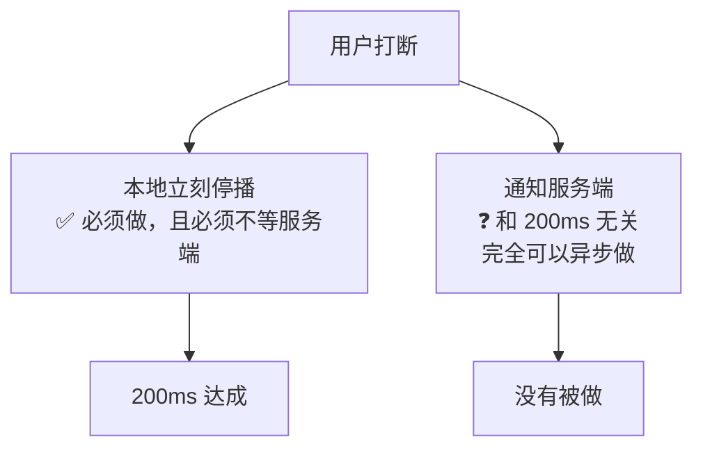
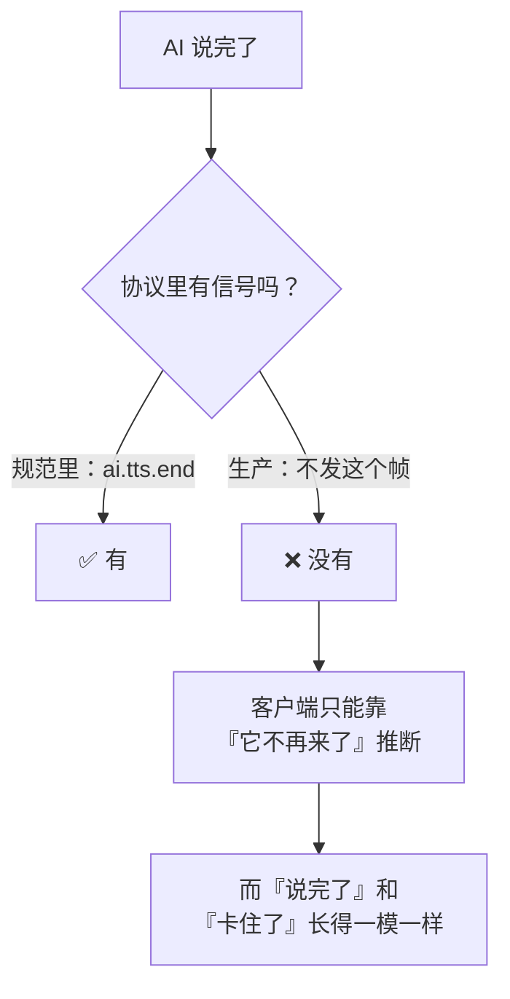
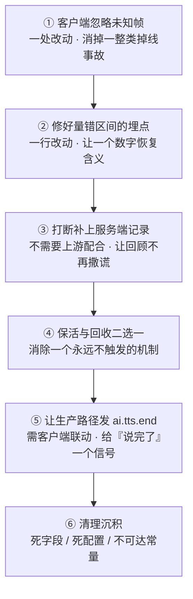

# WSS 系列 09 · 实践总结：这套用法的问题、偏颇与改进

**版本**：V1.0
**日期**：2026-09-11
**定位**：走完前八篇之后，对本项目 WebSocket 用法的一次**批判性收束** —— 哪些是刻意的取舍、哪些是没人回头看的沉积、哪些该改。也是本系列的落点。
**对应上游文档**：[89 方法论](89_WSS系列_08_方法论_遇到同类场景怎么想.md)（那是可迁移的方法；本篇是**本项目的判断**）
**变更说明**：首版。

---

## ① 本篇回答什么

**一个问题**：把这条链路从头到尾看一遍之后 —— 它哪里对、哪里有偏颇、哪里该改？

**读完后你能**：

- 分清这套系统里**什么是设计、什么是沉积**（这两者需要完全不同的应对）
- 说出六个具体的偏颇及其代价
- 拿到一份按性价比排序的改进清单

**本篇与前八篇的关系**：前八篇讲"它是怎么运作的"，本篇讲"**它这样运作有什么问题**"。这一篇不重复机制，只下判断。

---

## ② 先说做对的（因为后面全是批评）

前八篇已经展开，这里只列结论，作为判断的基线：

| 做对的 | 为什么它值得保留 |
|---|---|
| **零凭证 + 网关中转** | 一条硬约束重排了整个架构，而且顺带给出了可观测性、限流、记账的唯一落点 |
| **消息级而非媒体级** | 省掉了回声消除、混音、双路时钟同步这一整套，而产品根本不需要 |
| **防腐层** | 本地开发能换掉整个上游而连接逻辑一行不改；这是"能换"这件事的前提 |
| **抑制帧、不抑制记录** | 一个干净的不变量，把"显示"和"落库"两个需求分开了 |
| **带状态重采样** | 可证逐字节等价，且**不需要收尾** —— 推导本身是这套代码里最漂亮的一段 |
| **时钟偏移而不是直接相减** | 承认了两台机器的时钟没有关系，并给了误差棒 |
| **红验证纪律** | 三轮核对抓出的问题，没有一个是靠"测试通过"发现的 |

**后面每一条批评，都建立在这些之上。** 说它们对，不代表其余的地方也对。

---

## ③ 偏颇一：打断只做了一半 —— 而且缺的是有数据价值的那一半

**现状**：客户端本地停播 + 上行 `interrupt`；网关两层各记一条日志；**上游完全不知道**。

**流行的辩护**是"200ms 红线只有端上做得到"。这个论证成立 —— 但它论证的是 **"本地必须先停"**，不是 **"服务端永远不该知道"**。

这是**两件独立的事**，被合并成了一件：

**"本地先停"是必须的；"服务端也知道"是完全可以异步做的，两者不冲突。**

**为什么这半边值得补**，即使上游没有取消能力（已核实：**没有**）：

| 补上之后能做到 | 今天的状况 |
|---|---|
| 网关**停止转发**那一轮的剩余音频 | 继续往一条客户端正在丢弃的连接上推 |
| 持久化的转录**标注"这一轮被打断"** | **记录成 AI 说完了整段** —— 用户从没听过的话，进了回顾 |
| 统计打断率 | 无从统计 |

第三条对一个**把转录当作学习资产**的产品尤其重要：**回顾里那段"你听过的对话"，有一部分你其实没听过。**

**改进方向**：`interrupt` 帧不变，但网关在收到后（a）停止转发该轮音频，（b）在会话记录里标记该轮 `interrupted`。不需要上游配合，因为要的是**记录的正确性**，不是省算力。

---

## ④ 偏颇二：保活把服务端的回收机制屏蔽了

**现状**：客户端每 30 秒发一次应用级心跳；网关的读空闲超时是 2 分钟。

**后果**：只要连接还在，那个 2 分钟的超时**永远不会触发**。

**一个永远不会触发的机制，等于一个不存在的机制** —— 但它还留在配置里、留在文档里、留在读代码的人的心里，让人以为系统会回收闲置会话。

**这不是 bug，是"机制之间互相抵消"**：两个各自合理的设计，合起来让其中一个失效。而**没人负责发现这件事**，因为每一半单看都对。

**两个方向，必须选一个**：

| 方向 | 做法 | 代价 |
|---|---|---|
| **让回收真的发生** | 心跳改成有条件（比如仅在活跃轮次内发） | 要定义"什么算活跃"，用户长时间思考时可能被误杀 |
| **承认不要回收** | 移除空闲超时，或把它调成"只防僵死连接"的极大值 | 放弃服务端的资源保护 |

**今天的状况是最糟的第三种：两样都留着，但一个是装饰。**

---

## ⑤ 偏颇三：生产路径没有"音频结束"信号

**已核实**：`ai.tts.end` 在整个后端**只有本地开发的 mock 会发**。生产路径一个都不发。

**后果**：客户端**无法从协议上知道"AI 说完了"**。它只能观察到"音频不再到达"。

**为什么这是风险而不只是遗憾**：

- 任何需要"AI 说完之后做点什么"的功能，都只能**猜一个时间**。
- 而**用计时器代替信号**，正是本项目已经发生过的那类缺陷的形状 —— 一个为别的目的设的固定计时器，被挂上了"停播"的职责，结果按秒数剪掉了话尾。

> 这里我要克制一点：**没有证据表明那次缺陷的成因就是"缺少结束信号"**。但可以确定的是：**当协议不提供某个信号时，实现者会用计时器去逼近它** —— 而计时器和信号不等价。这是这类缺口的一般代价。

**改进方向**：让生产路径也发 `ai.tts.end`（规范里已经定义好了，`completion_status` 字段也在）。现在不发是因为它会改变客户端的解码路径 —— 那是一个**需要在客户端一起改**的联动，不是一个单边决定。

---

## ⑥ 偏颇四：前向兼容只做了一半

**现状**：网关忽略未知帧并计数；**客户端遇到未知帧类型会断开连接**。

**这不是两条独立的实现，是同一条规则的两端** —— 而只有一端被实现了。

**代价**：一个只加了新帧类型的服务端版本，**能让所有老客户端掉线**。这和当年"未知帧打死活会话"是同一类事故，只是换了受害者。

**这一条是全篇里性价比最高的修复**：客户端把"未知类型"从**抛错**改成**忽略并计数**，是一处改动，且不依赖任何其他变化。

---

## ⑦ 偏颇五：冻结了一个从没跑过的协议版本

**现状**：v1 被字节冻结（哈希钉住）。它里面躺着至少两处**从来没有产生、也从来没有消费过**的东西：一个帧类型和一个字段。

**这两件事单独看都不严重，合起来是一个方法问题**：

**冻结的意义是"承诺不变"** —— 而承诺一个你从没验证过的东西，是把**未知**变成了**负债**。

**可迁移的规则**：

> **冻结之前先跑一遍。** 一个字段在冻结前没被真实流量验证过，冻结后它就从"可能有用"变成了"永久占位" —— 而且后来的人会照着它写对接代码。

---

## ⑧ 偏颇六：可观测性只看得见一半

三处缺口，按严重度：

| 缺口 | 后果 |
|---|---|
| **时间戳只在一个帧上** | 只有**文本**首帧能被拆成上行/服务端/下行。而**音频**才是用户感知的那一路 —— 它的首响永远只有一个总数 |
| **一个埋点量错了区间** | 有个耗时埋点的起点采样在等待**之前**，量到的是"干等下一帧"，而它声称的是"处理耗时"。**它的数字一直看着挺合理** |
| **没有跨网关到上游的关联** | 会话有 `log_id` 可以把客户端日志和上游日志对上，但那是在**轮末**才拿到的 —— 一轮出问题时，你还没有它 |

**共同点**：这三处都不是"没有数据"，而是**有数据、但数据回答不了你真正想问的问题**。这比没有数据更危险，因为它会让人以为已经看见了。

---

## ⑨ 一个横跨全篇的形状：同名不同物

回头看，本项目的偏颇里反复出现同一个形状 —— **两样东西名字一样（或几乎一样），解决的问题完全不同**：

| 同名的一对 | 各自解决什么 | 混淆的代价 |
|---|---|---|
| **两个 ping** | 一个探测对端死活，一个喂对端超时 | 删任何一个都会坏，坏得还不一样 |
| **两道丢弃闸门** | 一道在传输层，一道在播放侧 | 生命周期不同，是水位线错配的来源 |
| **两个重连窗口** | 一个在配置里，一个硬编码生效 | 改一个不影响另一个，且不报错 |
| **几组超时** | 各自守护不同的阶段 | 把 A 的职责挂到 B 上，就剪掉话尾 |

**这不是命名问题，是"没人检查过这两个东西是不是一回事"的问题。**

**一条可迁移的检查**：

> 当你发现系统里有**两个同名（或名字很像）的东西**时，不要假设它们是重复的 —— 先分别写下**它们各自回答什么问题**。如果答案相同，删一个；如果不同，**把区别写下来**，否则下一个人会删错。

---

## ⑩ 分清"设计"与"沉积"

本篇最重要的一个区分：

| | 设计 | 沉积 |
|---|---|---|
| **特征** | 有理由、有代价、写下来过 | 曾经有理由，或者从来没有 |
| **例子** | 零凭证中转 · 消息级而非媒体级 · 抑制帧不抑制记录 · 本地先停播 | 协议里的死字段 · 存了但没人读的配置 · 永不可达的环境常量 · 零调用的实现 |
| **应对** | **别动** —— 除非约束变了 | **清掉** —— 或者在注释里写明"预留，未启用" |
| **危险** | 被人当成沉积顺手改掉 | 被人当成设计照着写 |

**这两类东西在代码里长得一模一样** —— 都是一行声明、一个常量、一个分支。区分它们**只能靠有没有留下理由**。

**所以"写下来"这件事本身就是维护成本的一部分**：一段解释"为什么是这样"的注释，是**设计**；一段没有注释的怪代码，是**沉积**。它们的差别不在于正确性，在于**下一个人会不会把它删掉**。

---

## ⑪ 改进清单（按性价比排序）

| # | 改什么 | 为什么排这个位置 |
|---|---|---|
| **①** | 客户端遇到未知帧类型 → 忽略并计数（不再断开） | 一处改动，消掉一整类"升级即掉线"的事故 |
| **②** | 把那个耗时埋点的起点挪到等待**之后** | 一行改动；不改的话，所有基于它的判断都偏 |
| **③** | 网关收到 `interrupt` 后停止转发该轮音频 + 标记该轮 | 不需要上游配合；直接修复"回顾里有没听过的话" |
| **④** | 保活与空闲回收，明确留一个 | 消除一个装饰性机制，并让意图变得可读 |
| **⑤** | 生产路径发 `ai.tts.end` | 价值明确，但需要客户端联动，不是单边决定 |
| **⑥** | 清理沉积：死字段、死配置、不可达常量、零调用实现 | 不急，但每清一处就少一个误导源 |

**①②③ 都是小改动、无联动、收益明确。** 如果只做三件事，做这三件。

---

## ⑫ 我这次扫描本身的偏颇

一份总结如果不交代自己的视角，就只是一份主张。三处需要说明：

**一、我读的是代码，不是产品。** 本篇的所有判断都以"代码做了什么"为准。但有些问题只在**用户**那里成立 —— 比如"AI 打断后继续生成"这件事，对成本的伤害可能远小于对**体验**的伤害（用户以为打断了，但回顾里那句话还在）。我能量化前者，量不了后者。

**二、我天然偏向"可验证的东西"。** 有测试、有断言、有 `file:line` 的问题，我更容易下判断；而那些"设计上不够优雅但没坏"的地方，我倾向于略过。这会让本篇读起来比实际情况**更工程化**。

**三、我继承了这个仓库自己的框架。** 哪些算"缺陷"、哪些算"取舍"，我大量沿用了项目已有的分类（红验证、失效模式、设计 vs 沉积）。这有好处（口径一致），也有代价：**仓库没意识到的问题，我大概率也没意识到。**

**所以本篇是一份"用这个项目的语言做的体检"，不是一份外部审计。**

---

## ⑬ 自检

1. "200ms 红线"论证的是哪一件事？它**不**论证哪一件事？
2. 保活与空闲回收之间的抵消，为什么说"两样都留着"是最糟的？
3. 生产路径没有"音频结束"信号，会导致实现者用什么去逼近它？那种逼近有什么固有缺陷？
4. 为什么"冻结一个没跑过的协议版本"是把未知变成了负债？
5. 区分"设计"与"沉积"靠的是什么？为什么这个区分重要？
6. 如果你的系统里有两个同名的机制，你该做的第一件事是什么？

---

## ⑭ 速查

| 项 | 判断 |
|---|---|
| **偏颇一** | 打断只做了本地半边；**回顾里记录了用户没听过的话** |
| **偏颇二** | 心跳让服务端回收**永不触发** —— 装饰性机制 |
| **偏颇三** | 生产**没有**"音频说完"的信号；实现者会用计时器逼近它 |
| **偏颇四** | 前向兼容**只做了一半**（服务端做了，客户端没做） |
| **偏颇五** | v1 冻结时带着**从没跑过**的字段 —— 现在删不掉 |
| **偏颇六** | 可观测性"有数据但答不了问题"，比没数据更危险 |
| **横跨形状** | **同名不同物** —— 两个 ping / 两道闸门 / 两个重连窗口 |
| **最重要的区分** | 设计 vs 沉积 —— 差别在于**有没有留下理由** |
| **性价比最高的三件** | 客户端忽略未知帧 · 修埋点起点 · 打断补服务端记录 |
| **本篇的偏颇** | 读代码不读产品 · 偏向可验证的 · 继承仓库自己的框架 |

---

**系列导航**

[导读](81_WSS系列_00_导读_全景图与术语表.md) · [ELI5](82_WSS系列_01_ELI5_一条语音的旅程.md) · [为什么是 WSS](83_WSS系列_02_为什么是WSS_选型推导.md) · [协议层](84_WSS系列_03_协议层_帧设计与版本化.md) · [iOS 传输层](85_WSS系列_04_iOS传输层.md) · [后端网关](86_WSS系列_05_后端网关.md) · [双工·流式·打断](87_WSS系列_06_双工_流式与打断.md) · [可观测性与健壮性](88_WSS系列_07_可观测性与健壮性.md) · [方法论](89_WSS系列_08_方法论_遇到同类场景怎么想.md) · **本篇** · [认证·错误·降级](91_WSS系列_10_认证_错误与降级.md) · [怎么测试](92_WSS系列_11_怎么测试一条WSS链路.md) · [问题排查](93_WSS系列_12_问题排查手册.md) · [客户端状态机](94_WSS系列_13_客户端状态机_协议事件的消费者.md)
