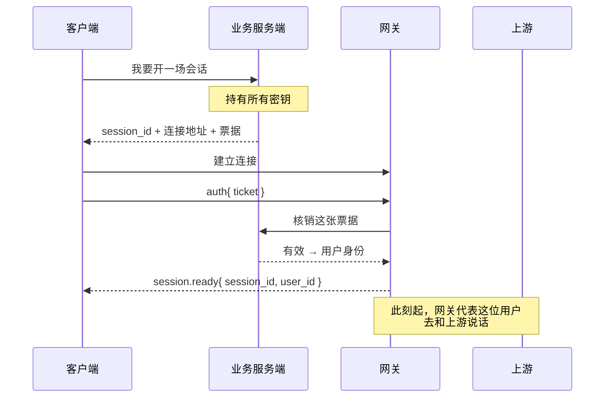
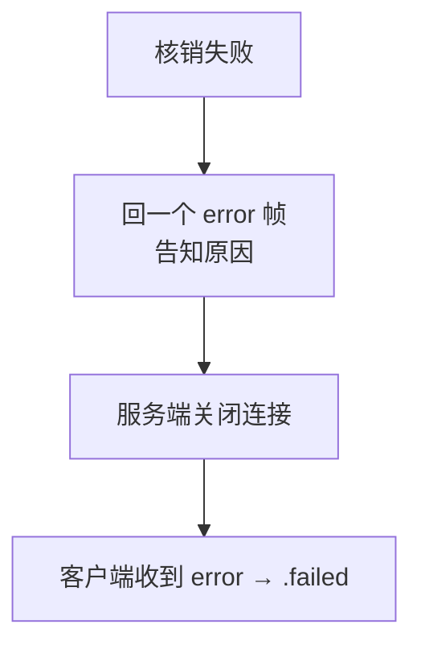
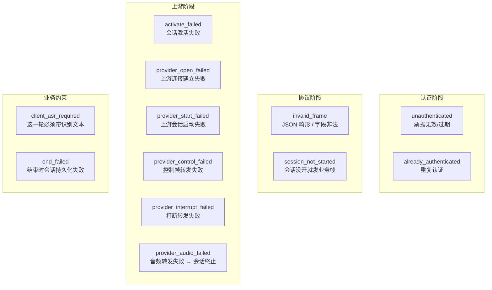
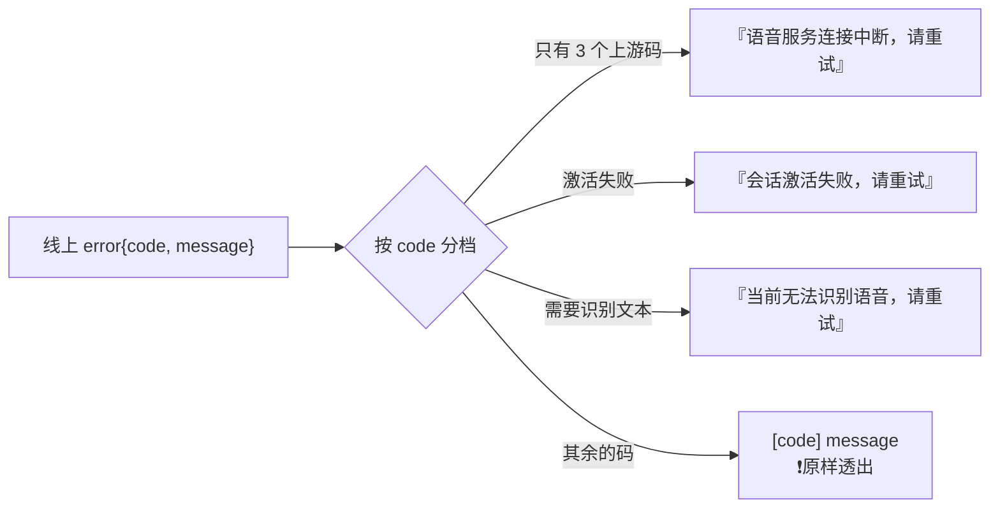
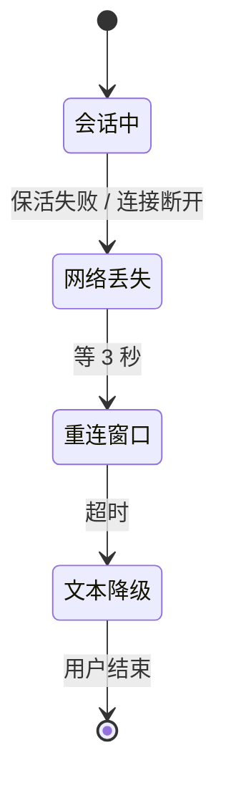
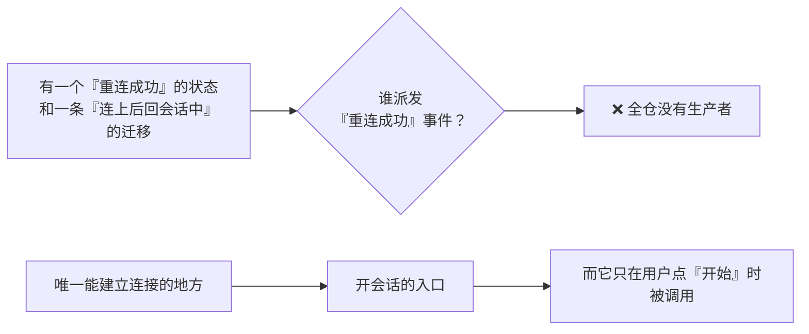

# WSS 系列 10 · 认证、错误与降级

**版本**：V1.0
**日期**：2026-09-11
**定位**：补齐前九篇没讲的两块 —— **连接怎么被放进来**（认证），以及**它在各个阶段会怎么坏、坏了之后客户端怎么降级**（错误路径）。
**对应上游文档**：[86 后端网关](86_WSS系列_05_后端网关.md)（那是连接的正常生命周期；本篇是它的入口与失败面）
**变更说明**：首版。补完本系列在"安全"与"错误路径"上的缺口。V1.1：① 与「没有重连」对齐；速查写明未知帧哪一端；死路形状指向 88⑧。

---

## ① 本篇回答什么

**两个问题**：

1. 一条连接是怎么被允许进来的？（零凭证意味着什么？）
2. 这条链路会在哪些地方坏？每一种坏，用户看到什么？

**读完后你能**：说清"零凭证"在**运行时**是什么意思；拿到完整的错误码表；说清为什么看起来有重连，以及每一次断线为什么必然落到文本降级。

---

## ② 概念

**票据（ticket）。** 一次性凭证。客户端先向业务服务端换取，再拿它去和网关建立连接。**换一次，用一次。**

**消费（consume）。** 网关拿票据去业务服务端核销的动作。核销意味着这张票据**从此失效**。

**降级（degradation）。** 主通道不可用时，退到一个能力更弱但仍可用的模式。本项目的降级是**文本模式**：说不了话，但还能打字。

**用户可见错误。** 一条给学习者看的提示语。它的设计约束是：**不能把原始的 socket 错误文本透出去。**

---

## ③ 约束与推导

### 3.1 零凭证在运行时意味着什么

"客户端零凭证"经常被理解成"不放密钥"。它在运行时其实是一条**完整的凭证流转链**：

**三个直接后果：**

1. **手机从不接触任何第三方密钥。** 上游的调用全程由网关发起。
2. **票据是一次性的。** 网关核销之后它就失效了 —— 因此**拿到一张新票据的唯一途径是重新走一遍开会话流程**。
3. **业务服务端是身份的唯一权威。** 网关不自己判断"你是谁"，它只把票据拿去问。这让身份逻辑只有一处。

> **第 2 条要说清楚**：票据一次性**意味着**重连必须重新换票（逻辑上）。但**今天没有重连** —— 所以这个代价还没有兑现过。真正的因果是：*因为压根没有重连，票据一次性这件事还没机会成为问题*。见 ④ 的降级图。

### 3.2 认证阶段的三个约束

**① 首帧必须是认证帧，而且只认文本帧。**

一个未认证的连接**什么都不能做**。这不是洁癖：连接是一个有成本的资源，不放任何匿名请求进来。

**② 15 秒预算。**

从连上到认证完成有 15 秒。超过就断。防的是"连上就不说话"的连接占着资源。

**③ 失败时，服务端主动关闭连接。**

**注意顺序**：先回错误帧（让客户端知道**为什么**），再关闭。只关闭不说明，客户端只能看到一个"连接断了"，无从判断是自己凭证过期还是服务端故障。

### 3.3 错误码全景

网关会发出的错误码，按**发生在哪个阶段**分组：

**这张表本身就是一份设计文档** —— 每个码对应一个"谁该负责"的判断：

| 分组 | 谁的问题 | 客户端该怎么做 |
|---|---|---|
| 认证 | 凭证生命周期 | 重新走一遍开会话流程 |
| 协议 | 客户端 bug 或版本不匹配 | 不该发生；发生即为缺陷 |
| 上游 | 第三方或网络 | 可重试 |
| 业务约束 | 产品规则 | 按规则补齐输入 |

**一个值得注意的设计**：`invalid_frame` 会**回错误帧**，而**未知帧类型不会**（忽略并计数）。这两条看起来矛盾，其实不是。

**代码给的理由是"自保"**：对不认识的东西回错误帧，**曾经把活的会话打死过** —— 因为客户端会把错误帧当成致命错误。所以对未知类型保持沉默，是为了**让一个更新过的对端不会因为多发了什么而杀掉老连接**。

**判据可以概括成一句**：*这个"不认识"是会伤害我的，还是只是我落后了？*

- **格式错误**（JSON 都解析不了）→ 对端发的东西**不合法**，必须告诉它。
- **类型不认识**（格式没问题，只是这个版本没定义）→ 对方**更新了**，沉默即可。

**注意这条的推理方向**：不是"报错是好习惯所以保留它"，而是**"报错曾经造成过事故，所以给它划一个更窄的适用范围"**。

### 3.4 有一条路径**故意不回错误**

`client.turn.abort`（客户端中止当前录音轮）的处理里，如果转发上游失败，**只记日志，不回错误帧**。

原因写在代码注释里，值得原样理解：

> 客户端会把 `error` 帧映射成致命错误并**终止会话** —— 而这个帧存在的意义恰恰是**保住会话**。

**这是一个很干净的判断**：一个帧的**目的**决定了它的**错误处理方式**。如果一个错误提示会导致"这个请求本来想避免的结果"，那就不该发它。

### 3.5 客户端怎么把错误变成用户能懂的话

**设计约束**：**稳定的失败不能把原始 socket 文本透给学习者。** 用户不需要看到 `write tcp ... broken pipe`。

**但覆盖是不完整的 —— 这一点值得单独看**：

12 个错误码里，只有 **5 个**有专门的用户文案。**六个上游类错误码里只有三个**被映射：

| 有文案的三个 | 落到默认档的三个 |
|---|---|
| 音频转发失败 · 控制帧转发失败 · 上游连接建立失败 | **上游会话启动失败** · **打断转发失败** · 以及其余未分类的 |

也就是说：**"上游启动失败"和"上游连接失败"对用户是两种不同的体验** —— 后者得到一句人话，前者得到一串机器码。而这个区别**没有任何设计理由**，只是文案表没覆盖到。

**最后那档的取舍本身是对的**：未分类的错误码**原样透出**是一个有意的选择 —— 宁可显示一个生僻的码（便于报障时定位），也不要把未知错误伪装成已知错误。

**但"哪些算已分类"必须跟着错误码表一起维护。** 新增一个错误码而忘了更新文案表，用户就会看到机器码 —— 而这件事**不会触发任何测试**。

---

## ④ 降级：主通道断了之后

**注意这张图里没有"连回来了"那条边 —— 因为它在代码里不存在。**

**结果是确定的**：**每一次网络丢失都必然走到文本降级**，没有例外。那条"3 秒窗口内连上"的路径，是一条**有状态、有迁移、但没有触发者**的死路 —— 形状见 [88 ⑧](88_WSS系列_07_可观测性与健壮性.md)，实例还出现在 94 的 `processingReview`。

**这条对排查的意义**：如果你在网上看到"等 3 秒，可能连回来"，别信 —— **等 3 秒是等一个已经不可能发生的事**。

**降级模式的准确含义**：

| 还能做 | 不能做 |
|---|---|
| 用文字继续对话 | 说话（音频通道没了） |
| 保留这一轮的上下文 | 恢复被打断的那一轮 |

**为什么是"降级"而不是"报错重来"**：用户可能已经说了几轮、有上下文了。直接失败会让这些白费；文本模式至少保住对话本身。

**一个必须知道的限制**：**重连不恢复在途的轮次。** 连接断开时正在进行的那一轮，回来了也不会继续 —— 它是一个新的会话。

> **顺带修正一处上游推论**：既然"重建连接"这条路没人走，那么"一次性票据 ⇒ 重连必须重新换票据"这个说法虽然**逻辑上成立**，但它描述的是一条**代码没有实现的流程**。真实的因果是反过来的：**因为压根没有重连，所以票据一次性这件事还没有机会成为一个问题。**

---

## ⑤ 本项目的落地

| 职责 | 位置 |
|---|---|
| 票据签发 | 业务服务端 `POST /api/v1/sessions` |
| 票据核销 | 网关 → 业务服务端 `POST /internal/v1/tickets/consume`（带内部令牌） |
| 认证处理 | `internal/voicegateway/handler.go` 的 `handshake` |
| 错误帧定义 | `internal/voiceproto/frames.go` 的 `ErrorFrame` |
| 错误码 → 用户文案 | `SocketTransportEventMapper.swift` 的 `userFacingErrorText` |
| 降级状态 | 客户端状态机的"文本降级"相位 |

---

## ⑥ 代价与陷阱

**陷阱一：一条"看起来能用"的降级路径其实是死路。**

见 ④。有一个"重连成功"的状态、有一条"连上后回会话中"的迁移、有一个 3 秒的窗口 —— **唯独没有任何东西会派发那个事件**。于是每一次网络丢失都必然落到文本降级。

**它比"功能没做"更值得记**：功能没做是空的；这是**有一个完整的形状，但没有触发者**。读代码的人会以为"等 3 秒可能连回来"，而实际上不是在等一个概率，是在等一个**已经不可能发生的事**。

**它与 94 的 `processingReview` 是同一个形状**（有定义、有消费、没有生产者），定义见 [88 ⑧](88_WSS系列_07_可观测性与健壮性.md)。**这类东西应该被单独扫一遍** —— 它们不会报错，只会让所有人对系统多知道一件不存在的事。

**陷阱二：认证失败时服务端的 `Close` 用的是"策略违规"状态码。**

客户端拿到的是一个**通用**的关闭原因，具体原因在**先发的那条错误帧**里。所以：**如果一个客户端只看关闭码、不看错误帧，它会以为是自己违反了协议。** 顺序（先错误帧、后关闭）是必须的。

**陷阱三：本地开发会跳过来源校验。**

来源校验只在开发环境关闭 —— 这本身合理。但要注意它的**推理方向**：不是"开发环境不安全没关系"，而是"开发环境的来源不可预测，校验会误伤"。**这个开关不该出现在生产配置里**，而"它不会"这件事应该由配置校验来保证，而不是靠人记得。

**陷阱四：未分类的错误码会原样显示给用户。**

见 3.5 末尾。这个取舍在**报障场景**下是对的，但意味着**新增错误码时必须同步更新文案表**，否则用户会看到一串机器码。新增错误码的清单应该和文案表放在一起检查。

---

## ⑦ 自检

1. "客户端零凭证"在运行时是一条什么样的链？网关在其中扮演什么角色？
2. 票据为什么是一次性的？它和"没有重连"之间，真正的因果关系是什么？
3. 认证失败时，为什么必须**先回错误帧再关闭连接**？只关闭会怎样？
4. `invalid_frame` 回错误帧，而未知帧类型不回 —— 这两条的判据是什么？
5. `client.turn.abort` 转发失败时为什么不回错误帧？
6. 降级模式保住了什么、放弃了什么？
7. 重连能恢复正在进行的那个轮次吗？

---

## ⑧ 速查

| 项 | 值 |
|---|---|
| 凭证流转 | 客户端 → 业务服务端换票据 → 网关核销 → 上游调用由网关发起 |
| 票据 | **一次性**，核销即失效 |
| 认证窗口 | 首帧必须是文本帧且类型为认证；**15 秒**预算 |
| 认证失败 | 先回错误帧（说明原因）→ 再主动关闭连接 |
| 错误码分组 | 认证 · 协议 · 上游 · 业务约束 |
| 未知帧类型 | **网关**忽略并计数；**客户端遇到未知类型仍断开**。见 84、90①。格式错误则回 `invalid_frame` |
| 不回错误的特例 | `client.turn.abort` 转发失败 —— 发错误会杀掉它想保住的会话 |
| 用户文案 | 稳定失败给人话，**不透原始 socket 文本**；但 **12 个码里只有 5 个有文案**，其余原样透出机器码 |
| 降级 | 网络丢失 → 3 秒窗口 → 文本模式（还能打字，不能说话） |
| 网络丢失之后 | **必然**落到文本降级 —— "3 秒内连回来"那条边在代码里没有触发者 |
| 来源校验 | 仅开发环境跳过；靠配置校验而非人记得来保证它不进生产 |

---

**系列导航**

[导读](81_WSS系列_00_导读_全景图与术语表.md) · [ELI5](82_WSS系列_01_ELI5_一条语音的旅程.md) · [为什么是 WSS](83_WSS系列_02_为什么是WSS_选型推导.md) · [协议层](84_WSS系列_03_协议层_帧设计与版本化.md) · [iOS 传输层](85_WSS系列_04_iOS传输层.md) · [后端网关](86_WSS系列_05_后端网关.md) · [双工·流式·打断](87_WSS系列_06_双工_流式与打断.md) · [可观测性与健壮性](88_WSS系列_07_可观测性与健壮性.md) · [方法论](89_WSS系列_08_方法论_遇到同类场景怎么想.md) · [实践总结](90_WSS系列_09_实践总结_这套用法的问题与改进.md) · **本篇** · [怎么测试](92_WSS系列_11_怎么测试一条WSS链路.md) · [问题排查](93_WSS系列_12_问题排查手册.md) · [客户端状态机](94_WSS系列_13_客户端状态机_协议事件的消费者.md)
