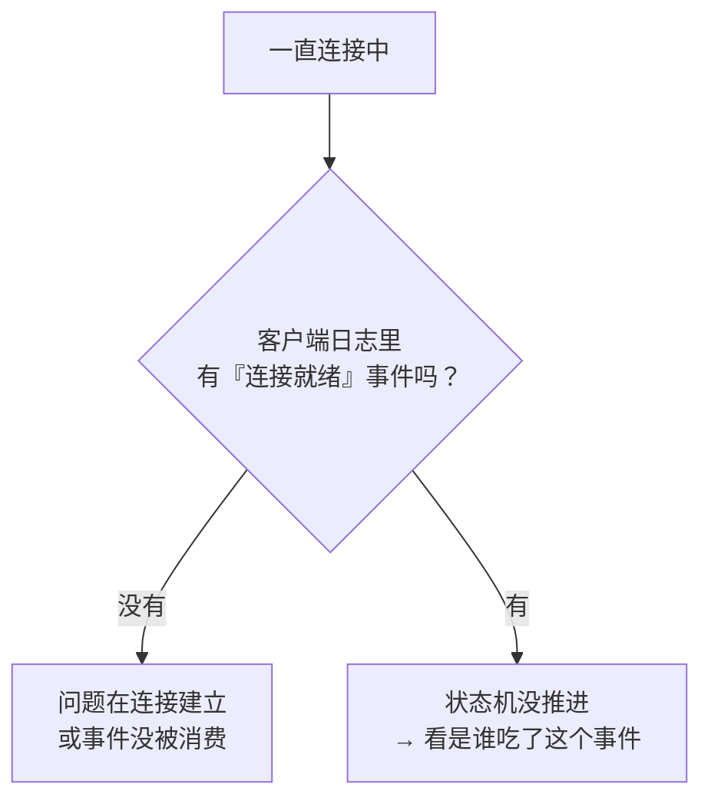
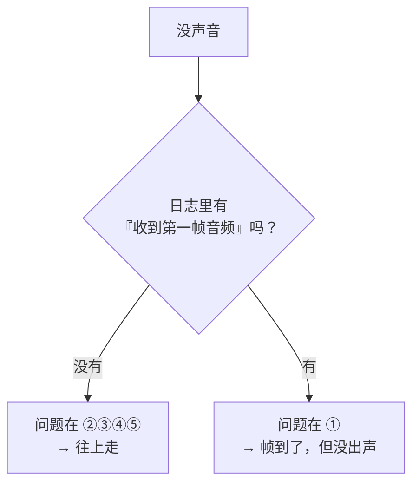
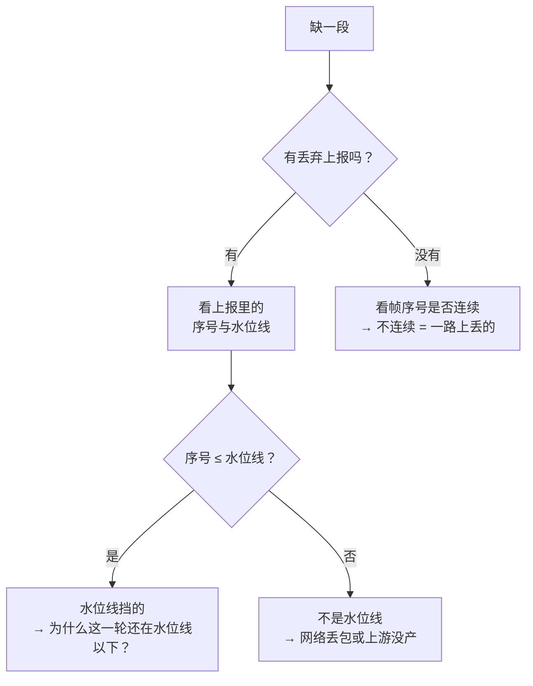
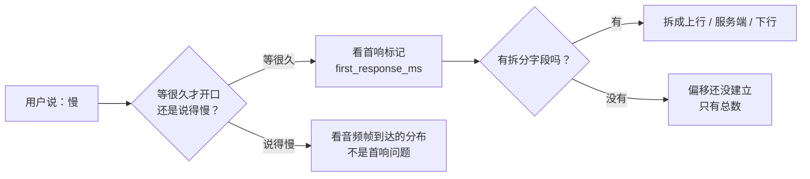
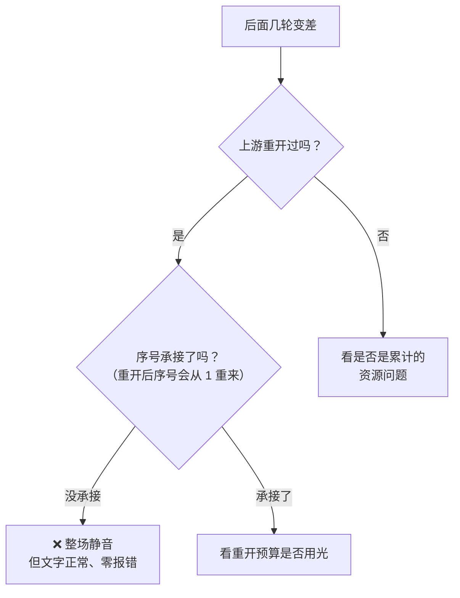
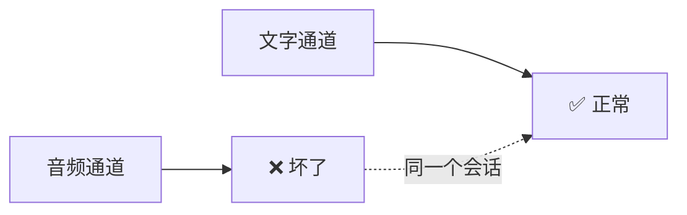

# WSS 系列 12 · 问题排查手册

**版本**：V1.0
**日期**：2026-09-11
**定位**：**按症状查**，不按模块查。真出问题时你不是从"我想看传输层"开始的，是从"用户说没声音"开始的。本篇把症状映射到证据。
**对应上游文档**：[88 可观测性与健壮性](88_WSS系列_07_可观测性与健壮性.md)（那是埋点体系与失效模式；本篇是**怎么用它**）
**变更说明**：首版。V1.1：症状 5 补「空闲超时先怀疑心跳没到」（85 / 90④）。

---

## ① 本篇回答什么

**一个问题**：出问题了，从哪儿下手？

**读完后你能**：拿到一个症状，知道**先问什么**、**看哪条证据**、以及**最容易误判成什么**。

**本篇的用法**：不要通读。拿着症状直接跳到 ④ 的对应行。

---

## ② 三条定位原则

**原则一：先分层，再找因。**

> **症状出现的层 ≠ 原因所在的层。**

"没有声音"是**用户**那一层的描述。它可能来自五段中的任何一段。定位的第一步永远是：**把症状翻译成"哪一段没完成它该做的事"**。

**原则二：找一个能"二选一"的观察，而不是罗列所有可能。**

新手的做法是列一张"可能原因"清单然后逐个排除 —— 那在一条五段的链路上是组合爆炸。

**有效的做法是找一个能把可能性一刀切成两半的观察。** 比如"音频帧到客户端了吗" —— 这一个问题就把五段砍成两段。

**原则三：区分"没有数据"和"数据正常但结论不对"。**

- **没有数据** → 缺埋点。加日志就能推进。
- **数据正常但结论不对** → **埋点本身在骗你**。加更多日志没用，要去核对那个数字的含义。

后一种更贵，因为你会一直以为已经看见了。本系列里有多处属于这一类。

---

## ③ 分层：这条链路上有哪几段

**每一段都有它自己的"该做的事"**：

| 段 | 它该做的事 | 它没做到时，用户看到 |
|---|---|---|
| ① 客户端处理 | 把收到的帧变成声音 | **收到了但没声音** |
| ② 客户端网络 | 把帧送到 | 断续、延迟、最终断开 |
| ③ 网关 | 转发 + 记账 | 帧根本没上路 |
| ④ 网关↔上游 | 把音频送去、把结果取回 | 网关在等，客户端超时 |
| ⑤ 上游 | 生成正确的输出 | 内容是错的，但时序正常 |

**关键**：**"没声音"这四种失败，用户描述完全一样。**

---

## ④ 症状 → 定位路径

### 症状 1 · 一直停在"连接中"

**先问**：客户端有没有收到"连接就绪"事件？

**最容易误判**：把"事件没送到"和"事件送到了但没人处理"当成一回事。它们的修法完全相反。

> **这类问题在本项目有过一次典型形态**：客户端侧的事件消费者被当成了**会话资源**（随会话创建、随会话销毁），于是**上一个会话的取消落在了下一个会话的消费者身上**，消费者静默退出。表现就是永久停在"连接中"，而**日志里一切正常** —— 因为该发的事件都发了。
>
> 判别证据：消费者**启动过但退出得异常早**。

### 症状 2 · 连上了，但完全没有声音

**先问**：**音频帧到达客户端了吗？**

这一个问题把五段砍成两段：

**如果"没有"** —— 继续往上：网关有没有发？上游有没有产出？逐段用同一个问题往上游问。

**如果"有"** —— 问题在客户端：

| 再问 | 如果是 | 说明 |
|---|---|---|
| 帧是**被丢弃**了吗？ | 有丢弃上报 | 水位线把它挡了（见症状 6） |
| 帧进了播放队列吗？ | 没有 | 播放器没启动 / 被换掉了 |
| 播放器在运行吗？ | 不在 | 引擎停了 |

**最容易误判**：**以为"日志里有帧"就等于"用户听得到"**。本项目在这上面栽过 —— 帧一路正常，而播放节点**从来没有被启动过**。**"链路上有数据"和"用户有感知"是两件事**，中间还有一整段客户端处理。

### 症状 3 · 有声音，但缺一段

**先问**：有没有**丢弃上报**？

> 丢弃必须是可观测的 —— 这是设计约束。一个静默的丢弃和一个"本来就没有数据"完全无法区分。

**最容易误判**：**把"水位线挡的"当成"网络丢的"**。前者是本地逻辑，后者是链路问题 —— 而它们的表现都是"某一段声音不见了"。

**水位线挡的情况有个指纹**：**缺的总是"前面"**（序号小的那部分）。网络丢包则是随机的。

**机制上更准确的说法**：水位线是**打断那一刻"已见到的最大序号"**。它丢的是**所有 ≤ 这个数的帧** —— 所以它挡的其实不是"打断之前的"，而是"**打断时已经出现过编号范围内的**"。

**这个区别在正常情况下看不出来，在序号回退时会咬人**：如果编号从 1 重新开始（比如上游重开），那么**新一轮的帧全部落在水位线以内** —— 于是"缺一段"变成"**整场静音**"。

**所以看到丢弃上报时，除了看缺的是哪一段，还要问一句：这个序号范围和当前的轮次对得上吗？** 对不上就是编号回退了，那是另一个问题（见症状 8）。

### 症状 4 · AI 不回应，一直"处理中"

**先问**：收到 `ai.turn.end` 了吗？

**这个帧是"这一轮结束了"的权威信号。** 没有它，客户端会一直等。

| 收到 `ai.turn.end`？ | 含义 |
|---|---|
| **没有** | 它被丢了，或者上游/网关没发 —— 注意它和音频**走同一条流**，所以背压策略曾经会把它丢掉 |
| **有，但 outcome 是 timeout** | 上游超时，客户端应该走超时 UX |
| **有，但界面还卡着** | 客户端没处理它 —— 状态机的问题，不是链路的问题 |

**最容易误判**：**在链路上找原因，而问题在客户端对帧的处理**。"帧到了"和"状态机因此推进了"是两件事。

### 症状 5 · 会话自己结束了

**先问**：**哪一方先断的？**

| 谁先断 | 常见原因 |
|---|---|
| **服务端** | 空闲超时（**但心跳在的话不该发生**）· 认证问题 · 上游故障导致会话被标记为坏掉 |
| **客户端** | 保活连续失败 · 收到致命错误帧 · 用户操作 |
| **说不清** | 网络断了 —— 两边都只看到"读失败" |

**判别证据**：服务端关闭时会带一个**状态码和原因**；客户端侧的关闭原因在**错误帧**里（**先错误帧、后关闭**，所以要看的是帧不是关闭码）。

> **若真发生了空闲超时**：先怀疑心跳没到。应用级 ping 正常工作时，网关的 2 分钟读空闲**永远不会触发**（见 85、90④）。真触发了，不是"回收终于生效"，是喂超时的那条 ping 断了。

### 症状 6 · 慢

这一条 88 篇已详述，这里只给入口：

**最容易误判**：把"说得慢"当成"首响慢" —— 那是两个完全不同的问题。

### 症状 7 · 打断没反应，或者停了又响

**先分成两种，它们的成因完全不同**：

| 表现 | 问题在哪 |
|---|---|
| **完全没停** | 本地停播没执行 —— 状态机没收到"用户开口"这个事件 |
| **停了，但过一会儿又冒出一句** | 本地停了，**但水位线没挡住后面到的帧** |

第二种正是水位线存在的理由：停播之后，**已经在路上的**音频还会继续到达。

**最容易误判**：以为"打断"是一个动作。它是**两个**：本地停播 + 挡住在途数据。只做前一个，就会"停了又响"。

### 症状 8 · 第一轮正常，后面越来越差

**先问**：**是不是在一次"透明重开"之后？**

这是本系列讨论最多的那类故障的形状：

**最容易误判**：**以为"文字正常"就说明链路正常**。音频和文字走**两条不同的路径**，一条坏不牵连另一条 —— 这正是这类故障难发现的原因。

### 症状 9 · 只有一部分用户/网络出问题

**先问**：**共同点是什么？**

| 共同点 | 指向 |
|---|---|
| **同一个 App 版本** | 协议不兼容 —— 尤其注意"服务端加了新帧类型"这种情况 |
| **同一个网络环境** | 中间设备（代理、企业防火墙）对长连接不友好 |
| **同一个运营商/地区** | 到网关的网络路径 |
| **所有用了很久的会话** | 累计状态问题（比如水位线） |

**最容易误判**：把它当成偶发。**"一部分用户"几乎总是有共同点**，而找出共同点比逐个排查快得多。

---

## ⑤ 三种最难定位的形状

这三类在本项目里都出现过，且**共性是"看起来正常"**。

### 形状一：一端坏了，另一端正常

**为什么难**：任何"会话级别"的健康判断（连接在吗？有错误吗？）都是**绿的**。

**对策**：健康检查要**逐通道**做，不要只看"会话活着吗"。问"**每一条**该到的数据都到了吗"。

### 形状二：静默丢弃

**为什么难**：丢弃和"本来就没有"长得一模一样。

**对策**：**丢弃必须上报**。哪怕只在开始和结束各报一次 —— 那也足以把"没有数据"和"数据被扔了"分开。

### 形状三：数字看着对

**为什么难**：它是个合理的数字，量纲也对，只是含义不是它声称的那个。

**对策**：对每个关键数字问一句 —— **"它是从哪个时刻量到哪个时刻的？"** 如果答不上来，那个数字就不该被用来做判断。

> 本项目有一处正是如此：一个耗时埋点声称量的是"处理耗时"，实际量的是"等待下一帧的时间"。**它一直看着挺合理。**

---

## ⑥ 取证：能拿到什么

| 来源 | 有什么 | 什么时候用 |
|---|---|---|
| **客户端日志** | 时间线标记（含首响）、丢弃上报、错误映射、帧到达 | 绝大多数症状的**第一站** |
| **网关日志** | 连接生命周期、重开、上游故障、去重后的警告 | 客户端显示"没有帧到达"时 |
| **会话记录（落库）** | 每一轮的转录、用量 | 判断"用户到底听到了什么" |
| **上游日志** | 需要 `log_id` 关联 —— 而它在**轮末**才拿到 | 怀疑上游时；注意一轮进行中你还没有它 |

**一条实操建议**：**先拿客户端日志**。它是唯一能看到"用户侧真实发生了什么"的地方，而且绝大多数症状的第一问（帧到了吗、有丢弃吗、有结束帧吗）都在那里能答。

---

## ⑦ 自检

1. 三条定位原则分别是什么？"症状的层 ≠ 原因的层"为什么重要？
2. "没有声音"这一个症状，对应几段可能的失败？怎么用一个问题砍成两半？
3. 怎么区分"水位线挡的"和"网络丢的"？它们的指纹有什么不同？
4. "AI 不回应"时，收到 `ai.turn.end` 与否分别意味着什么？
5. "停了又响"是哪个机制没起作用？
6. 为什么"文字正常"不能作为音频链路正常的证据？
7. 为什么"数字看着对"比"没有数据"更难定位？

---

## ⑧ 速查：症状 → 第一问 → 关键证据

| 症状 | 第一问 | 关键证据 |
|---|---|---|
| 一直"连接中" | 收到"连接就绪"了吗？ | 事件消费者是否启动过又异常早退 |
| 完全没声音 | **音频帧到了吗？** | 首帧到达标记 |
| 有声音但缺一段 | 有丢弃上报吗？ | 丢弃上报里的序号 vs 水位线；缺的是"前面"还是"随机" |
| AI 不回应 | 收到 `ai.turn.end` 了吗？ | 该帧到达标记；它和音频走同一条流 |
| 会话自己结束 | **哪一方先断的？** | 服务端关闭码 / 客户端错误帧。若是空闲超时，先怀疑心跳没到（85 / 90④） |
| 慢 | 等很久才开口，还是说得慢？ | 首响标记（有无拆分字段） |
| 打断没反应 | 没停，还是停了又响？ | 两个不同的机制：停播 vs 水位线 |
| 第一轮好后面差 | 是重开之后吗？ | 序号是否承接；**文字正常不代表链路正常** |
| 只有一部分用户 | 共同点是什么？ | 版本 / 网络 / 地区 —— 比逐个排查快 |

**三条通用原则**

| 原则 | 一句话 |
|---|---|
| 分层 | 症状的层 ≠ 原因的层；先翻译成"哪一段没做到" |
| 二分 | 找能**一刀砍一半**的观察，不要罗列所有可能 |
| 辨伪 | 先分清是"没有数据"还是"**数据在骗你**" |

**最容易误判的四条**

1. 日志里有帧 ≠ 用户听得到
2. 文字正常 ≠ 链路正常（音频和文字是两条路径）
3. 帧到了 ≠ 状态机因此推进了
4. 数字合理 ≠ 数字的含义是它声称的那个

---

**系列导航**

[导读](81_WSS系列_00_导读_全景图与术语表.md) · [ELI5](82_WSS系列_01_ELI5_一条语音的旅程.md) · [为什么是 WSS](83_WSS系列_02_为什么是WSS_选型推导.md) · [协议层](84_WSS系列_03_协议层_帧设计与版本化.md) · [iOS 传输层](85_WSS系列_04_iOS传输层.md) · [后端网关](86_WSS系列_05_后端网关.md) · [双工·流式·打断](87_WSS系列_06_双工_流式与打断.md) · [可观测性与健壮性](88_WSS系列_07_可观测性与健壮性.md) · [方法论](89_WSS系列_08_方法论_遇到同类场景怎么想.md) · [实践总结](90_WSS系列_09_实践总结_这套用法的问题与改进.md) · [认证·错误·降级](91_WSS系列_10_认证_错误与降级.md) · [怎么测试](92_WSS系列_11_怎么测试一条WSS链路.md) · **本篇** · [客户端状态机](94_WSS系列_13_客户端状态机_协议事件的消费者.md)
