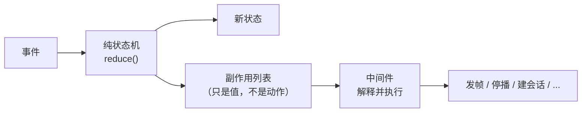
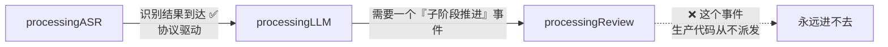
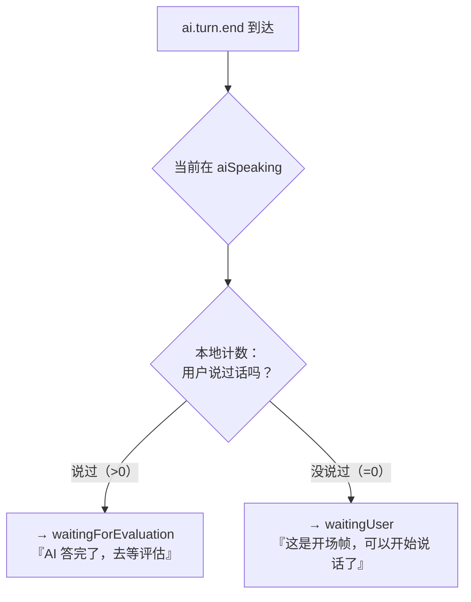
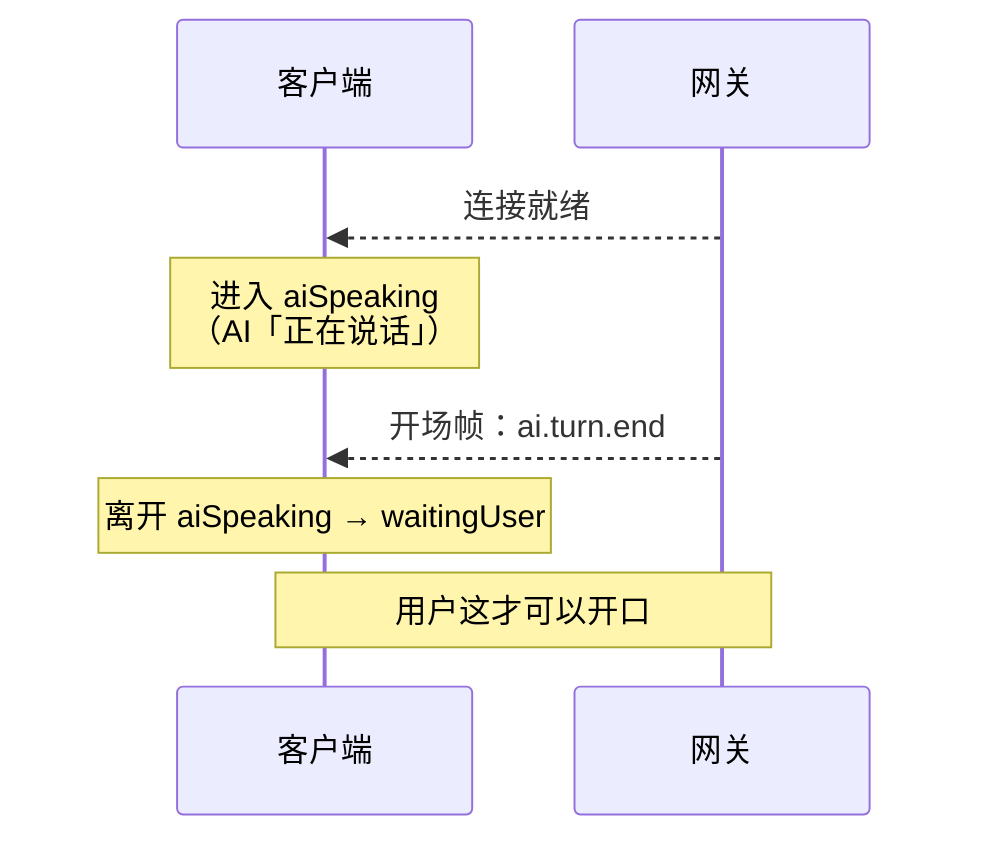
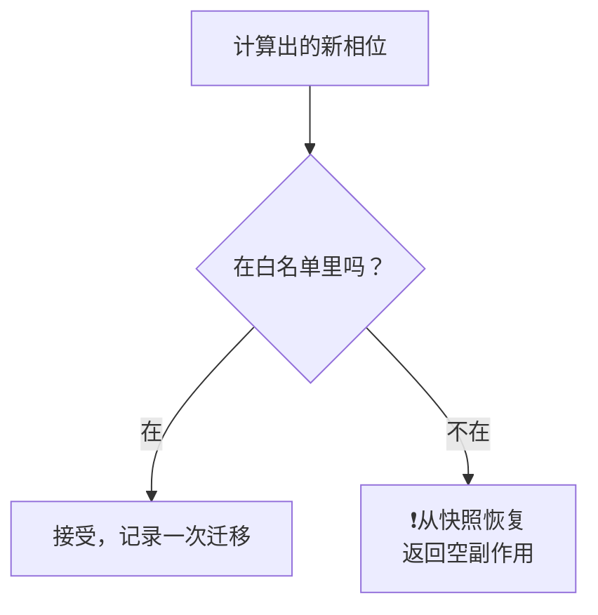
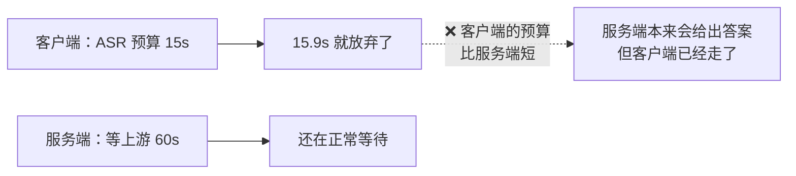
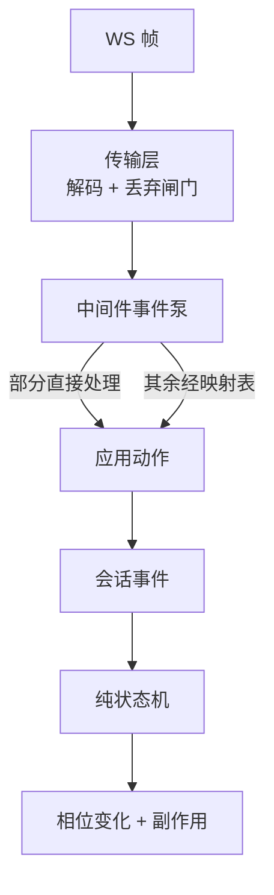
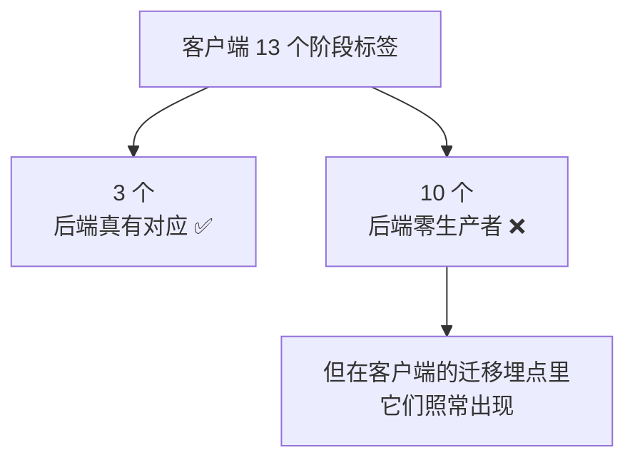

# WSS 系列 13 · 客户端状态机：协议事件的消费者

**版本**：V1.0
**日期**：2026-09-11
**定位**：一条帧从线上到达之后，是谁决定"接下来做什么"。讲清**协议事件如何驱动应用状态**，以及这层耦合里最容易出错的地方。
**对应上游文档**：[85 iOS 传输层](85_WSS系列_04_iOS传输层.md)（那是帧怎么到；本篇是帧到了之后）
**变更说明**：首版。补完本系列在"协议的消费者"上的缺口。

---

## ① 本篇回答什么

**一个问题**：帧到了客户端之后，谁决定接下来做什么？

**读完后你能**：

- 说清"纯状态机 + 副作用解释器"这个分工为什么让这一层可测
- 说出 13 个相位里**哪些由协议驱动、哪些由本地驱动**
- 认出这层耦合里最容易出错的三处：一个事件两种含义、后端阶段泄漏、计时器互相打架

---

## ② 概念

**相位（phase）。** 会话当前处于哪个状态。本项目有 13 个。

**纯状态机。** 一个函数：`(当前状态, 事件) → (新状态, 要做的事)`。它**不做任何 I/O** —— 不发网络、不碰音频、不读时钟。

**副作用（side effect）。** 状态机"想做的事"的表达，但它**只是一个值**。谁来执行？下一层。

**事件源。** 驱动状态机的东西。本项目的四条：**用户操作**（点击、按住说话）· **本地音频检测**（VAD）· **协议**（WS 帧）· **系统**（来电等中断）。

---

## ③ 约束与推导

### 3.1 分工：状态机零 I/O，副作用由别人执行

**为什么把副作用做成"值"而不是直接调用**：

- **状态机可以完全离线测试** —— 不需要网络、不需要音频设备、不需要时钟。喂事件，断言状态和副作用列表。
- **"想做什么"和"怎么做"分开** —— 同一套状态逻辑可以配不同的执行器。

**代价是间接**：读代码时要跳一层才能看到"这个副作用最后干了什么"。但换来的是：**这套逻辑的每一次改动都可以被穷尽地测。**

### 3.2 13 个相位 —— 但**协议只驱动其中一部分**

这是本篇最实用的那张表。每个相位的**进入条件**来自哪里：

| 相位 | 谁让它进入 | 源 |
|---|---|---|
| `idle` | 初始 | — |
| `connecting` | 用户点击开始 | 👤 用户 |
| **`aiSpeaking`** | **连接就绪** | 🌐 **协议** |
| `waitingUser` | 首轮结束 / 评估完成 / 打断之后 | 🌐 + 👤 |
| `recording` | 检测到用户开口 / 按住说话 | 🎤 本地 |
| `processingASR` | 用户停口 / 松手 | 🎤 本地 |
| **`processingLLM`** | **识别结果到达** | 🌐 **协议** |
| `processingReview` | **没有人让它进入** | ⚠️ **死路**（见下） |
| `waitingForAIAnswer` | 录音超时中止 | ⏱️ 本地计时器 |
| **`waitingForEvaluation`** | **本轮结束帧到达** | 🌐 **协议** |
| `degradedText` | 网络降级 / 重连超时 | 🌐 传输层 |
| `ended` | 用户结束 | 👤 用户 |
| `failed` | 错误帧 / 传输失败 | 🌐 协议 |

**三个观察：**

1. **协议驱动的相位比想象中少。** 多数相位由用户、本地音频检测、计时器驱动 —— **状态机不是"协议的镜像"，它是四条事件源的汇合点。**
2. **`processingReview` 是一条死路 —— 没有任何东西能让它被进入。**
3. **`aiSpeaking` 由"连接就绪"进入，而不是由任何 AI 相关的事件。** 这一条反直觉，值得单独说 —— 见 3.4。

### 3.2.1 那条死路：一个"有定义、有消费、但没有生产者"的阶段

`processingReview` 需要一个"子阶段推进"事件才能进入。这个事件**在状态机里有定义、有消费分支**，但：

> **生产代码里没有任何地方派发它。** 全仓唯一一处派发在**测试**里。

**这不是"少了点东西"，是一个完整的形状**：定义在、消费分支在、测试在 —— 唯独**生产者不在**。而测试能过，因为测试自己造了那个事件。

**这类东西比"死字段"更隐蔽**：死字段只是没人读；这个是**有消费者、有测试、有文档记录，唯独线上永远不会发生**。任何照着代码理解系统的人都会以为"AI 处理会经过三个阶段"，而实际上只有两个。

**可迁移的检查**：

> 对每一个"状态"或"分支"，问一句 —— **谁生产进入它的那个事件？** 如果答案只在测试里，那它不是一条路径，是一个装饰。

（这也解释了为什么 ③ 的表里那一格我标的是"⚠️ 死路"而不是"本地驱动" —— 本地驱动意味着有个计时器或用户操作会触发它，而这里什么都没有。）

### 3.3 一个协议事件，两种含义 —— 靠本地计数器区分

**这是全篇最值得注意的一处。**

`.ai.turn.end` 到达时，如果当前在 `aiSpeaking`，去哪个相位**取决于一个本地计数器**：

**同一帧，两个完全不同的意思。** 而**协议本身不携带区分它们的信息** —— 区分靠的是客户端本地的状态。

**为什么会有这个局面**：客户端在**连接就绪时就进入"AI 在说话"**（见 3.4），所以服务端必须发一个"结束"帧把它放出来。于是"开场"和"答完"用了**同一个帧类型**。

**代价**：客户端的正确性依赖一个**隐式约定** —— "第一次 `ai.turn.end` 一定是开场"。如果服务端改了开场行为，客户端会**错判而不会报错**。

**这类设计的通用教训**：

> 当一个协议事件的含义**取决于接收方的本地状态**时，这个协议就多了一条**不成文的规则**。它不出现在任何 schema 里，但你违反它就会坏。

### 3.4 为什么"连接就绪"直接进入"AI 在说话"

**这不是设计，是迁就。** 客户端把"连接就绪"当作"AI 即将说话"的信号，于是需要一个"结束帧"把它放出来。服务端相应地补了一个**开场帧**。

**如果没有那个开场帧**会怎样？客户端会一直停在"AI 在说话"，而**用户的第一次点击会被解读成打断** —— 于是产生一个莫名其妙的打断信号。

> **这个案例的可迁移之处**：当两端的"默认状态"不一致时，通常的修法不是改默认，而是**让一端补一个"什么都没有发生"的信号**。它看起来是噪音，实际上是在对齐两端的起点。

### 3.5 非法迁移会被回滚

状态机维护一张**允许迁移的白名单**。落到白名单之外时：

**注意"从快照恢复"** —— 不是"忽略这个事件"，而是**把整个状态回滚**。这意味着一条没预料到的路径不会让机器停在一个**没人定义过**的相位里。

**代价**：一个本该发生的迁移被静默丢弃，**没有错误、没有日志**（只有一条"没迁移"）。所以白名单是一把双刃剑 —— 它防住了未知状态，也**吞掉了未知的状态变化**。

### 3.6 计时器谱系：八个计时器，而其中三个**是诊断不是判决**

| 计时器 | 时长 | 触发后做什么 |
|---|---|---|
| 连接等待 | 10s | 判定连接失败 |
| 录音上限 | 60s | 中止当前录音轮，**会话保留** |
| 子阶段 ASR | 15s | **只记一条日志，什么都不做** |
| 子阶段 LLM | 45s | 同上 |
| 子阶段 review | 30s | 同上 |
| 评估等待 | 20s | 离开"等评估"，**不停播** |
| 整轮上限 | 70s | 判定这一轮超时 |
| 重连窗口 | 3s | 进入文本降级 |

**"子阶段超时是诊断不是判决"这一条，是本项目用一次真机故障换来的：**

**实测**：客户端在 15.9 秒放弃时，网关**仍在它 60 秒的窗口内**。

**教训**：

> **一个"分阶段预算"如果比它上面那一层的总预算还短，它就不是一个预算，是一个提前放弃。**
>
> 分阶段的数字只在**诊断**时有用（"这一段慢了"）；让它**做决定**，就等于把上层的时间预算架空了。

**所以这三个计时器只上报、不行动。** 一轮的权威结束信号是**协议里的结束帧**，或者那个 70 秒的总上限 —— 后者是"什么都没有到达"时的兜底。

### 3.7 一条帧要走三层才变成相位变化

**为什么要记这个链路**：排查时，"帧到了"和"相位变了"之间**隔着三层**。任何一层出问题，症状都是"帧在日志里，但界面没反应"。

**一个容易搞错的地方**：中间件的那个分支里，**两种情况是混在一起的** ——

| 同一分支里混着 | 例子 |
|---|---|
| **会驱动状态机的帧** | 音频首帧、反馈命中、本轮结束、识别结果 —— 它们**都**在这里被派发成会话事件 |
| **只产生副作用的帧** | 语音流的起止、文本增量 —— 它们只记录、上报，不进状态机 |

**所以"这个帧会改变状态吗"不能从它走了哪个分支推断** —— 同一个分支里两种都有。**要看它被派发成了什么事件。**

（真正按分支分开的是另一条线：**上面这些具名分支之外**的帧，才落到通用的映射表去。）

---

## ④ 本项目的落地

| 职责 | 文件 |
|---|---|
| 相位、状态、迁移白名单 | `SpeechSessionState.swift` · `SpeechSessionMachine.swift` |
| 事件定义（四条来源汇合） | `SpeechSessionEvent.swift` |
| 副作用定义（只是值） | `SpeechSessionSideEffect.swift` |
| 计时器配置 | `ProcessingTimeouts.swift` |
| 副作用解释 + 事件泵 + 帧到事件的映射 | `SpeechSessionMiddleware.swift` |
| 传输事件 → 应用动作 | `SocketTransportEventMapper.swift` |

---

## ⑤ 代价与陷阱

**陷阱一：后端管线阶段泄漏进了产品相位。**

`processingASR` / `processingLLM` / `processingReview` 这三个相位，名字就是**后端管线的三个阶段**。它们不是产品语义 —— 产品只知道"AI 在想"。

**更麻烦的是信息存了两遍**：上下文的"当前子阶段"**已经有一个独立字段**，而相位又把它表达了一次。同一个事实两个来源，就有不一致的可能。

**代价是具体的**：任何"这个阶段超时了怎么办"的问题，都要同时考虑"相位"和"子阶段字段"两个地方 —— 而缺陷恰恰出在这类地方。

**陷阱二：一个事件两种含义，靠本地计数器区分。**

见 3.3。它没有写进任何 schema，是一条**只在实现里存在的约定**。

**陷阱三：分阶段预算比总预算短，于是架空了总预算。**

见 3.6。这条已经修好（改成诊断），但**同样的形状还可能出现在别处** —— 任何"每一层各有超时"的系统都要检查：**内层的预算之和，是否超过了外层的容忍度？**

**陷阱四：相位名**号称**是跨服务的日志契约 —— 但只兑现了一小部分。**

每个相位都映射到一个"阶段标签"，设计意图是它能和网关、上游的日志**一起被检索**。

**实际清点下来，13 个标签里只有 3 个在后端真的有对应**（编排、识别、语音合成）。其余 10 个 —— 包括"等待用户""录音""等待评估""文本降级"这些**最常用于排查的** —— 在服务端**没有任何生产者**。

**这个差距的代价是具体的**：在客户端日志里看到某个阶段标签，会**以为**能在服务端日志里搜到同名的东西 —— 而搜不到，且**不会报错**，你会以为那段时间服务端没日志。

**对"收敛相位"那项重构的意义也变了**：它不是"先核对映射关系"那么简单 —— 它面对的是**一个只兑现了 3/13 的契约**。收敛之前该先决定：剩下那 10 个是要**补上对应**，还是**承认它们只是客户端内部的标签**。这两个方向的改法完全不同。

---

## ⑥ 自检

1. "纯状态机 + 副作用解释器"这个分工换来了什么？代价是什么？
2. 13 个相位里，协议驱动几个？其余由谁驱动？
3. `ai.turn.end` 在 `aiSpeaking` 相位有几种含义？靠什么区分？这条约定写在哪里？
4. 为什么客户端会在"连接就绪"时进入"AI 在说话"？服务端为此补了什么？
5. 落进白名单之外的迁移会发生什么？这个机制的代价是什么？
6. 为什么"子阶段超时"只上报不行动？如果不这样会怎样？
7. 一条帧要经过几层才能变成相位变化？"帧到了但界面没反应"该查哪里？
8. `processingReview` 这条路径缺的是什么？为什么它比"死字段"更难发现？
9. 同一个分支里混着"驱动状态机"和"只做副作用"的帧 —— 那怎么判断一个帧会不会改变状态？

---

## ⑦ 速查

| 项 | 值 |
|---|---|
| 相位总数 | 13 |
| 由**协议**驱动的 | 连接就绪 · 识别到达 · 本轮结束 · 降级 · 失败 |
| 由**本地**驱动的 | 用户操作 · 音频检测 · 计时器 |
| **死路一条** | `processingReview` —— 定义在、消费在、测试在，**生产代码从不派发进入它的事件** |
| 进入"AI 在说话"的信号 | **连接就绪**（不是任何 AI 事件） |
| 一个事件两种含义 | `ai.turn.end` 在 `aiSpeaking`：开场帧 → 等待用户；答完 → 等待评估 |
| 区分依据 | **本地轮次计数**（协议里没有这个信息） |
| 非法迁移 | **回滚到快照**，静默丢弃（无错误、无日志） |
| 子阶段计时器 | **只上报，不行动** —— 分阶段预算比总预算短，不能拿它做决定 |
| 一轮的权威结束 | 协议里的结束帧；兜底是 70 秒总上限 |
| 帧到相位 | 三层：传输层 → 中间件（部分直达 / 部分经映射）→ 状态机 |
| 相位名的额外作用 | **号称**是跨服务日志的检索键 —— 但 **13 个标签里只有 3 个在后端真有对应** |
| "帧会改变状态吗" | 不能看它走哪个分支（同一分支里两种混着）—— **要看它被派发成了什么事件** |

---

**系列导航**

[导读](81_WSS系列_00_导读_全景图与术语表.md) · [ELI5](82_WSS系列_01_ELI5_一条语音的旅程.md) · [为什么是 WSS](83_WSS系列_02_为什么是WSS_选型推导.md) · [协议层](84_WSS系列_03_协议层_帧设计与版本化.md) · [iOS 传输层](85_WSS系列_04_iOS传输层.md) · [后端网关](86_WSS系列_05_后端网关.md) · [双工·流式·打断](87_WSS系列_06_双工_流式与打断.md) · [可观测性与健壮性](88_WSS系列_07_可观测性与健壮性.md) · [方法论](89_WSS系列_08_方法论_遇到同类场景怎么想.md) · [实践总结](90_WSS系列_09_实践总结_这套用法的问题与改进.md) · [认证·错误·降级](91_WSS系列_10_认证_错误与降级.md) · [怎么测试](92_WSS系列_11_怎么测试一条WSS链路.md) · [问题排查](93_WSS系列_12_问题排查手册.md) · **本篇**
