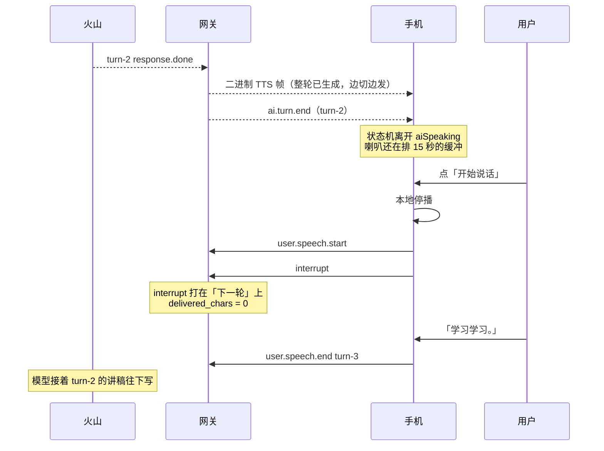
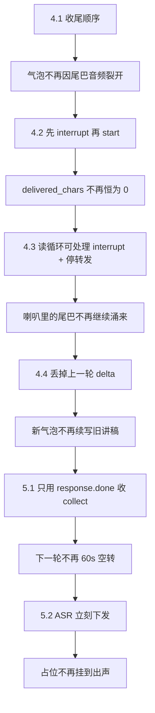

# WSS 系列 14 · 长 TTS 打断：如何定位，如何修

**版本**：V1.0
**日期**：2026-09-12
**定位**：一次真机事故的完整证据链。用户在 AI **还在说话**时开口，本地声音截断了，但左边气泡裂开、新内容答的不是刚问的那句。本篇只讲**怎么发现、怎么拆、怎么改**；业界对照与「原来的代码错在哪一层原理」见 [96](96_WSS系列_15_长TTS打断_业界做法与原代码问题.md)。播放本身怎么接到扬声器，见 [98](98_WSS系列_17_TTS播放与轮次设计.md)。
**对应上游文档**：[87 双工·流式·打断](87_WSS系列_06_双工_流式与打断.md) · [94 客户端状态机](94_WSS系列_13_客户端状态机_协议事件的消费者.md)
**变更说明**：首版。87 把打断写成「网关两层空操作」——那是 9/11 的事实，**不是** 9/12 之后的事实。读 87 的 §3.5 时以本篇为准。

---

## ① 本篇回答什么

**一个问题**：长回复还在喇叭里响的时候用户开口，客户端看起来「打断了」，为什么对话却接错了轮？

**读完后你能**：

- 用一份会话日志，把「气泡裂开」还原成四条互不替代的根因
- 说清为什么**生成已经结束**和**播放还没结束**会让同一条 `interrupt` 打在错误的轮上
- 按「先红再改」的顺序复述这次修法，以及每一刀守住的不变量

---

## ② 用户看到了什么

说的房间里，AI 在念一段很长的回复。用户点「开始说话」。

本地立刻安静 —— 这一步是对的，`interruptNow()` 停的是扬声器，不等网关。

右边进入「正在转写」。左边已经有的那条 AI 气泡**从中间裂开**：下半截不是对刚刚那句问话的回答，而是被截断的上一轮讲稿的续写。

这不是「识别错了几个字」。这是**轮次接错了**。

同一晚上后半段还有两个跟「长 TTS」绑在一起、但不是同一个根因的症状，本篇后半会单独写，免得和主事故缠在一起：

- 转写占位一直挂到 TTS **已经出声**
- 点「结束练习」时喇叭里有沙沙（那是拆音频图，见 iOS `docs/66`，不是本篇的打断）

---

## ③ 怎么定位：先分三个时钟

排查时最容易犯的错，是把下面三件事当成一件：

| 时钟 | 谁的时间 | 这一次它停在哪 |
|---|---|---|
| **生成** | 火山 Duplex 产出文本 / PCM | turn-2 的 `response.done` 已经到了 |
| **转发** | 网关把帧写进手机那条 WSS | `collect_turn.done` + `ai.turn.end` 已经发出 |
| **播放** | 手机 `AVAudioPlayerNode` 把已排程的 PCM 排干 | 还在播，大约还有 15 秒 |

真机会话：`8dffe643-…`，火山 `log_id=20260912044916780AF50DE25950797886`。

时间线（同一秒内的因果关系，不是感觉）：

**关键读数**：`interrupt` 到达时 `delivered_chars: 0`。网关认为这一轮还什么都没送给用户。用户耳朵里刚刚才被截断的，是 **turn-2 已经播了十几秒的声音**。

所以第一个定位结论是：

> **用户打断的是播放时钟上的上一轮；协议帧打在了转发时钟上的下一轮。**

下面四条根因，没有一条能单独解释全部症状。它们叠在同一个手势上。

---

## ④ 四条根因（主事故）

### 4.1 收尾帧的顺序：尾巴音频落在 `ai.turn.end` 后面

iOS 在 `ai.turn.end` 上做两件不可逆的事：把当前这条 AI 消息**封口**，并且（在 `userTurnCount > 0` 时）离开 `.aiSpeaking`。

网关 `turnToOutbound` 原来的收尾是：先发 `ai.turn.end`，再把重采样器里**不满一帧**的尾巴、以及 `ai.tts.end` 发出去。

长回复的尾巴经常是「最后几十毫秒 PCM + 终结符」。它们在 `ai.turn.end` **之后**到达。客户端已经把气泡封了，于是把这段当成**新的一轮 AI 消息** —— 这就是「裂开」。

守卫：`TestTurnToOutbound_DoesNotFinalizeBeforeTheAudioTail`。

不变量：

> **同一轮的声音，必须在 `ai.turn.end` 之前全部离开网关。顺序是：文本 / ASR → 尾巴或整包音频 → `ai.tts.end` → `ai.turn.end` 最后。**

### 4.2 帧顺序：`user.speech.start` 先于 `interrupt`，而且 start 会清掉本轮记账

客户端音频泵在 `.aiSpeaking` 里检测到开口，曾经先发 `user.speech.start`，再由状态机副作用发 `interrupt`。

网关在 `user.speech.start` 上调用 `resetTurnStreamingState()`：清空 `deliveredText`、`interruptedThisTurn`、半帧缓冲。这在「一轮真正开始」时是对的；在「上一轮的 collect 还没散场、用户只是要打断播放」时，它把**刚刚才要用来截断转录的送达文本擦掉了**。

于是日志里永远是 `delivered_chars: 0`。不是用户什么都没听到，是记账被下一轮的 start 洗了。

守卫：`TestBargeInStartThenInterruptStillRecordsWhatWasDelivered`。

iOS 守卫：`bargeInFromAISpeakingSendsInterruptBeforeUserSpeechStart`。音频泵在 `.aiSpeaking` 时先 `submitTranscript("__interrupt__")`，再 `sendSpeechBoundary(started: true)`。

不变量：

> **打断帧必须先于「新一轮开口」帧。开口帧在 `collectingTurn` 时不得重置本轮的送达记账。**

今天音频泵和状态机都可能发 `interrupt`，线上会看到两次。无害，比反了顺序轻。

### 4.3 读循环被 `WaitTurnResult` 堵住，打断到不了正在转发的那一轮

`user.speech.end` 曾经在同一条 WSS 读循环里同步 `WaitTurnResult`（也就是 `collectTurn`）。长 TTS 生成要整轮跑完，这个调用会占住循环好几秒到几十秒。

用户在喇叭还在响时开口，`interrupt` 卡在 TCP 缓冲里，等 collect 返回才被处理。那时：

- turn-2 已经 `ai.turn.end`
- 火山可能还在往这条 duplex 上吐 turn-2 的残留，或已经开始下一轮
- 网关的 `interruptedThisTurn` 置位发生在**错误的窗口**

即便 interrupt 及时到了，sink 仍继续把 `output_audio.delta` 转发给手机 —— 87 写的「两层空操作」指的就是这里：帧被「处理」了，转发没停。

修法分三刀，缺一不可：

| 刀 | 做什么 |
|---|---|
| 读循环 | `user.speech.end` 改成 goroutine `startCollectTurn`；循环继续处理 `interrupt` / `ping` |
| 转发 | `AssistantTextDelta` / `AssistantAudio` 见 `interruptedThisTurn` 立即 return；`turnToOutbound` 丢掉未发出的 `audioPending` |
| 关闭 | 先关 provider，再 `collectWG.Wait()`，避免 collect 往已拆的连接上写 |

守卫：`TestInterruptStopsForwardingFurtherAssistantAudio`、`TestInterruptStopsForwardingFurtherAssistantTextDeltas`、`TestHandler_ProcessesInterruptWhileSpeechEndIsCollecting`。

不变量：

> **WSS 读循环在等待一轮结果时，必须仍能处理打断。打断之后，这一轮不得再向手机转发助手文本或音频。**

火山侧**没有** cancel API。生成和计费照旧。停的是转发和记录，不是账单。这一点 96 会放到业界对照里。

### 4.4 `collectTurn` 会把上一轮残留的 delta 拼进这一轮

Duplex 是一条长连接。turn-2 的 `output_text.delta` / `output_audio.delta` 在 `response.done` 之后仍可能从 socket 里冒出来。turn-3 的 `collectTurn` 如果一见到 delta 就往本轮回复上追加，左边气泡的「下半截」就是上一轮讲稿。

修法：在本轮看到**用户侧进展**（ASR 开始/增量/完成）之前，丢掉助手文本和音频 delta。

守卫：`TestCollectTurn_DropsStaleResponseDeltasUntilThisTurnHasUserProgress`。

不变量：

> **一轮 collect 的助手输出，必须发生在本轮用户进度之后。上一轮的尾巴不是这一轮的回答。**

---

## ⑤ 同一晚上的两条连带，不要并进主事故

主事故修完，真机又露出两件「长 TTS 特有」、但是另一条因果链的事。把它们写在主事故里会让人以为四刀没切干净。

### 5.1 用 `output_audio.done` 结束 collect

会话 `d5090fe1-…`。turn-1 的 collect 在 `response.output_audio.done` 上返回，把 `response.done` 留在火山 socket 上。

客户端已经因 `ai.turn.end` 进入 `.processing` / 评价，喇叭还在播大约 14 秒。用户从评价阶段 barge-in：**状态机只 `stopPlayback`，不发 WSS `interrupt`**（评价阶段认为服务端轮次已经结束）。

turn-2 的 collect 先吃到那条残留的 `response.done`，ASR 开始之后火山静默 60 秒，`outcome=partial`、转录空，iOS `processing_timeout_asr`。后来 duplex 重开，turn-3「测试一下。」才正常。

守卫：`TestCollectTurn_DoesNotFinishOnOutputAudioDoneBeforeResponseDone`。

不变量：

> **只有 `response.done` 结束一轮 collect。`output_audio.done` 只表示「这一轮的声音生成完了」，不是「这一轮在协议上结束了」。**

这和 4.1 是一对镜像：4.1 是网关对手机把「轮次结束」发早了；5.1 是网关对火山把「轮次结束」读早了。两边都把**音频流结束**当成了**轮次结束**。

### 5.2 用户转写要等整轮 TTS 生成完才下发

「正在转写…」一直挂到 AI 已经开口。网关曾经只在 `turnToOutbound`（collect 全部结束）才发 `client.asr.transcription`。长回复生成要十几秒，占位就挂十几秒。跟问句长短无关，跟 TTS 时长有关。

修法：ASR started / delta / completed 一旦有非空文本就立刻 `UserTranscript`；`turnToOutbound` 若已经流过就不再发控制帧，但仍填 `ServerASRText` 给徽章。

守卫：`TestCollectTurn_ForwardsUserTranscriptWhenASRCompletes`、`TestVolcDuplexStreamsASRAsSoonAsItArrives`、`TestUserTranscriptWithoutAnEmitterDoesNotSuppressTheASR`。

iOS 未改。reducer 本来就会在帧到达时换掉占位。

不变量：

> **识别文本的到达，不得以 TTS 生成完毕为条件。**

---

## ⑥ 修的顺序为什么必须是这样

这不是一次「把打断写完整」的重构。每一刀解开的是一个**会被下一刀的测试看成已经修好**的假象：

先做 4.3 而不做 4.1：转发停了，尾巴仍可能在 `ai.turn.end` 之后到，气泡照样裂。  
先做 4.4 而不做 4.2：残留 delta 被丢掉了，但 `deliveredText` 仍被 start 洗成 0，转录仍记成「用户什么都没听到」。

所以红验证必须按层下：破坏收尾顺序，红的是顺序测试，不是「停转发」测试。破坏 `collectingTurn` 时仍 reset，红的是 `delivered_chars` 那条。

---

## ⑦ 还没做的（本篇范围内）

| 未做 | 为什么现在不做 |
|---|---|
| 取消火山生成 | 没有 cancel API。账单仍按上游 PCM |
| 把 `interrupted` 暴露给客户端回顾 / 徽章 | 列和落库已有；产品还没决定怎么呈现 |
| `ai.tts.end.completion_status = interrupted` | iOS 枚举有这个值，网关仍按 turn outcome 填 |
| 评价阶段 barge-in 发 WSS `interrupt` | 5.1 修完后，服务端轮次已经在 `response.done`；再发 interrupt 会打在下一轮上，正是 4.2 要避免的形状。评价阶段只本地停播，这个取舍要保留，直到音频帧自己带 `turn_id` |
| 去掉泵和状态机的重复 `interrupt` | 无害；清它不是这次的不变量 |

---

## ⑧ 自检

1. 为什么 `ai.turn.end` 已经发出，用户还能「打断」一轮已经结束的 TTS？你的答案里必须出现「三个时钟」。
2. `delivered_chars: 0` 为什么不能当成「用户什么都没听到」？
3. 为什么 `user.speech.start` 在 collect 期间复位流式状态，会让转录记错？
4. 为什么同步 `WaitTurnResult` 会让 `interrupt` 打偏？
5. `output_audio.done` 和 `response.done` 差在哪？用错会让下一轮怎样死？
6. 评价阶段为什么**不应该**发 WSS `interrupt`？这和「本地必须立刻停播」矛盾吗？

---

## ⑨ 速查

| 项 | 值 |
|---|---|
| 主事故会话 | `8dffe643-…` / `log_id=20260912044916780AF50DE25950797886` |
| 用户手势 | 长 TTS 播放中点「开始说话」 |
| 表面 | 本地静音 + 转写；左边气泡裂开，续写上一轮 |
| 真正错位 | 播放时钟的上一轮 × 协议帧的下一轮 |
| 收尾顺序 | 尾巴音频 → `ai.tts.end` → **`ai.turn.end` 最后** |
| 打断顺序 | `interrupt` 先于 `user.speech.start` |
| collect 中的 start | **不得** `resetTurnStreamingState` |
| 读循环 | collect 进 goroutine；interrupt 仍在环上 |
| 打断后转发 | 文本 / 音频 sink 直接 return |
| collect 终止 | 仅 `response.done` |
| ASR 下发 | ASR 事件当时，不等 TTS |
| 火山 cancel | **无** |
| 姊妹篇 | [96 业界与原代码](96_WSS系列_15_长TTS打断_业界做法与原代码问题.md) · [98 播放与轮次](98_WSS系列_17_TTS播放与轮次设计.md) |

---

**系列导航**

[导读](81_WSS系列_00_导读_全景图与术语表.md) · [ELI5](82_WSS系列_01_ELI5_一条语音的旅程.md) · [为什么是 WSS](83_WSS系列_02_为什么是WSS_选型推导.md) · [协议层](84_WSS系列_03_协议层_帧设计与版本化.md) · [iOS 传输层](85_WSS系列_04_iOS传输层.md) · [后端网关](86_WSS系列_05_后端网关.md) · [双工·流式·打断](87_WSS系列_06_双工_流式与打断.md) · [可观测性与健壮性](88_WSS系列_07_可观测性与健壮性.md) · [方法论](89_WSS系列_08_方法论_遇到同类场景怎么想.md) · [实践总结](90_WSS系列_09_实践总结_这套用法的问题与改进.md) · [认证·错误·降级](91_WSS系列_10_认证_错误与降级.md) · [怎么测试](92_WSS系列_11_怎么测试一条WSS链路.md) · [问题排查](93_WSS系列_12_问题排查手册.md) · [客户端状态机](94_WSS系列_13_客户端状态机_协议事件的消费者.md) · **本篇** · [业界与原代码](96_WSS系列_15_长TTS打断_业界做法与原代码问题.md) · [帧的解析与包装](97_WSS系列_16_帧的解析与包装.md) · [TTS 播放与轮次](98_WSS系列_17_TTS播放与轮次设计.md)
