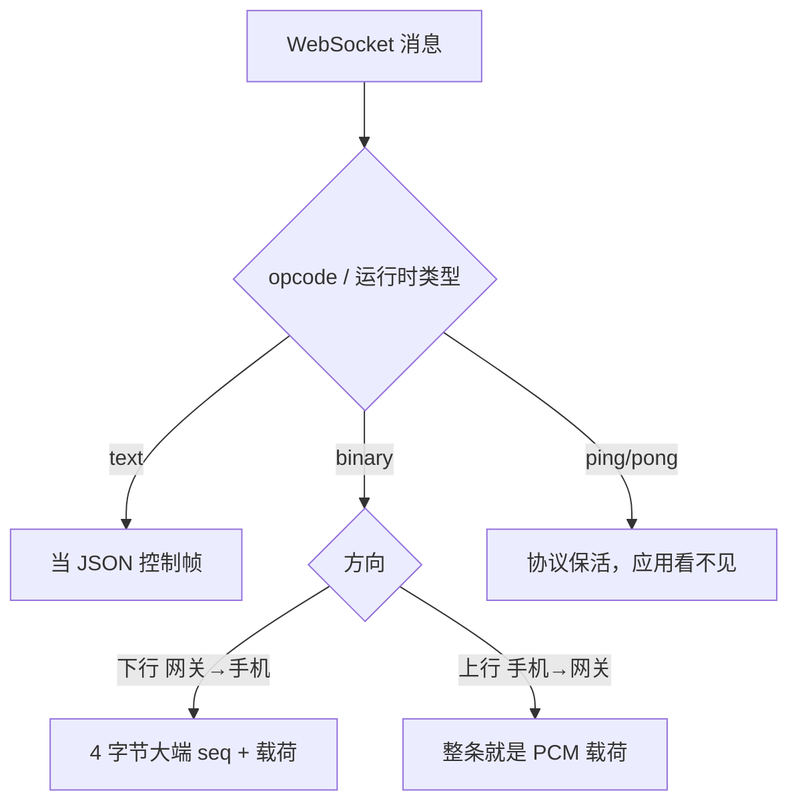

# WSS 系列 16 · 帧的解析与包装

**版本**：V1.0
**日期**：2026-09-12
**定位**：84 讲这条连接上**有哪些帧、它们为什么长这样**。本篇讲另一件事：两端把字节**变成对象、再变回字节**时，究竟走哪几段代码、哪里不对称、哪里会把活会话打死。规范真源仍是 infra 的 JSON schema；本篇是运行时编解码。
**对应上游文档**：[84 协议层](84_WSS系列_03_协议层_帧设计与版本化.md) · [85 iOS 传输层](85_WSS系列_04_iOS传输层.md) · [86 后端网关](86_WSS系列_05_后端网关.md)
**变更说明**：首版。84 写「客户端遇到未知 type 会断开」—— **那句话过时了**。当前接收循环对未知 type 是忽略并上报诊断（iOS `docs/52`）。本篇以代码为准。

---

## ① 本篇回答什么

**一个问题**：一条 WebSocket 消息从「内核里的帧」变成「状态机里的事件」，中间经过哪些包装？反向发送呢？

**读完后你能**：

- 指着一段 Wireshark / 日志里的 payload，说出它会进哪一个 decode 函数
- 解释为什么控制帧是 UTF-8 文本、音频是二进制，以及上行音频为什么连 4 字节头都没有
- 知道「未知 type」和「JSON 坏了」为什么必须走两条路

---

## ② 概念

**WebSocket 消息类型。** 协议自己区分 text / binary / ping / pong / close。应用协议叠在前两种上：JSON 控制走 text，音频走 binary。协议级 ping（opcode 0x9）应用层看不见，见 85。

**信封（envelope）。** 先只读 `{"type":"..."}`，再按 type 解剩下的字段。网关显式这么做；iOS 把信封和载荷揉进一个 `Codable` 枚举，但判别字段同样是 `type` 字符串，不是 Swift 类型名。

**包装（encode）。** 把内存里的结构体变成一条可 `conn.Write` / `URLSessionWebSocketTask.send` 的消息。控制帧：`json.Marshal` / `JSONEncoder` 后作为 **string** 发送。音频：拼 4 字节大端序号，作为 **data** 发送。

**不对称。** 同一语义在两端的字节布局可以不同。本项目最大的一处：下行音频有头，上行音频无头。

---

## ③ 约束与推导

### 3.1 先分消息种类，再分应用类型

接收端不能先假设 JSON。二进制音频的前 4 字节是序号，拿去当 UTF-8 会解出乱码或直接失败。



**为什么上行不加头？** 网关收到后原样转给火山，不靠序号做打断。下行需要序号，因为手机要用水位线丢掉过期 TTS（85）。给上行也加头，网关还得剥掉再转，纯属往热路径上加一次拷贝。

### 3.2 控制帧：两段解码，不是一次

**网关（Go）。**

1. `voiceproto.DecodeType(raw)`：只 `json.Unmarshal` 到 `Envelope{Type}`。缺 type 或不是 JSON → `invalid_frame`。
2. `switch type` 后再 `json.Unmarshal` 到具体结构体（`Ping`、`SessionStart`、`UserSpeechEnd`…）。
3. 未知 type：忽略、计数、打日志，连接保持（84 的前向兼容在服务端这一半）。

没有用 Go 的接口型多态，也没有 code generation。每一类帧是一个带 `Type string \`json:"type"\`` 的 struct，发送时 `json.Marshal` 整颗丢进 text 消息。

**iOS。**

`WSControlFrame` 是一个枚举。`init(from:)` 先读 `type`，再 `switch` 到 case。字段名写在**一份** `CodingKeys` 里 —— `session.start` 的音色是 `voice`，`ai.tts.start` 的音色是 `voice_id`，不能合成一个 key。曾经有第二份 `SessionStartPayload.CodingKeys` 拼着过时的错名，改它不影响线上；那种「看起来是契约、实际写不到线上」的第二份表已经删掉。

发送：`WSControlFrameCodec.encode` → `JSONEncoder` → `String(data:encoding:.utf8)` → `task.send(.string)`。必须是 string 消息。若误用 `.data` 发 UTF-8 字节，对端会走二进制解码，4 字节序号会对着 `'{'` 解出垃圾。

### 3.3 未知 type ≠ 坏 JSON

这是编解码层最容易写反的分支。

| 收到的东西 | 含义 | 正确动作 |
|---|---|---|
| JSON 合法，`type` 不认识 | 对端更新了协议 | **忽略**，连接继续 |
| 根本不是 JSON / 缺必填字段 | 契约被破坏 | 失败；网关回 `error` 帧，iOS 视情况断开 |

9/11 的客户端把未知 type 和坏 JSON 都丢进 `decodingFailed`，于是**服务端加一个新帧 = 全舰队掉线**。当前 `handle(message:)`：`unknownType` 发 `.diagnostic(.unsupportedControlFrame)` 然后 `return`；其它 decode 错误才 throw。84 文档若仍写「客户端断开」，以本篇为准。

### 3.4 二进制音频：两端各写一遍，布局必须咬死

下行（网关 → iOS）：

```
offset 0..3  uint32 big-endian sequence
offset 4..   payload（今日生产是 16 kHz mono PCM s16le，不是 Opus）
```

- 网关包装：`AITTSAudio.Encode` / `encodeAudioFrame`。空 payload 拒绝编码。
- 网关拆包（自测 / 回环）：`DecodeAITTSAudio`，短于 5 字节失败（4 头 + 至少 1 字节载荷）。
- iOS 拆包：`WSAudioFrameCodec.decode`，短于 4 字节 `truncatedHeader`。载荷允许为空——两端对「空载荷」不对称。iOS 播放路径会在 PCM 长度为奇数时再失败。
- iOS 包装（测试或将来上行若改布局时）：`WSAudioFrameCodec.encode`。**生产上行不用它。**

生产上行：`send(audio: Data)` 直接 `task.send(.data(pcm))`。网关 `handleAudio` 把整条消息当 PCM 转给 provider。16 kHz、20ms、640 字节一块（`pcm16kChunkBytes`）。

下行切帧：约 100ms，`audioFrameBytes = 3200`（1600 sample × 2）。这个尺寸承重打断粒度（87），不是编解码器的偏好。

序号由网关 `nextAudioSeq` 分配，从 1 起，跨透明重开承接（86）。客户端从不生成下行序号。

### 3.5 `type` 常量 `ai.tts.audio` 不上线

它只出现在日志和常量表里。线上没有 `{"type":"ai.tts.audio",...}` 这种 JSON。写 JSON 分发表的人如果给它留一个 case，那个 case 永远是死的。有测试钉「它的 JSON 拼写不是控制载荷」。

### 3.6 发送路径：控制走 JSON，音频走已编码的字节

网关出站是 `ProviderOutbound` 的 tagged union：

```
Control != nil  → writeJSON → websocket.MessageText
Binary 非空     → conn.Write(..., MessageBinary, item.Binary)
```

`item.Binary` **已经带上头**。handler 不再包一层。流式路径上 `SetOutboundEmitter` 每到一块就 `sendOutbound` 一次，所以手机看到的是「生成一块、路上一块」，不是轮末大包（那是更早的非流式路径）。

所有写被 `sessionRuntime.writeMu` 串行。collect 在 goroutine 里跑之后，interrupt 与音频发射会并发碰到同一条 conn，没有这把锁会把两帧写穿。

---

## ④ 本项目的落地

| 方向 | 步骤 | 文件 |
|---|---|---|
| 控制 · 网关收 | `DecodeType` → 按 type `Unmarshal` | `internal/voiceproto/frames.go` · `handler.go` `handleControl` |
| 控制 · 网关发 | `json.Marshal` → `MessageText` | `handler.go` `writeJSON` |
| 控制 · iOS 收 | text → `Data` → `WSControlFrameCodec.decode` | `URLSessionSocketTransport.handle` · `WSControlFrame.swift` |
| 控制 · iOS 发 | `JSONEncoder` → UTF-8 string → `.string` | 同左，`send(control:using:)` |
| 音频 · 网关切下行 | 24k PCM → 有状态重采样 16k → 3200 字节一块 + 4 字节头 | `provider_volc_duplex.go` `frameAudio` / `encodeAudioFrame` |
| 音频 · iOS 收下 | `.data` → `WSAudioFrameCodec.decode` → 水位线 → `.audio(frame)` | `WSAudioFrameCodec.swift` · `AudioFrameDropGate` |
| 音频 · iOS 上行 | 采集 tap 16k PCM → `.data` **无头** | `LiveAudioEngine` · `send(audio:)` |
| 音频 · 网关收上 | 整条 binary 当 PCM 转给 duplex | `handler.go` `handleAudio` |
| 规范真源 | 控制帧字段 | `fluentwork-infra/schemas/transport/wss-control-frames-v{1,2}.json` |

`opusPayload` 这个字段名是历史。生产载荷是 PCM。解码器默认 `RawPCM16FrameDecoder`：把字节原样交给 `AVAudioPCMBuffer`。接 Opus 要换 decoder，并且**先**有 `ai.tts.start` 声明 codec —— 今天生产不发 start（98）。

---

## ⑤ 代价与陷阱

**陷阱一：用错 WebSocket 消息种类。** 控制帧当 binary 发，对端走音频 decode。音频当 string 发，对端走 JSON decode。两端都不会「猜到你的本意」。没有第三个启发式。

**陷阱二：两套 CodingKeys。** 同一份载荷写两次字段名，改到没被线上用的那一份会全绿。session.start 的 `material_id` / `scene_type` / `voice` 曾经就这样空转。契约只允许存在于真正 `encode` 的那一份 keys。

**陷阱三：空音频载荷。** Go 拒绝编码空 payload；iOS decode 允许 0 长度 payload。不要在「空帧是否合法」上靠感觉对齐，看函数。

**陷阱四：未知 type 与坏 JSON 合流。** 已经修过一次。回归测试是：发一个未来才有的 `type`，连接上的 `ping` 必须还能得到 `pong`。

**陷阱五：二进制没有 `turn_id`。** 解析层给不出「这是哪一轮的声音」。归属靠上下文 + 封口顺序（95）+ 水位线。想在解析层做轮次过滤，先改布局、开 v3，不要在 codec 里猜。

---

## ⑥ 自检

1. 手机收到一条 binary 消息，最少几个字节算合法下行音频？网关编码时呢？
2. 手机上行的音频，网关为什么不调用 `DecodeAITTSAudio`？
3. 网关怎么判断一条 text 消息是 ping 还是 session.start？为什么要解两次 JSON？
4. 未知 `type` 和缺 `type` 在客户端分别走哪条路？
5. 为什么 `ai.tts.audio` 出现在常量里，却不会出现在 JSON 分发表的成功路径上？
6. 把控制帧用 `.data` 发出去，对端会怎样？

---

## ⑦ 速查

| 项 | 值 |
|---|---|
| 控制帧传输 | WebSocket **text**，UTF-8 JSON，判别字段 `type` |
| 下行音频 | WebSocket **binary**，4 字节大端 seq + PCM |
| 上行音频 | WebSocket **binary**，**无头**，16 kHz s16le，约 20ms / 640 字节 |
| 下行切帧 | 约 100ms / 3200 字节 |
| 网关类型分发 | `DecodeType` → switch → 二次 `Unmarshal` |
| iOS 类型分发 | `WSControlFrame.init(from:)` 读 `type` |
| 未知 type | 网关忽略计数；**iOS 忽略并诊断**（不再断开） |
| 坏 JSON | 网关 `invalid_frame`；iOS `decodingFailed` |
| 空下行 payload | 网关拒编码；iOS decode 不拒 0 长度 |
| 生产 codec | PCM s16le（字段名 `opusPayload` 是历史） |
| 规范真源 | infra `schemas/transport/`，本篇不定义字段 |

---

**系列导航**

[导读](81_WSS系列_00_导读_全景图与术语表.md) · [ELI5](82_WSS系列_01_ELI5_一条语音的旅程.md) · [为什么是 WSS](83_WSS系列_02_为什么是WSS_选型推导.md) · [协议层](84_WSS系列_03_协议层_帧设计与版本化.md) · [iOS 传输层](85_WSS系列_04_iOS传输层.md) · [后端网关](86_WSS系列_05_后端网关.md) · [双工·流式·打断](87_WSS系列_06_双工_流式与打断.md) · [可观测性与健壮性](88_WSS系列_07_可观测性与健壮性.md) · [方法论](89_WSS系列_08_方法论_遇到同类场景怎么想.md) · [实践总结](90_WSS系列_09_实践总结_这套用法的问题与改进.md) · [认证·错误·降级](91_WSS系列_10_认证_错误与降级.md) · [怎么测试](92_WSS系列_11_怎么测试一条WSS链路.md) · [问题排查](93_WSS系列_12_问题排查手册.md) · [客户端状态机](94_WSS系列_13_客户端状态机_协议事件的消费者.md) · [长 TTS 打断·定位](95_WSS系列_14_长TTS打断_如何定位与如何修.md) · [业界与原代码](96_WSS系列_15_长TTS打断_业界做法与原代码问题.md) · **本篇** · [TTS 播放与轮次](98_WSS系列_17_TTS播放与轮次设计.md)
