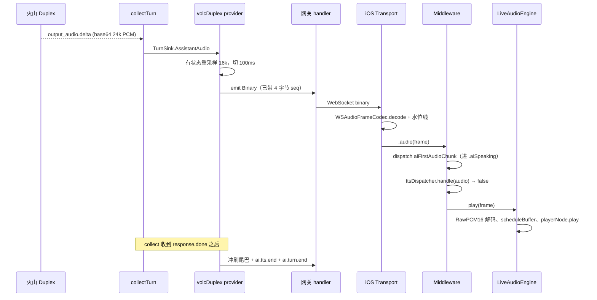
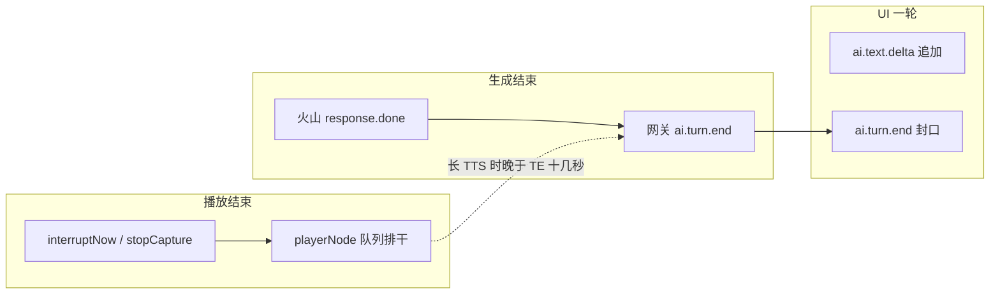

# WSS 系列 17 · TTS 播放与轮次：两端怎么对上

**版本**：V1.0
**日期**：2026-09-12
**定位**：声音怎么从火山的 PCM 变成喇叭里的一句话；以及「一轮」在网关、状态机、UI 气泡上为什么不是同一个东西。打断的事故见 95 / 96；字节布局见 97。本篇只讲播放设计本身。
**对应上游文档**：[87 双工·流式](87_WSS系列_06_双工_流式与打断.md) · [94 状态机](94_WSS系列_13_客户端状态机_协议事件的消费者.md) · [I15 草稿](../40_研发流程与协作/62_I15_TTS播放集成_Issue_Draft_2026-09-06.md)（设计意图，不是线上路径）
**变更说明**：首版。线上**不走** I15 设想的 `ai.tts.start` → Opus 解码器。走那条会静音。读草稿时以本篇的「生产路径」为准。V1.1：§6 第 3 步标注为协议卫生而非承重条件 —— 网关守卫已使帧序无关（95 §4.2）。

---

## ① 本篇回答什么

**一个问题**：当前项目里，TTS 是怎么被播放的？它和 backend / iOS 上各种 turn 怎么咬合？

**读完后你能**：

- 画出从 `output_audio.delta` 到 `playerNode.scheduleBuffer` 的唯一生产路径
- 解释为什么协议里有一套 TTS 流，代码里还有一套「漏掉 dispatcher 才出声」的 PCM 路径
- 分清 `turn-N`、`userTurnCount`、`.aiSpeaking`、`.processing/.evaluation`、火山 `response.done` 各自结束的是什么

---

## ② 概念

**TTS。** 这里不是「另调一个语音合成 HTTP」。火山 Duplex 在同一条上游 WSS 上同时吐识别、文本、音频。网关听到的「TTS」是 `response.output_audio.delta` 里的 base64 PCM（24 kHz），重采样成 16 kHz 再切帧下发。

**一轮（turn）。** 产品上是一次「用户说完 → AI 答完」。实现上至少有四份账，见 §5。

**播放图。** `AVAudioEngine` + `AVAudioPlayerNode`。采集 tap 和播放节点在**同一张图**上。`stopCapture` 拆的是整张图，不是只关麦克风。

**两条消费路径。** 二进制帧到达中间件后，先问 `TTSFrameDispatcher.handle(audio:)`：它若处于 `ai.tts.start` 打开的流，就把帧吞掉；否则返回 false，中间件调用 `audioEngine.play(frame:)`。生产上 dispatcher 一直 idle，所以**每一帧都落到 engine**。这是刻意的事故，见 §4.3。

---

## ③ 约束与推导

### 3.1 用户要的是「AI 更早开口」，不是「JSON 更早到」

87 写过：只做文字 delta，屏幕上的字提前了，喇叭没有。播放设计的第一约束是：

> **第一块可听 PCM 必须在生成出来之后尽快离开网关、尽快进 playerNode。**

所以生产是流式：`AssistantAudio` 在 collect 过程中就 `emit` 带序号的二进制帧，而不是等 `turnToOutbound` 一次性切。`turnToOutbound` 只负责冲刷重采样器里不满一帧的尾巴，然后发终结符。

### 3.2 采样率有三层，播放只认 16 kHz

| 层 | 采样率 | 谁转 |
|---|---|---|
| 上行采集 | 16 kHz mono s16le | iOS tap + converter |
| 火山 TTS | 24 kHz | 火山 |
| 下行播放 | 16 kHz mono s16le | 网关有状态 3:2 重采样 |

playerNode 的 format 钉死 16 kHz。网关不把 24 kHz 交给手机，手机就不在热路径上做重采样。接缝相位必须带状态，否则每块独立重采样会爆音（87）。

### 3.3 播放是排程，不是「收到一帧响一帧」

`play(frame:)` 解码后 `scheduleBuffer`，**立即返回**。不能 `await` 那个 async 重载 —— 它会等到这块被硬件吃完才回来，传输循环就会把整轮音频按真实时间卡住，文本帧和下一轮音频全部排队。

后果：喇叭里的时间轴 = 已排程缓冲的排干，**落后于** WSS 上的时间轴。长回复能落后十几秒。这是 95 三个时钟里的「播放时钟」。播放设计必须承认这个落后，不能用「帧已经收到」当「用户已经听完」。

`interruptNow()` 做 `stop()` + `reset()`，把还没排干的队列倒掉。`stop()` 单独不清队列。结束练习时若只 `stop` 再 `engine.stop()`，剩余 PCM 会以沙沙漏出来（iOS `docs/66`）。

### 3.4 协议上的 TTS 流，和喇叭，被一道开关隔开

v2 规范：

```
ai.tts.start → 二进制 × N → ai.tts.end
```

`TTSFrameDispatcher` 实现了这道开关：

| dispatcher 状态 | 二进制帧去哪 |
|---|---|
| `idle` | 不吞，中间件 → `audioEngine.play` |
| `active(turnID)` | `decoder.feed`，**不再**走 engine |
| `draining` | 吞掉但不播（打断后的在途帧） |

生产**不发** `ai.tts.start`。原因写在 `turnToOutbound` 和 `EngineBackedTTSDecoder` 的注释里，不是遗漏：

- dispatcher 绑定的解码器长期是 `MockTTSDecoder`：记账、不出声
- 一旦发 start，帧被 mock 吃掉，房间静音
- `ai.tts.end` 在 idle 上是空操作，所以生产仍发 end（给「流结束」一个终结符），但不发 start

I15 草稿设想的是 Opus + start 预热解码器 + `enqueueOpusFrame`。那条路的解码器本体（`EngineBackedTTSDecoder`）已经写好，**没有接到生产 DI**。方向 A 曾同时打开 start 和真解码器，与「被打断的轮次不发音频」叠在一起，真机完全没声音，整包回滚（84）。

所以当前播放设计是：

> **规范里的 TTS 流是暗的；喇叭走的是「二进制 PCM + LiveAudioEngine」这条漏网路径。**

改它的前置条件是：DI 换成会出声的解码器，**并且**归属（95）已经钉住，**并且**有一条测试能看见「静音」。缺任何一条都会回到 84 的流程错误。

---

## ④ 生产路径：从火山到喇叭



几处容易看错的：

**`aiFirstAudioChunk` 每帧都 dispatch。** 状态机只在 `.processing` 时吃它并切到 `.aiSpeaking`；已经在 `.aiSpeaking` 时是空操作。所以「第一块音频」是相位入口，不是「只处理第一帧」。

**文本比音频早。** `output_text.delta` 经 `AssistantTextDelta` 变成 `ai.text.delta`，reducer 往当前 AI 气泡上追加。气泡的字和喇叭的声同源，但字几乎不缓冲，声缓冲很长 —— 用户会看到字已经到下一句，喇叭还在上一句。这是正常落后，不是串轮。串轮是 95 那种「新气泡里出现旧讲稿」。

**ASR 现在也是流式。** `UserTranscript` 在识别一有字就发 `client.asr.transcription`，不再等 TTS 生成完。右边「正在转写」换成真字，和左边 AI 气泡、喇叭是三条独立时间轴。

**徽章。** `feedback.badge` 走同一条 WSS，但不是播放路径。命中检测用的文本优先客户端 `user.speech.end.text`，空则用服务端 ASR。

---

## ⑤ 四份「turn」，对不上就会播错

### 5.1 火山的 response

一次 `response.create` … `response.done`。内部还有 `output_audio.done`。本系统只认 `response.done` 为 collect 结束（95 §5.1）。

### 5.2 网关的 `activeTurnID` / `turn-N`

客户端在 `user.speech.end` 上带 `turn_id`（`turn-1`、`turn-2`…，由 `userTurnCount+1` 生成）。网关回声到 `ai.text.delta` / `client.asr.transcription` / `ai.turn.end` / `ai.tts.end`。

二进制音频**没有**这个字段。播放层不知道「这一帧属于 turn-2」。它只知道序号和水位线。所以：

- 停播可以立刻（本地）
- 「丢掉这一轮剩下的声音」靠打断后停转发 + 水位线丢旧序号
- 「不要把尾巴当成新一轮」靠 `ai.turn.end` 晚于最后一字节音频

### 5.3 状态机的相位

和播放直接相关的几跳：

| 事件 | 相位 | 播放上的意思 |
|---|---|---|
| 握手后第一个 `ai.turn.end`（`userTurnCount==0`） | `.waitingUser` | 开场白的生成结束；喇叭可能还在念开场白 |
| `aiFirstAudioChunk` | `.aiSpeaking` | 至少有一帧已经交给 engine（不等于用户已经听见） |
| 之后的 `ai.turn.end` | `.processing` + `.evaluation` | **生成结束**。评价计时开始。喇叭往往还在念 |
| 评价阶段 `vadSpeechStart` / `holdStart` | `.recording` + `stopPlayback` | 本地停播；**不**发 WSS interrupt |
| `.aiSpeaking` 上开口 | `.recording` + `stopPlayback` + `sendInterrupt` | 本地停 + 通知网关停转发 |

94 写过：`ai.turn.end` 有两种意思，靠 `userTurnCount` 区分。播放设计必须跟着这张表走：从 `.evaluation` 开口，服务端那一轮已经 `response.done`，再发 `interrupt` 会打在下一轮上（96 §7）。

I21 的 `.aiAnswer` 是录音超时 abort 的落点，**假定没有正在播的东西要停**。若 abort 之后迟到音频还在路上，水位线 / `playbackRetired` 管，状态机不管。

### 5.4 UI 气泡

reducer 在 `ai.text.delta` 上追加当前助手消息；在 `ai.turn.end` 上把这条消息封口。封口之后再来的文本或「被当成新一轮的音频」会开**下一条**气泡 —— 95 的裂开就是这个。

所以「一轮」在 UI 上 = 两次封口之间的 delta。它必须和网关的 `activeTurnID` 对齐，而对齐手段是 `turn_id` 回声 + 封口顺序。播放缓冲不参与气泡边界，这是有意的：不能等喇叭念完再显示字。

### 5.5 一张对照



虚线是事故来源：有人把右边的结束当成左边已经发生，或反过来。

---

## ⑥ 打断、结束练习、下一轮：播放侧要做什么

**Barge-in（AI 还在说话，用户要开口）。**

1. 状态机 / 音频泵：`stopPlayback` → `ttsDispatcher.interrupt()`（生产 idle，空）+ `audioEngine.interruptNow()`（stop+reset）
2. 传输层 `markInterrupted()` 置水位线，在途旧序号丢掉
3. 若来自 `.aiSpeaking`：WSS `interrupt` 先于 `user.speech.start`（协议卫生。网关 `!collectingTurn` 守卫已让帧序变成无关项，见 95 §4.2 —— 这一步不是承重的）
4. 网关停转发；火山继续生成
5. 下一轮第一帧序号更大，水位线放行，`play(frame:)` 把 player 再 `play()` 起来

**评价阶段开口。** 只有 1、2、5。没有 3、4。因为 5.3：服务端轮次已结束。

**结束练习。** 没有「下一轮第一帧」。必须 `playbackRetired=true` 再拆图，迟到帧静默丢弃，不得 `.failed`（否则进程级音频泵退出，下一场「开始说话」没人听）。拆图顺序：停 player、reset、停 engine、再 removeTap / detach（iOS `docs/66`）。

**会话再进。** `startCapture` 重建图、`playbackRetired=false`、水位线 reset。dispatcher `reset()`，以免上一场残留的 start 吞掉这一场的 PCM —— 生产没 start，这是防御。

---

## ⑦ 代价与陷阱

**陷阱一：把 I15 草稿当现状。** 草稿里的 Opus、`client.audio.start`、独立 `ttsPlayer`，生产里都没有。线上是 PCM、`user.speech.*`、`LiveAudioEngine`。

**陷阱二：给生产接上 `ai.tts.start` 而不换 DI。** 立刻静音。要接，先换 `EngineBackedTTSDecoder`，再发 start，并加一条「听得见」的守卫（CI 至少钉 decoder 被 feed 且 engine.play 被调用；真听得见仍要真机）。

**陷阱三：`await scheduleBuffer`。** 测门禁会挂死（engine 没在跑，buffer 永不被消费）；生产会把传输循环拖成实时。必须用带 completion `nil` 的同步排程。

**陷阱四：用评价超时停播。** 20s 固定，回复 27s，句尾被切。已改为超时只结束评价等待，不停播。停播只属于 barge-in 和结束会话。

**陷阱五：二进制帧的字段叫 `opusPayload`。** 日志和代码搜索会把人带去 Opus。看 decoder 类型，不要看字段名。

---

## ⑧ 自检

1. 生产路径上，一帧二进制音频为什么不会进 `TTSDecoder.feed`？
2. 为什么现在发 `ai.tts.end` 却不发 `ai.tts.start`？只发 end 会不会把 dispatcher 带进 active？
3. `ai.turn.end` 到达时，喇叭是否一定已经安静？若否，状态机在哪个相位？
4. 评价阶段开口为什么不发 WSS `interrupt`，却仍要 `stopPlayback`？
5. 上行 20ms 切块和下行 100ms 切块，各自服务哪一个功能？
6. 把 `play(frame:)` 改成 await 排程，坏的是测试、生产，还是两者？

---

## ⑨ 速查

| 项 | 值 |
|---|---|
| 生产播放 | `LiveAudioEngine.play` ← 中间件，当 dispatcher 返回 false |
| dispatcher | 无 `ai.tts.start` 则 idle；生产一直 idle |
| 载荷 | 16 kHz mono PCM s16le（名 `opusPayload`） |
| 重采样 | 网关 24k→16k，有状态，逐字节可证等价 |
| 下行帧 | ~100ms / 3200 字节 + 4 字节 seq |
| 上行帧 | ~20ms / 640 字节，无头 |
| 排程 | `scheduleBuffer` 不等待渲染 |
| 停播 | `playerNode.stop` + `reset` |
| 相位 vs 播放 | `.evaluation` ≠ 喇叭已停 |
| UI 封口 | `ai.turn.end`，必须晚于该轮最后音频字节 |
| 真 TTS 流 | 代码在，DI 未接；接之前先有「静音」守卫 |
| 姊妹篇 | [95](95_WSS系列_14_长TTS打断_如何定位与如何修.md) · [97](97_WSS系列_16_帧的解析与包装.md) |

---

**系列导航**

[导读](81_WSS系列_00_导读_全景图与术语表.md) · [ELI5](82_WSS系列_01_ELI5_一条语音的旅程.md) · [为什么是 WSS](83_WSS系列_02_为什么是WSS_选型推导.md) · [协议层](84_WSS系列_03_协议层_帧设计与版本化.md) · [iOS 传输层](85_WSS系列_04_iOS传输层.md) · [后端网关](86_WSS系列_05_后端网关.md) · [双工·流式·打断](87_WSS系列_06_双工_流式与打断.md) · [可观测性与健壮性](88_WSS系列_07_可观测性与健壮性.md) · [方法论](89_WSS系列_08_方法论_遇到同类场景怎么想.md) · [实践总结](90_WSS系列_09_实践总结_这套用法的问题与改进.md) · [认证·错误·降级](91_WSS系列_10_认证_错误与降级.md) · [怎么测试](92_WSS系列_11_怎么测试一条WSS链路.md) · [问题排查](93_WSS系列_12_问题排查手册.md) · [客户端状态机](94_WSS系列_13_客户端状态机_协议事件的消费者.md) · [长 TTS 打断·定位](95_WSS系列_14_长TTS打断_如何定位与如何修.md) · [业界与原代码](96_WSS系列_15_长TTS打断_业界做法与原代码问题.md) · [帧的解析与包装](97_WSS系列_16_帧的解析与包装.md) · **本篇** · [轮次归属](99_WSS系列_18_轮次归属_顺序标识与三条时钟.md)
