# WSS 系列 18 · 轮次归属：当协议用「顺序」代替了「标识」

**版本**：V1.0
**日期**：2026-09-12
**定位**：这是本系列的**收束篇**。前面十七篇各自回答一个问题；本篇回答它们共同欠下的那一个 —— **为什么这条链路上「轮次」会接错，以及那个缺口到底在哪一行**。视角是通信：把这条链路当成一条**复用了多个逻辑流的双向信道**来看，它的寻址方案是什么、什么时候够用、什么时候失效。
**对应上游文档**：[87 双工·流式·打断](87_WSS系列_06_双工_流式与打断.md) · [95 定位与修复](95_WSS系列_14_长TTS打断_如何定位与如何修.md) · [96 业界与原代码](96_WSS系列_15_长TTS打断_业界做法与原代码问题.md) · [98 播放与轮次](98_WSS系列_17_TTS播放与轮次设计.md) · [90 实践总结](90_WSS系列_09_实践总结_这套用法的问题与改进.md) · [84 复盘](84_打断这件事为什么看着别扭_复盘_2026-09-12.md)
**变更说明**：首版。本篇不做新的事实主张 —— 它把 95 / 96 / 98 已经落地的事实重新组织成一条**因果链**，并第一次把「技术债」按**根因**而不是按**症状**归类。

---

## ① 本篇回答什么

**一个问题**：这条链路上一连串"轮次接错"的缺陷，**根上是同一件事吗**？

**读完后你能**：

- 用「寻址」这一个词，把气泡裂开、`delivered_chars: 0`、60 秒空转、转录截断四件事串成一条因果链
- 说清 `collectTurn` 在整个系统里的角色，以及它为什么是所有轮次事故的交汇点
- 判断哪些债是**供应商边界**（不用还）、哪些是**协议冻结**（要版本化才能还）、哪些是**实现选择**（现在就能还）
- 拿到三条可执行的优化路径，按代价排序

---

## ② 大局：一条语音的旅程

先把整条链路铺开。这一段是后面所有讨论的地图 —— 记住**四个进程**和**三条流**。

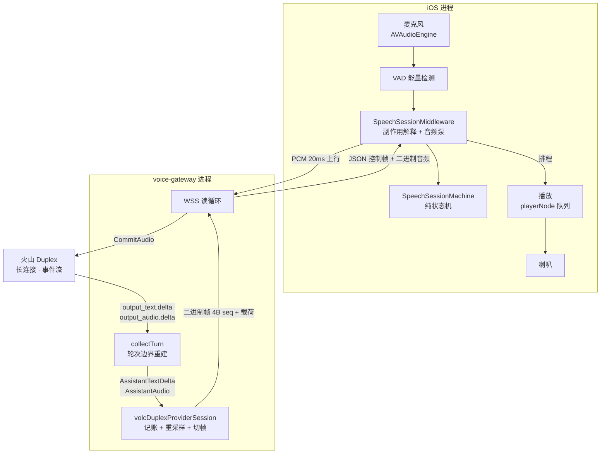

**三条流，各自的时钟不同步** —— 这是全篇的前提：

| 流 | 谁产生 | 粒度 | 谁消费 |
|---|---|---|---|
| **上行音频** | iOS 麦克风 | 20ms PCM | 火山（经网关转发） |
| **下行文本** | 火山 `output_text.delta` | 语义增量 | UI 气泡 |
| **下行音频** | 火山 `output_audio.delta` | 100ms 帧 | **喇叭（经播放队列）** |

**关键**：这三条流**共用一条 WSS 连接**，而它们的消费速率完全不同 —— 文本几乎瞬时消费，音频要排队慢慢放。**复用是省事的来源，也是所有麻烦的来源。**

---

## ③ 本质（上）：复用信道必须可寻址

### 3.1 两种寻址

一条信道上跑多个逻辑单元（这里的一个"单元"就是一轮对话），接收方必须能回答：**这一段字节属于哪一轮？** 通信上有两种做法：

| | 显式标识 | 隐式顺序 |
|---|---|---|
| 怎么做 | 每个单元带 id | 靠严格顺序 + 边界帧切分 |
| 例子 | HTTP/2 stream id · OpenAI `item_id` | TCP 字节流 · 本项目的轮次 |
| 要求 | 标识唯一且端到端传递 | **收发双方共享一条时间线** |

**隐式顺序是廉价的**：不用加字段、不用改帧格式、不用两端同时改。**它的代价藏在前置条件里。**

### 3.2 隐式顺序的前置条件

「按顺序切」能成立，靠的是一条隐含假设：

> **发送方写出的顺序 ＝ 接收方使用的顺序。**

在 TCP 上这几乎是定义。但在**有缓冲**的系统里，它不成立 —— 缓冲把**到达**和**消费**解耦了。

**而一旦解耦，"顺序"这个坐标就只描述了到达，不描述消费。**

### 3.3 三条时钟

本项目的下行音频正好有缓冲，而且很长（先到的帧要排几秒到十几秒）。于是同一件事有三条时间线：

| 时钟 | 谁的时间 | 长 TTS 时的表现 |
|---|---|---|
| **生成** | 火山产出文本 / PCM | 先结束 |
| **转发** | 网关写进那条 WSS | 紧跟生成 |
| **播放** | 手机把已排程的 PCM 排干 | **落后十几秒** |

95 §③ 用一次真实事故量过：turn-2 的 `response.done` 已经到了，网关的 `ai.turn.end` 已经发了，**喇叭里还有大约 15 秒**。

### 3.4 顺序坐标的分裂

现在把 3.2 和 3.3 叠起来，缺陷就是必然的：

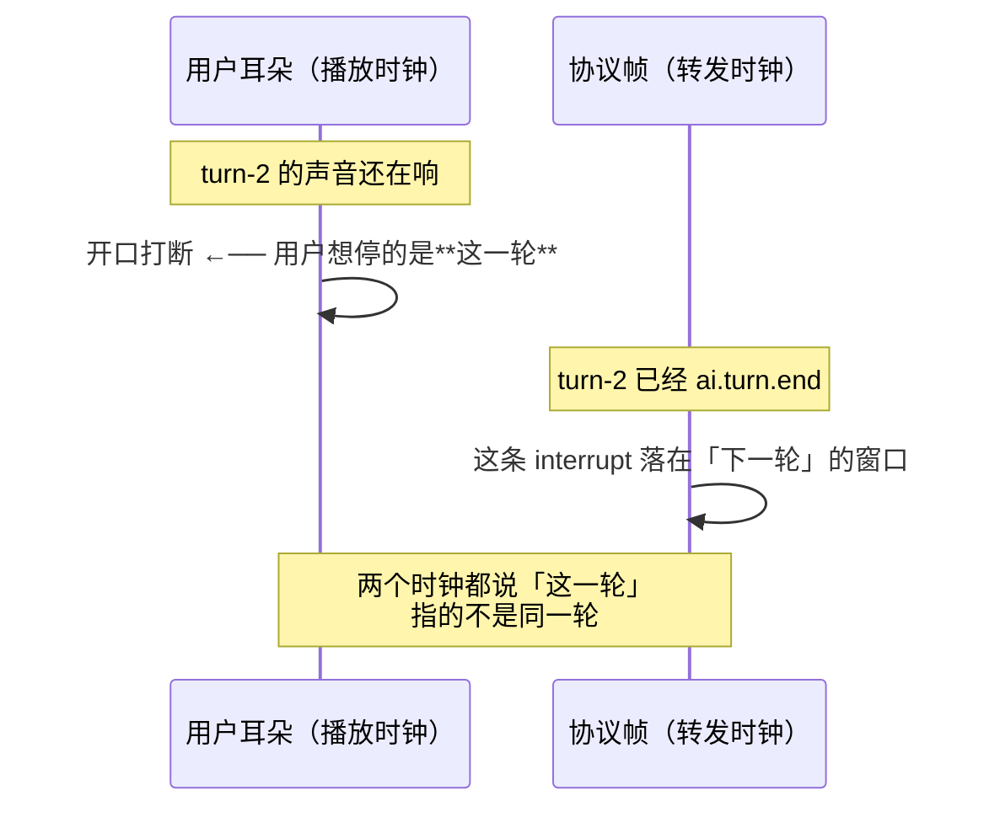

**这就是本质：**

> **协议用「顺序」充当了「标识」。而顺序只在单一时间线下等价于标识 —— 三条时钟一散开，顺序就失效了。**

95 §③ 把这句话写成了事故的读法：「用户打断的是**播放时钟**上的上一轮；协议帧打在了**转发时钟**上的下一轮。」

**它不是"少写了一个 if"。顺序作为坐标，在这条链路上是系统性失效的。**

---

## ④ 本质（下）：一张帧清单

理论说完，看代码。**如果"顺序代替了标识"是真问题，那它一定能在帧定义里看见。** 它确实能。

### 4.1 谁有地址，谁没有

`internal/voiceproto/frames.go` 逐条核对：

| 帧 | 方向 | 带 `turn_id` 吗 |
|---|---|---|
| `user.speech.start` | C→S | **❌ 没有**（注释明写 `No turn_id`） |
| `interrupt` | C→S | **❌ 零载荷** —— 只有类型常量，连结构体都没有 |
| `ai.tts.audio` / `ai.audio.chunk`（二进制） | S→C | **❌ 只有 4 字节 seq** |
| `user.speech.end` | C→S | ✅ |
| `ai.text.delta` | S→C | ✅ |
| `ai.turn.end` | S→C | ✅（+ `outcome`） |
| `ai.tts.start` / `ai.tts.end` | S→C | ✅ |
| `client.asr.transcription` | S→C | ✅ |

**控制帧大多有地址；缺地址的恰好是三个特殊位置。**

### 4.2 缺口正好落在用户唯一感知的那一路

二进制音频帧的**完整**线上布局（`frames.go:194-203`）：

```
┌────────────────┬─────────────────────────┐
│ 4 字节 seq     │ PCM 载荷                 │
│ big-endian     │                         │
└────────────────┴─────────────────────────┘
```

**就这些。** 没有轮次、没有长度、没有标志位。

而后端自己的注释（`provider_volc_duplex.go:296-319`，`markFirstAudio`）写得很清楚，哪一路才是要紧的：

> `server_ts_ms` rides on `ai.text.delta` alone, so a first *text* frame can be split into upstream / server / downstream while the first *audio* frame — **the one the user perceives** — could only ever be reported as a single total.

**于是得到本篇最锋利的一句：**

> **承载"用户真正感知到的东西"的那条流，是整条链路上唯一没有轮次标识的。**

所有轮次归属的复杂度 —— 水位线、封口顺序、`deliveredText`、`interruptedThisTurn`、`userTurnCount` 解释 `ai.turn.end` 的两种含义 —— **全部是这个缺口的投影。**

### 4.3 团队识别过它，而且被协议冻结挡住了

这是最值得记的一段。同一处注释继续写：

> # Why this is a log and not a wire field
>
> The obvious carrier already exists and cannot be used. … So the alternatives were a new control frame, **widening every binary audio frame** for a stamp that matters once per turn, or a log.

**"加宽每一个二进制音频帧"就是"给音频帧加 `turn_id`"。** 它不是没人想到 —— 它被明确列出来过，然后因为 **v1 已经字节冻结**而放弃，改用一条日志旁路。

**这句话是本篇下半部分的钥匙：**

> **债务不是"没想到"，是"想到了，但被冻结挡住，于是改用代理"。**

### 4.4 为什么偏偏是这里：这是一个**半事件流、半轮次**的混合体

把 4.1 的清单换个角度看，会得到比"该不该做成事件流"更重要的东西。

| | 每帧都带地址吗 | 有"轮"这个概念吗 |
|---|---|---|
| **纯事件流**（直接转发上游） | ✅ 带供应商的 `response.id` | ❌ 没有 —— 但每帧可寻址 |
| **纯轮次模型**（本系统自己的轮） | ✅ 带**自己的** `turn_id`（含音频） | ✅ 有 |
| **本项目现状** | ❌ **音频没有地址** | ✅ **有轮次边界** |

**现状取了最不协调的那个组合：有轮次边界，但最高频的那条流没有轮次地址。**

两端任选其一都是**自洽**的。而现在这种，缺口正好落在两种模型的**接缝**上 —— 也就是 `collectTurn` 所在的位置。**这解释了为什么它是所有轮次事故的交汇点：它不是一个模块出了错，它是两种模型的缝合处。**

**顺带回答一个自然的追问**：做成纯事件流会规避这个 bug 吗？

- **"必须靠推断来归属"——会规避。** 上游的事件自带身份，转发它就意味着可寻址。
- **"三条时钟散开"——不会规避。** 那是**播放缓冲**造成的，与协议模型无关。事件流一样要缓冲，播放一样落后。

**真正的问题从来不是"散开"，而是"散开之后还靠顺序推断归属"。** 纯事件流消除了后半句；而消除前半句（散开）在流式语音里做不到。所以纯事件流**不是**解法，它只是把推断换成匹配 —— 代价是产品语义与防腐层（见 §⑪ 开头的"明确不做"）。

---

## ⑤ collectTurn：轮次边界的唯一权威

### 5.1 两个模型在中间对撞

| | 上游（火山 Duplex） | 下游（本项目协议） |
|---|---|---|
| 模型 | **事件流** —— 一条长连接，事件持续到达 | **轮次** —— turn-1 / turn-2，各有开始与结束 |
| 边界 | 没有天然的"这一轮完了" | 每一轮必须有明确结束 |

**这两套模型必须有人翻译。** 那就是 `collectTurn`。

### 5.2 它是边界重建器

`collectTurn`（`internal/voicepoc/volc_duplex.go:510`）做的是**把连续的事件流切成离散的轮**：

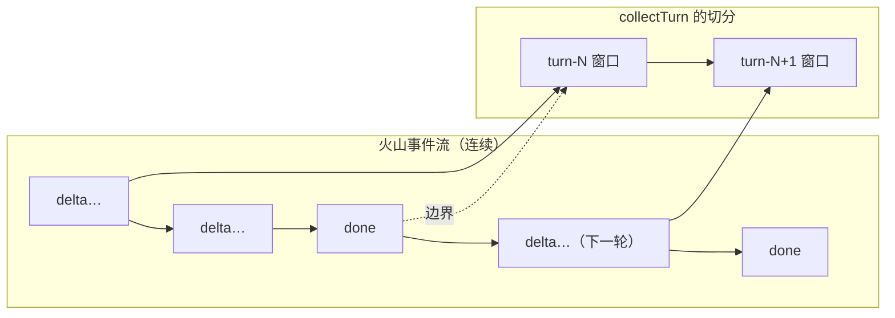

**它的全部状态，是两个布尔量**（`:551-552`）：

| 变量 | 何时置位 | 门控什么 |
|---|---|---|
| `seenUserProgress` | 本轮见到用户侧进展（ASR started / delta / completed、`input_audio_buffer.committed`） | 在此之前**丢弃**一切助手文本与音频 delta（挡上一轮残留） |
| `seenResponse` | 见到 `response.output_audio.done` 等下行事件 | 与前者共同门控 `response.done` |

**轮边界是靠一次「相位翻转」隐式定义的** —— 读循环本身不认识"轮"，它只有一个三态返回：

```
[残留 response.*]         seenUserProgress==false  → 丢弃（return false，继续读）
transcription.started     ──────────────────────►  seenUserProgress = true   ← 相位翻转
... ASR 增量 / 完成 ...
response.output_*.delta   开始累积 + 推 sink
response.output_audio.done   只置 seenResponse（不是终止符）
response.done              ──────────────────────►  return true（唯一正常终止）
```

**结束条件只认 `response.done`**（`:668-672`），而且要求两个进度都已出现：

```go
// Ignore stale done from a previous turn until this turn has user+response progress.
if !seenUserProgress || !seenResponse {
    return false
}
```

**这一条是踩出来的**，`:659-667` 的注释就是现场记录：

> The audio stream finished. This is not the turn terminator — Volc still sends response.done after it. Ending here (2026-09-12 `d5090fe1`) left that done on the socket; the next collectTurn started with leftover done, ASR started, then Volc produced nothing for 60s.

**轮与轮的排他**由两个标志保证：网关的 `rt.collecting`（`handler.go:733` 用 CAS 拒绝重叠）与 provider 的 `collectingTurn`。**一次只有一轮在飞。**

> **注意 collectTurn 不知道自己"在第几轮"。** 它没有任何轮次标识，只有"本轮是否见过用户进度"。这是 ③④ 的缺口在它身上的直接体现 —— **它能正确切分，只是因为它假设事件流是严格有序的。**

### 5.3 读早与写晚：两次事故是一对镜像

`collectTurn` 的职责是"判定边界"，于是它**只有两种错法**。两种都真实发生过：

| 方向 | 事故 | 后果 |
|---|---|---|
| **读早**（对上游） | 拿 `output_audio.done` 当轮次结束 | 真正的 `response.done` 留在 socket 上，被下一轮第一口吃掉 → **下一轮 60 秒空转** |
| **写晚**（对下游） | `ai.turn.end` 发在尾巴音频**之前** | 尾巴被当成新一轮 → **气泡裂开** |

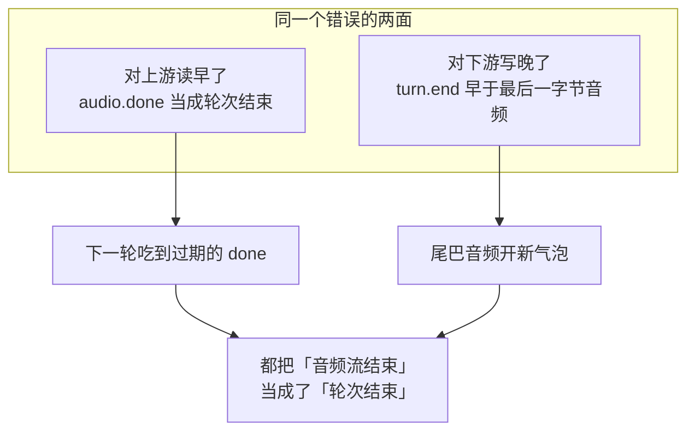

**这两个是同一个错误的镜像：都把音频流的终结符当成了会话的终结符。** 95 §5.1 已经点出这层对称，这里补上它的位置 —— **它是 `collectTurn` 这个角色的固有风险，不是某次实现疏漏。**

### 5.4 把它放进读循环＝把双工用成单工

`user.speech.end` 曾经在同一条 WSS 读循环里**同步**等 `collectTurn` 返回。长 TTS 生成要整轮跑完 —— 这个调用会占住循环几秒到几十秒。

后果：**`interrupt` 卡在 TCP 缓冲里，等 collect 返回才被处理。** 那时打断已经打在错误的窗口上了。

从通信的角度看，这件事的性质比"性能问题"重得多：

> **单工 = 请求-响应。双工 = 等待时仍能收控制帧。**
>
> **把 `WaitTurnResult` 放进读循环，等于把一条双向管道用成了单工 RPC —— 而选 WSS 的整个理由（83）就是不要这个。**

修法是把 collect 丢进 goroutine（`handler.go:739-744`，`collectWG`），读循环继续处理 `interrupt` / `ping`。**这不是优化，是把已经付过钱的能力要回来。**

---

## ⑥ 流式：它的代价是时序语义

### 6.1 流的是什么

"流式"在这条链路上是**两个方向、两件事**：

| 方向 | 流什么 | 为了什么 |
|---|---|---|
| 上行 | PCM 20ms 帧 | 火山能连续识别 + VAD |
| 下行 | 文本 delta + 音频帧 | **降低首响** —— 不等整段生成完 |

`AssistantAudio` 的注释（`provider_volc_duplex.go:266-269`）把下行的动机写得很直白：

> Text deltas made the transcript appear sooner; audio frames are what make the assistant *speak* sooner. Before this, the whole turn's audio was resampled and cut into frames at turn end, **so the first syllable waited for the last one.**

### 6.2 缓冲把「到达」和「消费」解耦

流式解决了首响，**代价是引入了播放缓冲**。而缓冲正是 3.2 里那个前置条件的破坏者：


**所以这不是"流式有 bug"，是流式的定义就包含这个代价。**

> **流式买来的是延迟，付出的是一条时间线。**

### 6.3 为什么 OpenAI 要 `audio_end_ms`，而我们没有

业界标杆的第三件套恰好是补这个缺口的：

| 动作 | 补的是 |
|---|---|
| `output_audio_buffer.clear` | 清客户端已排未播的 PCM |
| `response.cancel` | 停这一轮生成 |
| `conversation.item.truncate`（带 **`audio_end_ms`**） | 把上下文截到用户**实际听到**的位置 |

**`audio_end_ms` 就是"消费侧水位"的显式化** —— 客户端把"我放到哪了"上报，服务端据此截断。

本项目用 `deliveredText` 代理它。但**它是发送侧水位**（网关送出了什么），不是消费侧水位（耳膜收到了什么）—— 差着水位线丢掉的那几帧。96 §4.1 与 backend `docs/63` §6 都登记了这个边界。

**一句话对比：**

> **业界把"消费进度"做成协议字段；我们用"发送进度"加三条不变量去逼近它。**

### 6.4 而且：这条链路**没有背压**

流式解耦了到达与消费，于是必然要回答"消费端跟不上怎么办"。**这条链路的答案是：没有机制。**

**两侧严重不对称：**

| | 上行 | 下行 |
|---|---|---|
| 节奏 | **客户端决定**（一帧转发一帧） | **上游产出多快就发多快** |
| 节流 | POC 路径有 20ms/帧的模拟实时速率（网关路径无） | **一处都没有** |
| 上限 | `maxClientBinaryFrame = 4 MiB` | `duplexReadLimit = 4 MiB` |

**而且没有任何写超时** —— 全仓没有 `SetWriteDeadline` / `WriteTimeout` 的调用。`emit` 是**同步**的，一路落到 `conn.Write`。

于是有一条完整的因果链（**这是本篇里唯一一条"未来仍会复发"的结构性风险**）：

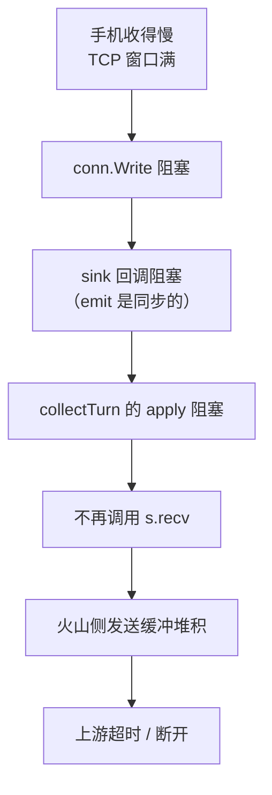

**而接口注释明确要求 sink 不得阻塞**（`volc_duplex.go:64-66`）：

> Called synchronously, on collectTurn's own goroutine, in arrival order. **A sink must not block — it sits on the read path** — and must tolerate being called for a turn that later ends in timeout or error.

**这条要求是对的，但没有任何东西保证它。** sink 的实现最终是一次网络写 —— 而网络写会阻塞。

> **流式把消费压力从"缓冲"转成了"背压"，而这个系统只实现了缓冲，没实现背压。**

---

## ⑦ 9/12 那一天：一个手势打在四条空不变量上

细节在 95，这里只保留**因果结构** —— 因为它正是 ③④ 两节的落地验证。

用户的一个动作（长 TTS 播放中点「开始说话」），同时打在四条**当时都空着**的不变量上：

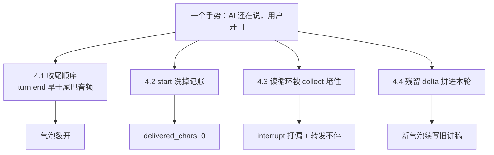

**四条不是四个独立的 bug**，而是 ③④ 说的同一个缺口在四个位置上的投影：

| 空的不变量 | 投影自哪个缺口 |
|---|---|
| 收尾顺序 | 音频无标识 → 只能用**位置**判断"这一轮到哪结束" |
| start 洗记账 | `user.speech.start` **无标识** → 分不清"新一轮"与"打断中的那一轮" |
| 读循环堵塞 | `interrupt` **无载荷** → 只能靠"及时到达"落在正确窗口 |
| 残留 delta | 上游事件流**无边界** → 只能靠"看到用户进展"推断归属 |

**这张表是本篇的论点核心：四个症状，一个根因。**

---

## ⑧ 修复的本质：三个代理标识

### 8.1 加不了标识，就只能加代理

既然 `turn_id` 加不进二进制帧（4.3 的冻结），9/12 的修法本质上是**用三个代理去逼近一个标识**：

| 代理 | 是什么 | 替代了哪个标识 | 守它的不变量 |
|---|---|---|---|
| **水位线**（`Seq` + `markInterrupted`） | 跨轮单调的 4 字节序号 | 「这一帧属于哪一轮」 | 停播后丢弃 ≤ 打断点的序号 |
| **封口顺序** | `ai.turn.end` 必须晚于最后一字节音频 | 「这一轮到哪结束」 | 尾巴 → `ai.tts.end` → **`ai.turn.end` 最后** |
| **`deliveredText`** | 与 TTS 同源推进的文本水位 | 「用户听到哪了」 | 只记**送达**的部分，不记整段 |

**水位线为什么能work**：`nextAudioSeq` **不在** `resetTurnStreamingState` 的清空列表里（`:252-261`），所以它**跨整个会话单调**，不会每轮归零。

```go
// resetTurnStreamingState —— 注意 nextAudioSeq 不在其中
s.streamedText = false
s.streamedAudio = false
s.streamedASR = false
s.deliveredText.Reset()
s.interruptedThisTurn = false
s.audioResampler = nil
s.audioPending = nil
s.collectingTurn = false
```

**这是个正确且不显眼的设计决定**：序号一旦每轮归零，水位线立刻失效。

**同样不显眼的还有帧大小。** `audioFrameBytes = 3200`（100ms @16kHz），注释直接说明了它为什么是**承重的**：

> The chunking is load-bearing: the client's `AudioPlaybackGate` drops **whole frames** at and below the barge-in watermark, so one frame per turn (a 10s reply is 320 KB) would **leave nothing to drop**.

**也就是说：水位线这个代理，是靠"帧切得够细"才成立的。** 代理标识不只是"加一个变量" —— 它会把约束传导到帧大小这种看起来无关的地方。

### 8.2 每个代理都欠一条不变量

代理的代价是：**它不像标识那样自证，它靠一条不变量维持。**

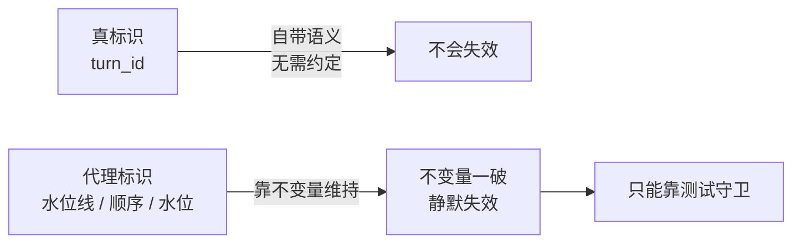

这就是为什么 9/12 的每一刀都配了一条守卫测试（`TestTurnToOutbound_DoesNotFinalizeBeforeTheAudioTail`、`TestBargeInStartThenInterruptStillRecordsWhatWasDelivered`、`TestInterruptStopsForwardingFurtherAssistantAudio`、`TestCollectTurn_DropsStaleResponseDeltasUntilThisTurnHasUserProgress`、`TestCollectTurn_DoesNotFinishOnOutputAudioDoneBeforeResponseDone`）。

**这些测试不是"覆盖率的补充"，它们是这套方案唯一的失效探测手段。**

### 8.3 两端各修了一次

95 §4.2 的复核结论在本篇里位置更清楚：网关的 `!collectingTurn` 守卫与 iOS 的帧序调整，**各自都足以单独修好**同一个 bug。网关那道让帧序变成无关项。

**这不是浪费** —— 它暴露了代理方案的一个特征：

> **代理标识的修复，天然会从两端各长出一半。** 因为没有唯一权威知道"这一帧属于哪一轮"，两端都只能各自用本地状态去逼近，于是各自都能修、也各自都可能修重。

---

## ⑨ 现在通了吗

**一句话：主干通了，闭环没通。**

### 9.1 通了什么

| 环节 | 状态 | 证据 |
|---|---|---|
| iOS 采集（AVAudioEngine + VAD） | ✅ 真机可用 | P0-1 真机闭合 |
| WSS 传输（`URLSessionWebSocketTask`） | ✅ 真机可用 | 真机多场会话 |
| 网关（voice-gateway） | ✅ 真机可用 | 真机会话留下火山 `log_id` |
| **火山 Duplex** | ✅ **真接的**，不是 mock/dev-echo | `.env.volc.local` `VOICE_GATEWAY_PROVIDER=volc-duplex` |
| 回传 → 播放 | ✅ 真机能听到 AI 说话 | P0-1 |
| 可对账 | ✅ `turn_id` + `log_id` 三键能对上 | 2026-09-10 真机达成 |

**9/12 这一批修复已落地**（95 §④ 与 §5）：收尾顺序、帧序与记账、读循环、残留 delta、`response.done` 收 collect、ASR 即时下发。

### 9.2 没通什么

**P0 台账 15 条**（`meta/docs/40_研发流程与协作/77_待修复问题总清单`）：

| 状态 | 条数 | 编号 |
|---|---|---|
| ✅ 已修 | 7 | P0-1 · 3 · 4 · 5 · 6 · 7 · 8 |
| ⏸️ 收口为非缺陷 | 1 | P0-9（环境相关，一行代码没改） |
| 🟡 部分 | 6 | P0-10 · 11 · 12 · 13 · 14 · 15 |
| ❌ 未修 | 1 | **P0-2（AEC 从未被验证）** |

**真正的最后一公里是五项真机验收 —— 一项都没跑**（`ios/docs/62_device_test_manual.md`）：

| 手册 | 验什么 | 对应 |
|---|---|---|
| T1 | 音频流式听感（首响 / 无爆音剪尾） | P1-2 音频半边 |
| T2 a/b/c | 徽章 4s 窗口 · 超时徽章 · 评价到达 | P1-8 |
| T3 | 静音保活（间隔 > 60s） | P0-4 |
| T4 | **AEC** —— 手册自陈最重要的一项 | **P0-2** |
| T5 | `abort` 后 ASR 串味（≥3 次） | P1-6 |

该手册的原话是：**「这五项是当前唯一挡在"P1 全清"前面的东西 —— 代码侧没有可复现的失败，所以没有真机就走不动。」**

### 9.3 闭环那个洞

**回顾页显示兜底内容，而用户看不出来**（P0-15）：8 场 16 次全败，7 场走 stub。而这个产品的差异化恰恰在"对话之后"。

### 9.4 最脆的一处

**音频能出声，建立在"服务端故意不发 `ai.tts.start`"之上**（84 §3.1）。生产 DI 绑的仍是 `MockTTSDecoder`，`EngineBackedTTSDecoder` 已写已测但**未接线**。换任何一条路径都会静音 —— 而静音在单元测试里没有表示。

### 9.5 ⚠️ 引用台账前必读：它是滞后的

`77_` 台账最后修改 **9/12 04:04**，而 9/12 的修复都在其后。已核实的冲突：

| 台账写的 | 实际 |
|---|---|
| P0-11「契约草案未实现，待定方向」 | 网关四层修复 + iOS 帧序已落地（backend `docs/66`、ios `docs/67`） |
| P0-14「未修，故意的」 | 代码与测试已齐（ios `docs/66`、提交 `95c126e`） |
| P0-6/7/8 物理位置在 **P1 表**里 | 按 P0 表扫描会漏掉三条 |
| 头部称「仅剩 P1-6 / P1-8 待真机」 | P0-2 · P0-4 · P0-10 · P0-11 同样待真机 |

**任何引用台账写现状的分析都会写错这三条。** 本节的台账数字取自 9/12 04:04 的那一版，**P0-11 应按已修计**。

---

## ⑩ 技术债清单：按**根因**归类

90 §③–⑧ 列了六条偏颇，是按**症状**排的。按本篇的框架重排一次 —— **因为不同根因的债，还法完全不同。**

### A 类：供应商边界 —— **不用还**

| 债 | 为什么不是我们的 |
|---|---|
| 火山 Duplex **没有 cancel API** | 生成与计费照旧，停的是转发和记录，不是账单。96 §4.5 已核对 |
| 上游事件流**没有天然轮次边界** | 所以才有 `collectTurn`。这是适配层存在的理由，不是缺陷 |

### B 类：协议冻结 —— **要版本化才能还**

| 债 | 现状 |
|---|---|
| **二进制音频帧没有 `turn_id`** | 4.3：被明确识别、明确放弃，改用代理。**这是本篇指认的头号债** |
| v1 冻结时带着**从没跑过**的字段与帧类型 | 90 偏颇五：把未知变成了永久占位 |
| `interrupt` **零载荷** | 它无法说"打断哪一轮"，只能靠到达时机 |

### C 类：实现选择 —— **现在就能还**

| 债 | 代价 | 还法 |
|---|---|---|
| **`submitTranscript("__interrupt__")`** | 名字承诺的能力不存在；哨兵值静默丢弃传错 | 加 `func sendInterrupt()` 进协议（94 陷阱六） |
| **一次 barge-in 发两次 `interrupt`** | 掩盖"哪一次起了作用" | 去掉泵或状态机其中一处 |
| **同一个线上有两个生产者** | 顺序不由构造保证 —— **事故的产地** | 把帧的发出收进状态机副作用（94 §3.8） |
| **相位存三份** | 漂移无告警 | 见 94 陷阱五 |
| **生产路径不发 `ai.tts.end`** | 客户端无法从协议知道"AI 说完了"，只能用计时器逼近 | 需客户端联动（90 偏颇三） |
| **保活屏蔽了空闲回收** | 一个装饰性机制 | 二选一（90 偏颇二） |
| **可观测性只看得见一半** | 有数据但答不了问题 | 修埋点起点 + 音频帧补服务端时标（90 偏颇六） |
| **`resetTurnStreamingState` 的注释没跟上** | 注释说 "Called at turn start"，实际已有 `!collectingTurn` 条件 | 改一行注释 |
| **没有任何背压**（§6.4） | 慢客户端 → 同步写阻塞 → collectTurn 停止 `recv` → **上游被拖死** | 加写超时 + 有界队列，或让 sink 真正异步 |
| **三处未持锁的跨 goroutine 访问** | `s.session` 指针替换 vs sink 正在读它；`DuplexSession.turnSink` 裸读写；`s.usage` / `s.inputMuted` 两侧都碰 | 把**指针生命周期**纳入锁的语义（现在的 `mu` 只管 turn 级状态） |
| **20s 重试是死代码** | `provider_volc_duplex.go:519-561` 要求 `Outcome == ""`，而 Outcome 已保证每条路径必设 → 永不命中 | 删掉，或注明"保留，防御性"（设计 vs 沉积的判定） |
| **关闭码从未进日志** | `CloseError` 的 code / reason 被归成 `ErrDuplexClosed` 后丢弃 —— **这是"看不到死因"的直接原因** | 至少打一条 |
| **`keepaliveIdleThreshold = 60s` 的依据已被撤回** | backend `docs/64` 用全样本推翻了"空闲时长是自变量"，而常量还是照那个假说设的 | 重设，或注明依据已撤 |

### D 类：观测与验证 —— **不还就永远不知道**

| 债 | 代价 |
|---|---|
| **五项真机验收（T1–T5）一项未跑** | 代码侧没有可复现的失败 —— **"没有真机就走不动"** |
| **没有任何测试构造过真实 socket**（P1-22 前半） | 传输层行为没有端到端验证 |
| **回顾页的兜底用户看不出来**（P0-15） | 8 场 16 次全败而无人知晓 |
| **台账滞后于代码**（§9.5） | 引用它会写错三条 |

**还债的优先级不是按症状轻重，是按「还了之后消灭哪一类事故」：**

> **C 类里，「两个生产者」和 `submitTranscript` 各消灭一整类未来事故；「没有背压」消灭的是一整类上游雪崩。**
>
> **B 类不还，代理方案就永远需要靠测试守卫撑着。D 类不还，前面三类你还不知道有没有还干净。**

---

## ⑪ 优化路径

### 首先：明确**不做**的一件事

**不把下游重构成纯事件流。** 见 §3 的追问 —— 它不消除时钟散开（那是播放缓冲造成的，与协议模型无关），只会把供应商的 schema 泄漏给客户端、拆掉防腐层，而"轮"作为产品概念（转录落库 / 徽章 / 评价 / 回顾）仍要在别处重建，且失去唯一权威。

### 第一步（最高优先）：给写路径加边界

**这是唯一一条"今天就可能发生、且发生时会重演 9/12 症状"的路径**，而且它是潜伏的 —— 客户端网络差一点就会触发。

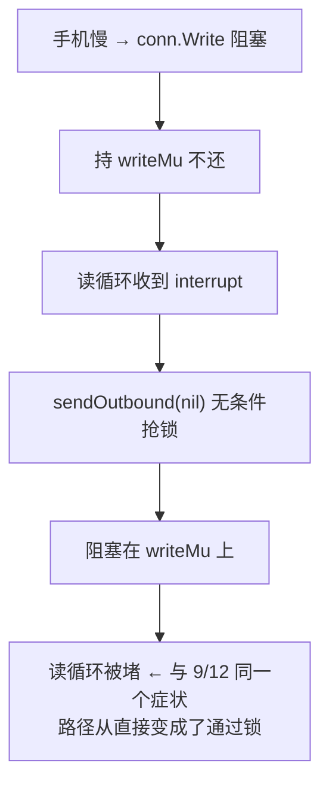

`sendJSON`（`handler.go:312`）与 `sendOutbound`（`:318`）**共用一把 `writeMu`**，而**全仓没有任何写超时**（`SetWriteDeadline` 零命中）。注释本身记录了他们的判断 —— *"its sink emits on that goroutine while the loop still writes ping/interrupt"* —— 他们知道两边都写，所以加锁；但**锁把「并发写」变成了「串行写」，于是一个慢的能拖住一个快的**。

**尤其要命的一处**：`interrupt` 分支无条件调用 `sendOutbound`（`handler.go:661`），而 `sendOutbound` **先取锁、再遍历**：

```go
func (rt *sessionRuntime) sendOutbound(ctx context.Context, conn *websocket.Conn, outbound []ProviderOutbound) error {
	rt.writeMu.Lock()                    // ← 即使 outbound 是 nil 也抢锁
	defer rt.writeMu.Unlock()
	return writeProviderOutbound(ctx, conn, outbound)
}
```

而 provider 对 `interrupt` 返回的是 `nil, nil`（`provider_volc_duplex.go:585-595`，只置位 + 打日志）。**所以一次没有内容要写的打断，也会去抢那把被阻塞写持有的锁** —— 读循环停在这里，`interruptedThisTurn` 永远置不上。**这正是 9/12 那个症状，以另一条路径回来。**

修法分两步，**而且第一步不是加超时**：

| 步 | 做什么 | 为什么 |
|---|---|---|
| **1** | **不产生字节的调用不参与锁竞争** | 它连"有界"都不需要 —— 本来就不该排队。这单独就让上图的 D→E 消失 |
| **2** | 给真正要写的路径加**上界** | 见下 |

第二步的取舍要写下来，因为"加个写超时"听起来无副作用，实际不是：`coder/websocket` 的 `setupWriteTimeout` 在 ctx 到期时 `close()` **整条连接**，不只是这次写。

**但那个副作用恰好是对的语义。** 语音是实时的 —— 一个几秒都吃不进字节的客户端不是"慢"，是**没了**。丢帧保会话会让它落后于一条**永远追不上**的流，听到的是断句；而关连接让会话正常收尾、上游 duplex 被干净拆掉。**这恰恰是阻塞时做不到的事**：阻塞时上游是被拖死，不是被收尾。

所以这里选的是**有界写 + 超时断连**，不是有界队列。后者（丢帧保会话）是另一个决定，要等真出现"客户端只是慢、并没有死"的现场再说 —— 届时第 2 步的日志会先给出那个现场。

**这一条是 9/12 之后新暴露的，写在这里因为它和 4.2 是同一个形状**：又一个「正确的机制被另一个机制抵消」—— 锁本来是为了并发安全，却成了阻塞传播的路径。

### 短期（不需要协议变更）

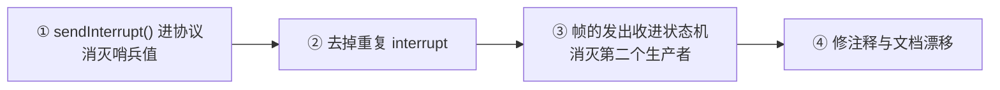

**③ 是短期里最值钱的一条**：它是 4.2 那个缺口的**唯一不必改协议就能做的一半** —— 让线上的顺序由**单一所有者**决定，代理就少欠一条不变量。

### 中期（版本化）

**给二进制音频帧加 `turn_id`** —— 4.3 里被冻结挡住的那条路。

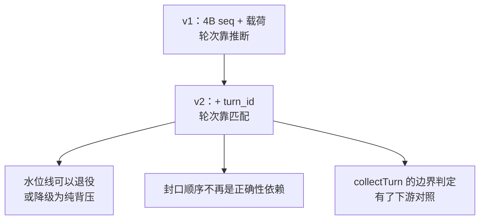

**代价与前置**：两端同时改；帧格式的哈希冻结要正式升版（84 讲版本化机制）。**但它是唯一能把代理换回标识的路径** —— 其余都是在代理上加补丁。

### 长期（把发送侧水位升级为消费侧水位）

对标 `audio_end_ms`：

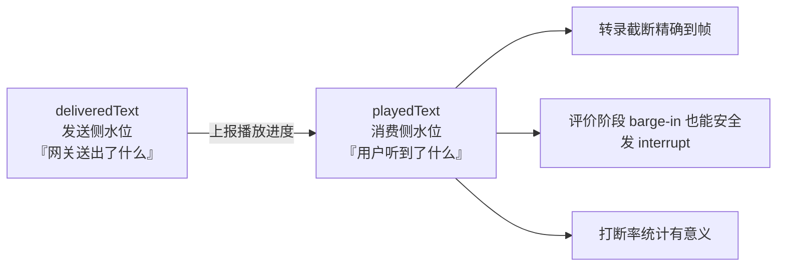

**这一条同时解掉 95 §7 里"评价阶段不能发 interrupt"的取舍** —— 一旦归属由**标识**决定而不是由**时机**决定，那条限制就不需要了。

### 一条贯穿的判断标准

> **每当你发现自己在用「时机」或「顺序」表达「归属」时 —— 记下来，那是一笔债。**
>
> 它今天能work（因为有测试守着），但它不会自证，也不能组合。**加字段的成本是一次性的；补代理的成本是每次改动的。**

---

## ⑫ 自检

1. 用一句话说清「显式标识」与「隐式顺序」的分工，以及隐式顺序的前置条件。
2. 为什么说"三条时钟"是顺序失效的**充分**条件，而不只是相关？
3. 二进制音频帧的线上布局是什么？哪几个字节能用来做轮次归属？
4. 本项目里承载"用户感知"的那条流，为什么恰好没有轮次标识？团队当时考虑了哪三个替代方案？
5. `collectTurn` 为什么必须存在？它只有哪两种错法？各自出过什么事故？
6. 把 `collectTurn` 放进读循环，从通信角度是什么性质的问题？
7. 「流式」在这条链路上买到了什么、付出了什么？
8. 9/12 的三个代理标识分别是什么？各自替代了哪个标识、欠哪条不变量？
9. 为什么 `nextAudioSeq` 绝不能放进 `resetTurnStreamingState`？帧大小（3200 字节）为什么是承重的？
10. 三类技术债的划分标准是什么？哪一类是"现在就能还"的？
11. 这条链路有背压吗？如果手机收得慢，把因果链从 `conn.Write` 一路说到上游超时。
12. 「主干通了，闭环没通」—— 各自指什么？那一项"最脆的一处"为什么脆？

---

## ⑬ 速查

| 项 | 值 |
|---|---|
| **本篇论点** | 协议用**顺序**代替了**标识**；顺序只在单一时间线下等价于标识 |
| 三条时钟 | 生成（火山）· 转发（网关）· 播放（手机）—— 长 TTS 上必然散开 |
| 没有地址的帧 | `user.speech.start` · `interrupt`（零载荷）· **二进制音频**（仅 4B seq） |
| 二进制帧布局 | `[4B big-endian seq][payload]` —— 无轮次、无长度、无标志 |
| 缺口位置 | **正好在用户唯一感知的那一路（音频）** |
| 团队是否识别过 | **是** —— "widening every binary audio frame" 被明确列出，因 v1 冻结放弃 |
| `collectTurn` 的角色 | 事件流 → 轮次的**边界重建器**；唯一权威 |
| 它只有两种错法 | **读早**（`audio.done` 当轮次完 → 下一轮 60s 空转）· **写晚**（`turn.end` 早于尾巴 → 气泡裂） |
| 读循环同步 collect | 把**双工用成单工 RPC** —— 否定选 WSS 的理由 |
| 流式的代价 | 买到首响延迟，付出**一条时间线** |
| 三个代理标识 | 水位线（seq 跨轮单调）· 封口顺序 · `deliveredText` |
| 代理的固有代价 | 不自证，只能靠**守卫测试**做失效探测 |
| 头号技术债 | 二进制音频帧没有 `turn_id`（B 类，要版本化） |
| 现在就能还的 | 两个生产者 · `submitTranscript` 哨兵 · 重复 interrupt · 三份相位 · **背压** |
| **背压** | **没有** —— 下行无节流、无写超时；慢客户端能把上游拖死（§6.4） |
| **现在通了吗** | **主干通，闭环没通** |
| 通了 | 采集 → WSS → 网关 → 火山 → 播放；`turn_id` + `log_id` 可对账 |
| 没通 | **五项真机验收（T1–T5）一项未跑**；AEC（P0-2）未修 |
| 闭环的洞 | 回顾页走 stub 兜底，**用户看不出来**（P0-15） |
| 最脆的一处 | 音频能出声，因为服务端**不发** `ai.tts.start` —— 换路径即静音，而静音测不出 |
| 引用台账要小心 | `77_` 最后改于 9/12 04:04，**P0-11 / P0-14 已过时**（§9.5） |
| 长期方向 | `deliveredText`（发送侧水位）→ `playedText`（消费侧水位），对标 `audio_end_ms` |
| 姊妹篇 | [95](95_WSS系列_14_长TTS打断_如何定位与如何修.md) · [96](96_WSS系列_15_长TTS打断_业界做法与原代码问题.md) · [98](98_WSS系列_17_TTS播放与轮次设计.md) · [94](94_WSS系列_13_客户端状态机_协议事件的消费者.md) |
